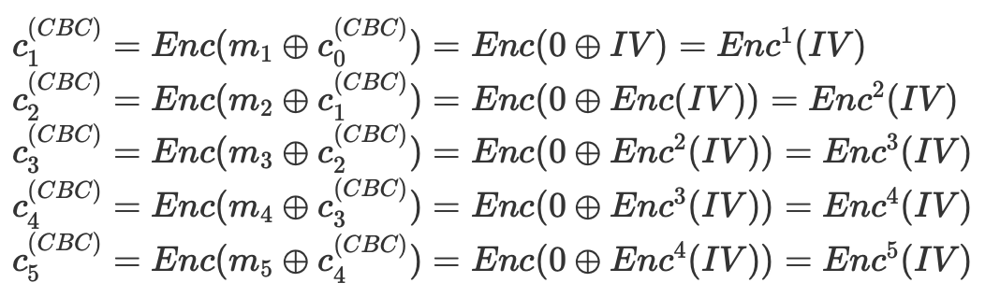
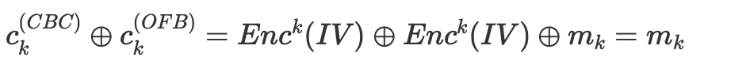

# HKCERT2021 - Freedom
- Write-Up Author: [Ivan Mak](https://ank.pw/tech/)

- Flag: hkcert21{w3_sh0u1d_n0t_g1v3_much_fr3ed0m_t0_us3r5_wh3n_1t_c0m3s_t0_cryp70gr4phy}

## **Question:**
Freedom (100 points)

>Challenge description


Attachment: [chall.py](./chall.py)

## Write up
1. 查看附檔

**chall.py**
```
import os
from Crypto.Cipher import AES
from Crypto.Util import Counter

def main():
    flag = os.environ.get('FLAG', 'hkcert21{*******************************REDACTED*******************************}')
    flag = flag.encode()
    assert len(flag) == 80

    key = os.urandom(16)
    iv = os.urandom(16)

    options = ['ecb', 'cbc', 'cfb', 'ofb', 'ctr']
    suboptions = ['data', 'flag']

    for _ in range(5):
        [option, suboption, *more] = input('> ').split(' ')
        if option not in options: raise Exception('invalid option!')
        if suboption not in suboptions: raise Exception('invalid suboption!')
        options.remove(option)

        if suboption == 'data':
            message = bytes.fromhex(more[0])
        else:
            message = flag

        if option == 'ecb':   cipher = AES.new(key, AES.MODE_ECB)
        elif option == 'cbc': cipher = AES.new(key, AES.MODE_CBC, iv)
        elif option == 'cfb': cipher = AES.new(key, AES.MODE_CFB, iv, segment_size=128)
        elif option == 'ofb': cipher = AES.new(key, AES.MODE_OFB, iv)
        elif option == 'ctr': cipher = AES.new(key, AES.MODE_CTR, counter=Counter.new(16, prefix=iv[:14]))

        ciphertext = cipher.encrypt(message)
        print(ciphertext.hex())
    else:
        print('Bye!')

if __name__ == '__main__':
    main()
```

就是提供了一個 AES 的加密途徑，分別有 ECB, CBC, CFB, OFB, CTR 這五種不同的模式，加密的文本，可以是自己輸入的 data，或是伺服器裡的 flag。

每一種加密方式只能用一次，乍看之下好像挺安全的，但由於單輪(共 5 次)的加密都是共用同個 Key 和 IV，所以我們就想辦法能不能在不同的加密模式下，取得 key 或 IV 來利用。


2. 重溫 AES 加密方式

參考自 [mystiz - hkcert 2021 write up](https://mystiz.hk/posts/2021-11-18-hkcert-ctf-1/)


由於 IV 一樣，所以當明文全是 0 時，CBC, CFB 和 OFB 所加密出來的值是一樣

```
$ python chall.py
> cbc data 00000000000000000000000000000000
5967492a7e7f503e7688979c42309611
> cfb data 00000000000000000000000000000000
5967492a7e7f503e7688979c42309611
> ofb data 00000000000000000000000000000000
5967492a7e7f503e7688979c42309611

```

- IV 只有 16 位長度，所以這裡只生成 32 個 0 就足夠(例子 a -> 61)

3. 拆解 cbc 的加密流程

由於 flag 的總長度是 80 字長度，共 160 bit，共 5 個 block (32+32+32+32+32)



4. 拆解 ofb 的加密流程


5. 對比上述兩個模式



換句話說，只要把 CBC 用 0 做出的密文和 OFB 用 flag 出做的密文做 XOR，便能出 flag

6. 寫出 payload

```
import libnum
from pwn import *

p = remote("chalp.hkcert21.pwnable.hk",28102)
p.recvuntil(">")

p.sendline("cbc data "+'0'*160)
a = p.recvline()

p.recvuntil(">")

p.sendline("ofb flag")
b = p.recvline()

a = a.strip()
b = b.strip()

a = a.decode('utf-8')
b = b.decode('utf-8')

ans = int(a,16) ^ int(b,16)
flag = libnum.n2s(ans)
print(flag)
```

> hkcert21{w3_sh0u1d_n0t_g1v3_much_fr3ed0m_t0_us3r5_wh3n_1t_c0m3s_t0_cryp70gr4phy}
