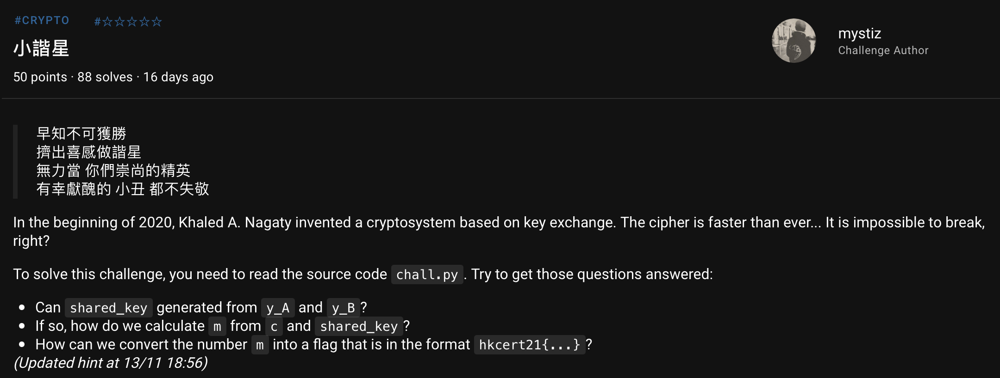

# HKCERT2021 - 小諧星
- Write-Up Author: [Ivan Mak](https://ank.pw/tech/)

- Flag: hkcert21{th1s_i5_wh4t_w3_c4ll3d_sn4k3o1l_crypt0sy5t3m}

## **Question:**
小諧星 (50 points)

>Challenge description



This is a key exchange scheme, where two entity (Alice and Bob) use the "cryptosystem" to exchange a shared key (i.e. after the process, they can generate the same key). After the key exchange, they can then use the shared key to encrypt / decrypt any message.

Thus, to decrypt the ciphertext back to plaintext (i.e. the flag), you will have to know the shared key, then use the "cryptosystem" to decrypt the ciphertext.

Can you get the shared key from the provided information? You have p, y_A and y_B, can you generate the shared key?

From the exchange function, self.shared_key = S_AB, and S_AB = (y_AB * y_B) * S_A % self.p; y_AB = y_A * y_B.

You have p, y_A and y_B, what are you missing? What is the relation between S_A and y_A and how can we use that?

(Updated hint at 14/11 00:25)

We are given output.txt that contains y_A and y_B, which are the public keys for Alice and Bob respectively. In this challenge, you need to derive the shared key S_AB from those public keys.

Look at the below line:

```
y_AB = y_A * y_B
S_AB = (y_AB * y_B) * S_A % self.p

```

From above, we can compute the shared key S_AB from y_A, y_B and S_A. However, the challenge is so "secure" that we don't even need any private keys. That said we can compute S_AB solely from y_A and y_B. How? Look at the relationship between S_A and y_A. In short, S_AB = (y_A * y_B * y_B) * y_A % p = (y_A * y_B)^2 % p.

One question is, how do we convert base 16 (those strings starting with 0x) to base 10? We can use Cyberchef to convert numbers. You can also find a product of two large numbers with Cyberchef. There is one question remain: What does % mean? Try to find it yourself!

Now we have the shared key S_AB (it is called sk below). If we have the ciphertext c, we can look the decrypt function shows how they decrypt:

```
def decrypt(self, c):
    sk = self.shared_key
    if sk is None: raise Exception('Key exchange is not completed')

    return c // sk
```

Okay, it is now a simple division. Now it is a primary-level math (actually not). Now you have a message represented as a number, you can convert the number here with Cyberchef again. Now put down the number for the flag!

(Updated hint at 14/11 02:45)

If you are getting something like 0x686B636572743231, that is hkcert21 in HEX. Find a HEX decoder online to grab your flag!

Attachment: [the-little-comedian_58178adf8b732db76116f5bb7e0c4198.zip](./the-little-comedian_58178adf8b732db76116f5bb7e0c4198.zip)

## Write up
1. 查看附件

解壓縮後總共有 2 個文件

**chall.py**
```
import random
from Crypto.Util.number import getPrime as get_prime

# https://link.springer.com/content/pdf/10.1007/s42452-019-1928-8.pdf
class NagatyCryptosystem:
    def __init__(self, p=None):
        # Section 3.1
        # "Select a very large prime number p."
        self.p = get_prime(1024) if p is None else p

        # Generate 1024 numbers as the sequence
        u = [random.getrandbits(1024) for _ in range(1024)]

        self.private_key = sum(u)
        self.public_key  = self.private_key % self.p

        self.shared_key = None

    def start_exchange(self):
        return (self.public_key, self.p)

    def exchange(self, y_B):
        S_A = self.private_key
        y_A = self.public_key

        y_AB = y_A * y_B
        S_AB = (y_AB * y_B) * S_A % self.p

        self.shared_key = S_AB

    def encrypt(self, m):
        sk = self.shared_key
        if sk is None: raise Exception('Key exchange is not completed')

        return m * sk

    def decrypt(self, c):
        sk = self.shared_key
        if sk is None: raise Exception('Key exchange is not completed')

        return c // sk


# Sanity test
def test():
    cipher_alice = NagatyCryptosystem()
    alice_public_key, p = cipher_alice.start_exchange()

    cipher_bob = NagatyCryptosystem(p)
    bob_public_key, _ = cipher_bob.start_exchange()

    cipher_alice.exchange(bob_public_key)
    cipher_bob.exchange(alice_public_key)

    # Test: Alice sends a message to Bob and Bob is able to decrypt it
    m = 1337
    c = cipher_alice.encrypt(m)
    assert cipher_bob.decrypt(c) == m

    # Test: Bob sends a message to Alice and Alice is able to decrypt it
    m = 1337
    c = cipher_bob.encrypt(m)
    assert cipher_alice.decrypt(c) == m

def main():
    # Reads the flag and converts the string into a number
    with open('flag.txt', 'rb') as f: flag = f.read()
    flag = int.from_bytes(flag, 'big')

    cipher_alice = NagatyCryptosystem()
    alice_public_key, p = cipher_alice.start_exchange()

    cipher_bob = NagatyCryptosystem(p)
    bob_public_key, _ = cipher_bob.start_exchange()

    cipher_alice.exchange(bob_public_key)
    cipher_bob.exchange(alice_public_key)

    c = cipher_alice.encrypt(flag)

    print('p =', hex(p))
    print('y_A =', hex(alice_public_key))
    print('y_B =', hex(bob_public_key))
    print('c =', hex(c))

if __name__ == '__main__':
    test()
    main()
```

**output.txt**

```
p = 0xbba8eaf686a5cb3acb507a29e7fb852e107dd439a8d7ba7228cd74043c8f12e87af197ef20577b61a508612d96fcc8d8d883b7b552b324312bbb851b1b5b40d7683b44f2dc3ee97cf1e177e4acf2867430ba8d564b6f4899a826ebd4cf668249a900d6d81b3c475ba8c374c741ea5fb019e4e96859f6873ee5c726eb84daf345
y_A = 0x9e619600689100ef9bad38d607c0b2a148f04d7af65f20d6b4ac056c41a8d0653ee16194fde8bb85aea2e4ebaa493eb5a5b352218e380dc38190010eea7716795ac07a9d5f7a2bc610e0bc5234754e487ee52c76343b182e22242c800ae1cf8ae39788199dc636046c9b734262b0015a71e669d079215e7f91b684b4444200fa
y_B = 0xa52e458bc2274e412c6a5a51ce82a9612c9bb9fedcdfeeb45e18e7c71075a7761f32cbe1c6a7ea5b960f09d1d85a197bfc08ecb0a209daf67c67020844519f3092122492ef997f7715109ffb922b78346319db770cde83701534a097900f772499c012585c10892fbb70f978fc4f83236adda513c9b5b9c1a4386c1de6e70587
c = 0x49a1477e673e7ab4794f580ef4b54f23209aaa161e5b0f54709ffd6f647b07b15e3577e49479eeb98ef863c128d05c03fa8d8ca6cdefea4d45a8e201fc042417ea066958b926bfe4cbdd558373de791a6b993becddaf2a336609a0ef89d6e8b2af95d598762de2c6b69588d6473419a8a8dc45a5d4b3194c820c97aa6c94ea730ccaf2240721dfff706e3bc3981630187b610d14add798ff1b9a3bfc1c08b3bb562536e9b26caf809b7a7e2e3aabb12df810fe280a11
```

2. 閱讀原始碼

這裡可以發現，加解密的方法都是透過 sk 這個值。

加密 : m * sk

解密 : c // sk

所以加解密說白了就只是乘除法而已，只要找到 sk 這個值就行

再逆著仔細讀

```
sk = S_AB

S_AB = (y_AB * y_B) * S_A % self.p

y_AB = y_A * y_B

S_A = self.private_key

```

透過上面資料，歸納一下基本上可以總結成:

```
sk = y_A * y_B * y_B * self.private_key % self.p

```

但是到這邊，我遇到一個難題，就是我並不知道 private_key

這時候我來了一下數字代入，把所有的數字都自己假設:

由於 **public_key = private % p**

alice : 9 = 31 % 11

bob : 2 = 57 % 11

再看看 shared_key:

alice 的 sk = 9 * 2 * 2 * 31 % 11 = 5

bob 的 sk = 2 * 9 * 9 * 57 % 11 = 5

很神奇的發現，即使 alice 和 bob 的 public key, private key 都不同，但最終 shared key 都是一樣，所以我們就要找出這中間的關連。

重新回看 sk 的生成

```
sk = y_A * y_B * y_B * self.private_key % self.p

```

在上面其中的

```
self.private_key % self.p

```
就不是 **y_A** 嗎?

也就是說，按照餘數定理，對 alice 來說 sk 是這樣算:

sk = (9 * 2 * 2 * 9) % 11

對 bob 來說，sk 是這樣算

sk = (2 * 9 * 9 * 2) % 11

所以它們的 sk 都一樣啦，那我們就可以在不用得知 31, 57 他們這些 private key 的情況下解出 sk

3. 寫出 payload

**solve.py**
```
import libnum

y_A = 0x9e619600689100ef9bad38d607c0b2a148f04d7af65f20d6b4ac056c41a8d0653ee16194fde8bb85aea2e4ebaa493eb5a5b352218e380dc38190010eea7716795ac07a9d5f7a2bc610e0bc5234754e487ee52c76343b182e22242c800ae1cf8ae39788199dc636046c9b734262b0015a71e669d079215e7f91b684b4444200fa
y_B = 0xa52e458bc2274e412c6a5a51ce82a9612c9bb9fedcdfeeb45e18e7c71075a7761f32cbe1c6a7ea5b960f09d1d85a197bfc08ecb0a209daf67c67020844519f3092122492ef997f7715109ffb922b78346319db770cde83701534a097900f772499c012585c10892fbb70f978fc4f83236adda513c9b5b9c1a4386c1de6e70587
p = 0xbba8eaf686a5cb3acb507a29e7fb852e107dd439a8d7ba7228cd74043c8f12e87af197ef20577b61a508612d96fcc8d8d883b7b552b324312bbb851b1b5b40d7683b44f2dc3ee97cf1e177e4acf2867430ba8d564b6f4899a826ebd4cf668249a900d6d81b3c475ba8c374c741ea5fb019e4e96859f6873ee5c726eb84daf345
c = 0x49a1477e673e7ab4794f580ef4b54f23209aaa161e5b0f54709ffd6f647b07b15e3577e49479eeb98ef863c128d05c03fa8d8ca6cdefea4d45a8e201fc042417ea066958b926bfe4cbdd558373de791a6b993becddaf2a336609a0ef89d6e8b2af95d598762de2c6b69588d6473419a8a8dc45a5d4b3194c820c97aa6c94ea730ccaf2240721dfff706e3bc3981630187b610d14add798ff1b9a3bfc1c08b3bb562536e9b26caf809b7a7e2e3aabb12df810fe280a11
shared_key = (y_A * y_A * y_B * y_B) % p
m = c //shared_key
flag = libnum.n2s(m)
print("flag = ",flag)
```

```
$ py solve.py
flag =  b'hkcert21{th1s_i5_wh4t_w3_c4ll3d_sn4k3o1l_crypt0sy5t3m}'
```

> hkcert21{th1s_i5_wh4t_w3_c4ll3d_sn4k3o1l_crypt0sy5t3m}
