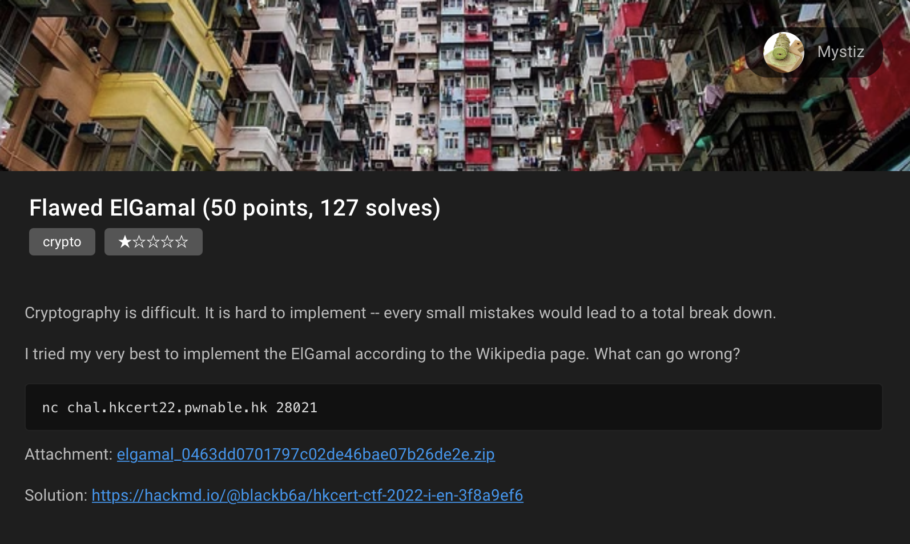
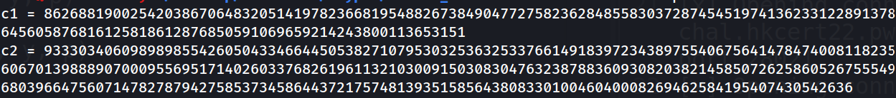

# HKCERT2022 - Flawed ElGamal
- Write-Up Author: Anthony Cheng

- Flag: hkcert22{4nd_th1s_t1m3_7h3_i5su3_1s_s0l31y_n0t_t4k1n9_m0du10s}

## **Question:**
Flawed ElGamal (50 points)

>Challenge description



Attachment: [chall.py](./chall.py)

[Offical Reference](https://hackmd.io/@blackb6a/hkcert-ctf-2022-i-en-3f8a9ef6)

## Write up
First try to connect the server and we can get a different c1 and c2 when connect the server each time

```
nc chal.hkcert22.pwnable.hk 28021
```



So download the source code and find the public key as the following

```
p = 1444779821068309665607966047026245709114363505560724292470220924533941341173119282750461450104319554545087521581252757303050671443847680075401505584975539
g = 2
h = 679175474187312157096793918495021788380347146757928688295980599009809870413272456661249570962293053504169610388075260415234004679602069004959459298631976
```

form the encryption part we can know that the flag is encrypt and store in m. If we notice the c2, c2 is a multiple of m: c2 = m ⋅ s and any taken modulo of p

```
m = int.from_bytes(flag, 'big')
y = random.randint(1, p-1)
s = pow(h, y, p)
c1 = pow(g, y, p)
c2 = m * s
```

so if we get many enough c2 with using Euclidean algorithm and we can actual get the m value.

First I get 10 different c2 values from the server and store in the list

```
import sys
from pwn import *

c2_arr = []

for i in range (10):
    conn = remote('chal.hkcert22.pwnable.hk', 28021)
    conn.recvline()
    c2_str = conn.recvline().decode('ascii').split('= ')[-1]
    c2_arr.append(int(c2_str))
    conn.close()

    i +=1
```

And then calculate the H.C.F of these ten c2; and then we can get the value of m

```
def get_gcd(x,y):
    while(y):
        x, y = y, x % y
     
    return x

num1 = c2_arr[0]
num2 = c2_arr[1]
gcd = get_gcd(num1, num2)
 
for i in range(2, len(c2_arr)):
    gcd = get_gcd(gcd, c2_arr[i])
     
print(gcd)
#83448672569534864171229573458512174989029902842741593452328950830727646347780610376319346605942533326077868662184217408726599090969242638931830272893
```

At last I convert the int to byte and decode as ascii and got the flag.

```
print(gcd.to_bytes(sys.getsizeof(gcd), byteorder='big').decode('ascii'))
```

> hkcert22{4nd_th1s_t1m3_7h3_i5su3_1s_s0l31y_n0t_t4k1n9_m0du10s}
