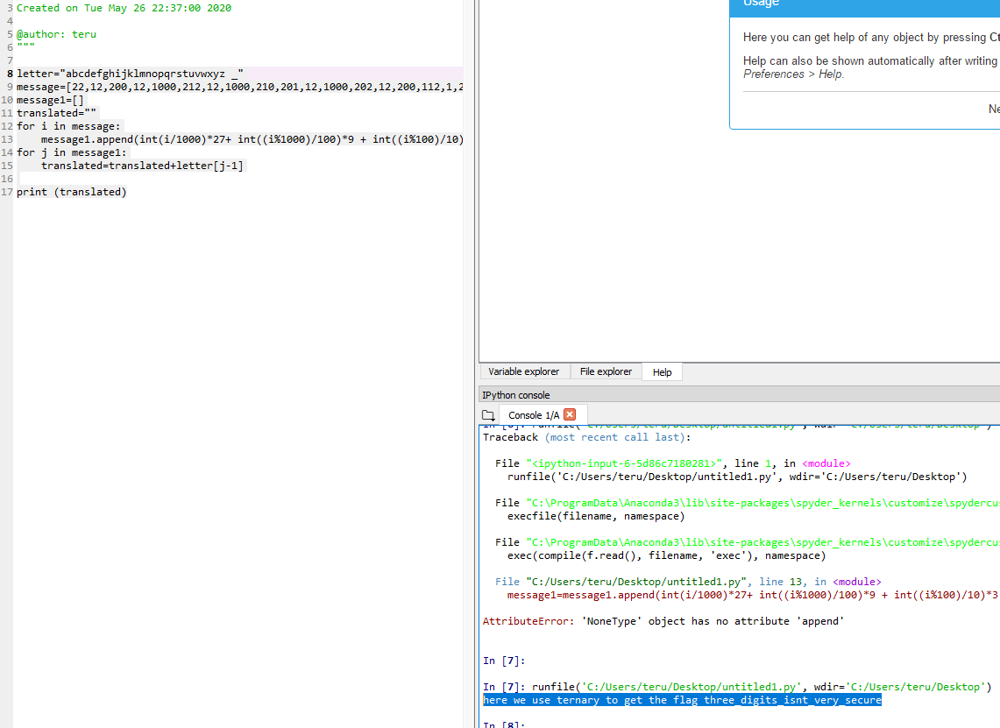

# Crypto - HSCTF2020 - 3ManyNumbers

- Write-Up Author: Teru Lei \[[MOCTF](https://www.facebook.com/MOCSCTF)\]

- Flag:**three_digits_isnt_very_secure**
## **Question:**
>Practice

```
This is similar to the text2numbers problem, except with a twist.
22 12 200 12 1000 212 12 1000 210 201 12 1000 202 12 200 112 1 200 221
1000 202 120 1000 21 12 202 1000 202 22 12 1000 20 110 1 21 1000 202 22
200 12 12 1001 11 100 21 100 202 201 1001 100 201 112 202 1001 211 12 200
221 1001 201 12 10 210 200 12
```

## Write up:

>With quick observation this is not a simple substitution from number. With further observation, we can find that all numbers only contain 0,1 and 2, so it's possible that those are ternary numbers (三進制). We can try to convert those numbers to int, then we can perform simple number to ASCII substitution as the previous Crypto practice write up.

>To convert the ternary numbers to int, we can use the below Python code:
```python
for i in message:
    message1.append(int(i/1000)*27+ int((i%1000)/100)*9 + int((i%100)/10)*3 + int((i%10)))
```
>int(i/1000)*27 is to convert the fourth digit of the number (If there is, if not, the result will be zero since the int function always round down). 27 = 3 x 3 x 3 for the factor of ternary number at fourth digit to int conversion.</br></br>For int((i%1000)/100), i%1000 is to deduct the ternary number to less than 1000, then int((i%1000)/100) can get the number of the third digit, 9 = 3 x 3 for the factor of ternary number at third digit to int conversion. The calculation is similar for int((i%100)/10)*3 and int((i%10)).

>After we convert the ternary numbers to int, we can do the substitution from int to ASCII. Below is the full code in Python:
```python
letter = "abcdefghijklmnopqrstuvwxyz _"
	
message = [	22,12,200,12,1000,212,12,1000,210,201,
		12,1000,202,12,200,112,1,200,221,1000,202,
		120,1000,21,12,202,1000,202,22,12,1000,20,
		110,1,21,1000,202,22,200,12,12,1001,11,100,
		21,100,202,201,1001,100,201,112,202,1001,211,
		12,200,221,1001,201,12,10,210,200,12]
			
message1=[]
translated=""

for i in message:
    message1.append(int(i/1000)*27+ int((i%1000)/100)*9 + int((i%100)/10)*3 + int((i%10)))
	
for j in message1:
    translated=translated+letter[j-1]
	
print (translated)
```
> ### The result of running the code is:

