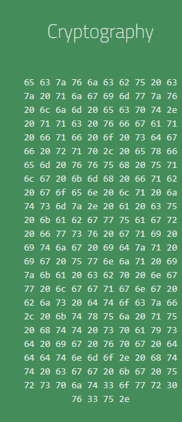
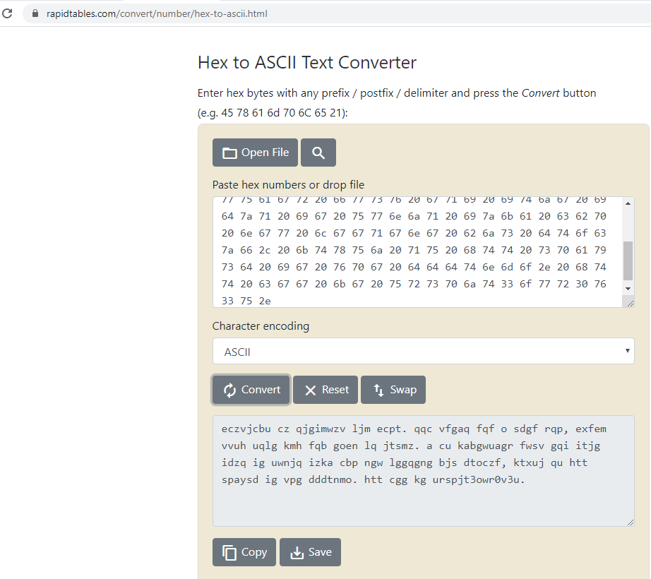
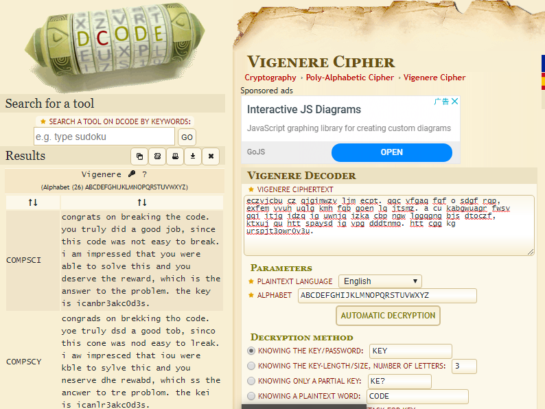

# Crypto - HSCTF2020 - Cryptography

- Write-Up Author: Teru Lei \[[MOCTF](https://www.facebook.com/MOCSCTF)\]

- Flag:**icanbr3akc0d3s**

## **Question:**
>Example



## Write up:

>With observing the numbers, those are hex numbers and very likely to be a string. Then try to convert the hex to string: (https://www.rapidtables.com/convert/number/hex-to-ascii.html)</br></br>Observing the output, seems it’s a cypher of some sentences, and some characters like ‘ ‘,’,’,’.’ are unchanged. We can guess the output make be Ceasar cipher or Vigenere cipher (https://en.wikipedia.org/wiki/Vigen%C3%A8re_cipher). 

>Start from simple, try to use below Python program to do simple shift of character for the output, but all the output are not structure:
```python
message = 'eczvjcbu cz qjgimwzv ljm ecpt. qqc vfgaq fqf o 
		sdgf rqp, exfem vvuh uqlg kmh fqb goen lq jtsmz. 
		a cu kabgwuagr fwsv gqi itjg idzq ig uwnjq izka 
		cbp ngw lggqgng bjs dtoczf, ktxuj qu htt spaysd ig 
		vpg dddtnmo. htt cgg kg urspjt3owr0v3u.'
		
#Lower Case Letter table
LETTERS = 'abcdefghijklmnopqrstuvwxyz'

for key in range(len(LETTERS)):
   translated = ''
   for symbol in message:
       if symbol.strip() and symbol in LETTERS: 
           translated = translated +(LETTERS[(LETTERS.index(symbol) + key) % 26])  
       else:
           translated = translated + symbol
   print('Hacking key #%s: %s' % (key, translated))

```
>To try Vigenere cipher, we need to have a key for decrypt which we don’t have. With some search, there is a website (https://www.dcode.fr/vigenere-cipher)

> ### for Vigenere cipher decrypt which can decrypt Vigenere cipher with language matching:

