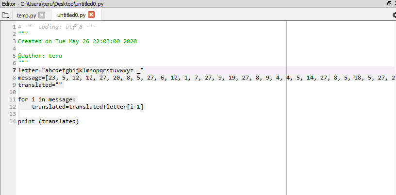
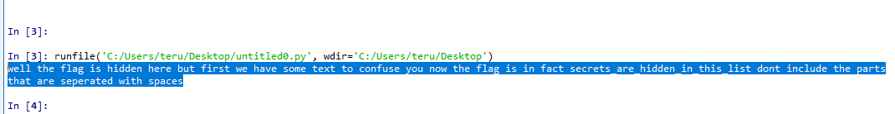

# Crypto - HSCTF2020 - text2numbers

- Write-Up Author: Teru Lei \[[MOCTF](https://www.facebook.com/MOCSCTF)\]

- Flag:**secret_are_hidden_in_this_list**

## **Question:**
>text2numbers</br>Writer: Jacob Edelman

>In order to make text more easily encrypted, it is essential to transform it into some sort of numeric state. A simple way to do this is by taking letters, transforming them into numbers by their place in the alphabet ( a -> 1, b -> 2, c -> 3, and so on), “ ” going to 27, and “_” going to 28. For instance, the string “bad ” would go to the numbers (2,1,4,27). A program to automate this will make things vastly easier for you. Can you decrypt the flag?</br>
(23, 5, 12, 12, 27, 20, 8, 5, 27, 6, 12, 1, 7, 27, 9, 19, 27, 8, 9,</br> 4, 4, 5, 14, 27, 8, 5, 18, 5, 27, 2, 21, 20, 27, 6, 9, 18, 19, 20, 27,</br> 23, 5, 27, 8, 1, 22, 5, 27, 19, 15, 13, 5, 27, 20, 5, 24, 20, 27, 20, </br>15, 27, 3, 15, 14, 6, 21, 19, 5, 27, 25, 15, 21, 27, 14, 15, 23, 27, 20, 8,</br> 5, 27, 6, 12, 1, 7, 27, 9, 19, 27, 9, 14, 27, 6, 1, 3, 20, 27, 19, 5, 3,</br> 18, 5, 20, 19, 28, 1, 18, 5, 28, 8, 9, 4, 4, 5, 14, 28, 9, 14, 28, 20, 8,</br> 9, 19, 28, 12, 9, 19, 20, 27, 4, 15, 14, 20, 27, 9, 14, 3, 12, 21, 4, 5,</br> 27, 20, 8, 5, 27, 16, 1, 18, 20, 19, 27, 20, 8, 1, 20, 27, 1, 18, 5, 27, </br> 19, 5, 16, 5, 18, 1, 20, 5, 4, 27, 23, 9, 20, 8, 27, 19, 16, 1, 3, 5, 19)
 


## Write up:

>It’s a simple substitution challenge. We need to substitute 1 with a, 2 with b etc. So that we can write a simple Python as below to get the content in ASCII:

```
#Below list the ASCIi(letter plus “ “, “_” in sequence for substitution

letter = "abcdefghijklmnopqrstuvwxyz _"

message = [23, 5, 12, 12, 27, 20, 8, 5, 27, 6, 12, 1, 
		7, 27, 9, 19, 27, 8, 9, 4, 4, 5, 14, 27, 8, 5, 18, 
		5, 27, 2, 21, 20, 27, 6, 9, 18, 19, 20, 27, 23, 5, 
		27, 8, 1, 22, 5, 27, 19, 15, 13, 5, 27, 20, 5, 24, 
		20, 27, 20, 15, 27, 3, 15, 14, 6, 21, 19, 5, 27, 25, 
		15, 21, 27, 14, 15, 23, 27, 20, 8, 5, 27, 6, 12, 1, 
		7, 27, 9, 19, 27, 9, 14, 27, 6, 1, 3, 20, 27, 19, 5, 
		3, 18, 5, 20, 19, 28, 1, 18, 5, 28, 8, 9, 4, 4, 5, 14, 
		28, 9, 14, 28, 20, 8, 9, 19, 28, 12, 9, 19, 20, 27, 4, 
		15, 14, 20, 27, 9, 14, 3, 12, 21, 4, 5, 27, 20, 8, 5, 27, 
		16, 1, 18, 20, 19, 27, 20, 8, 1, 20, 27, 1, 18, 5, 27, 19, 
		5, 16, 5, 18, 1, 20, 5, 4, 27, 23, 9, 20, 8, 27, 19, 16, 1, 3, 5, 19]
	
translated=""

for i in message:

	#Use for to substitute the numbers in message one by one
	#Need to use [i-1] since in variable ‘letter’, a is in index 0 instead of 1, since index is started from 0
    translated=translated+letter[i-1]
	
print (translated)

```
>Output of the program:</br>well the flag is hidden here but first we have some text to confuse you now the flag is in fact secrets_are_hidden_in_this_list dont include the parts that are seperated with spaces


