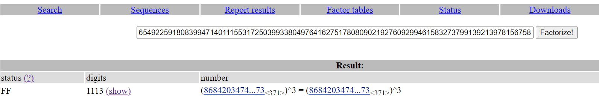

# RTLXHA2021 – Last Words

- Write-Up Author: RB916120 \[[MOCTF](https://www.facebook.com/MOCSCTF)\]

- Flag:**RTL{1_c0uld_pr0b4bly_m4k3_th15_al0t_h4rd3r_next_t1m3!!!-e82fac7a780f72579c47b6ce0d5b7fd82eb6192ed65949ca485309b5}**

## **Question:**
Last Words

>My friend told me his father died and his father had a last message for me, but it was in this weird format. Can you help me out?
>
>Author: H-mmer#8548

[chall.txt](./chall.txt)

## Write up
we can check the n on factordb.com</br>simply use the following code to get flag



[Euler's totient function](https://en.wikipedia.org/wiki/Euler%27s_totient_function#Value_of_phi_for_a_prime_power_argument)
according to this wiki phi_N should be (p-1)*(p**2) 

then the flag can be obtain from below python code

```python
import libnum
p=int(86842034747506493609419721799469420931995622862762177911235982167541270872531314416635530661571139759415845637249847122973461307626071732001202620839724983790638777821431490624281206999841752934471207639839705304729136564852048258975833304653350042975893538110232832319190920640420813884920174219068423676798778919245766035367660194191901644604977395931936301500921652573)

n=654922591808399471401115531725039933804976416275178080902192760929946158327379913921397815675866572368514471928883646492843129515545704650288455484139194674085479767043433916059634120332033088959269854607488937394748966549930683612344765680930825877346853207413052755531377359101713133223003902598963694672505995923904179391456221568627581198379796103905853274401142025181753922563551760475421349438387207814101835728396617249777551918738205026251791041540304166035801169367444769632368098508148321283516990672280903943844076578831127878464804361185261171218008337510295988058766597378522306523707845029512326086281153969312238517561678149326216382068770238520736531273600941471546492734984885174688640769745572963612242607879009754765129567334064867941063826839593018197528692242502124648098963061951119350954396467735643056862091298259178844956622094028547135110211632557488448742742990287309014601421331198088078262672918791473250793328827598271675543610977104049017695062380578362377174224228163980223055437425220689053314587171763084816067718392663203432596767350691383811865855862699762433397509373202656517
e=65537
c=100710438795162977079348743974088808865381156915931230652674830564884952723797964737417330704790990449847640350694313826907540645947517771309102468382620491151431303509245971254205327928401285858105844273322941744709730235138404791133855224230464330311543377527034287444040442497607564368033381652353025668428244301303066924437016815162803737278638329823899949834679835580778760115487417517224721370787073698165030607724383674378473550370840265887300696291636301457816942477342875386648871368111343762416276747522564143279926396047848536514023846050160848670498687478441942327283357707903465054287238235065476035197766241316080918681581228125031794197267118491412751434265211623073108630476746894061360362486334754179185179035203622586839918393560491482900365894224904151749064929247038688878617389856012413316816710758669316380134350637155478806193340543320655839127039864941782215970914222744836875559787971645305231571859542782671984468965485858145740868483956306860449187868403601170785547890022967337275595188765793071937500328605240827441496747925821120273130333043107613757070639870802278814019421139964349

# if p==q then (p-1)*q
# we have to generate the difference for phi_N
phi_N = (p-1)*(p**2)

d = libnum.modular.invmod(e,phi_N)

ans = pow(c,d,n)

print(libnum.n2s(ans))
```

