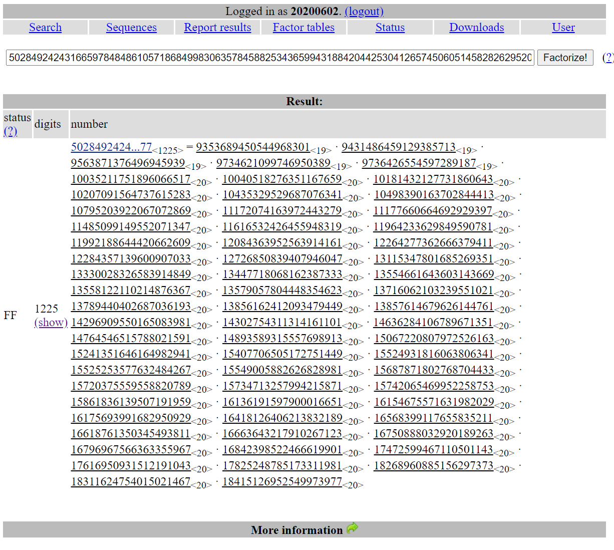

# RedpwnCTF2020 – 4k-rsa

- Write-Up Author: Bon \[[MOCTF](https://www.facebook.com/MOCSCTF)\]

- Flag:**flag{t0000_m4nyyyy_pr1m355555}**

## **Question:**
> 4k-rsa

```
Only n00bz use 2048-bit RSA. True gamers use keys that are at least 4k bits long, no matter how many primes it takes...
```

[4k-rsa-public-key.txt](./4k-rsa-public-key.txt)

## Write up
>check 4k-rsa-public-key.txt, put the n into factordb.com and found all the factor of the n.</br>simply use the following code to get flag




```python
from Crypto.Util.number import *

primes=[9353689450544968301,9431486459129385713,9563871376496945939,9734621099746950389,9736426554597289187,10035211751896066517,10040518276351167659,10181432127731860643,10207091564737615283,10435329529687076341,10498390163702844413,10795203922067072869,11172074163972443279,11177660664692929397,11485099149552071347,11616532426455948319,11964233629849590781,11992188644420662609,12084363952563914161,12264277362666379411,12284357139600907033,12726850839407946047,13115347801685269351,13330028326583914849,13447718068162387333,13554661643603143669,13558122110214876367,13579057804448354623,13716062103239551021,13789440402687036193,13856162412093479449,13857614679626144761,14296909550165083981,14302754311314161101,14636284106789671351,14764546515788021591,14893589315557698913,15067220807972526163,15241351646164982941,15407706505172751449,15524931816063806341,15525253577632484267,15549005882626828981,15687871802768704433,15720375559558820789,15734713257994215871,15742065469952258753,15861836139507191959,16136191597900016651,16154675571631982029,16175693991682950929,16418126406213832189,16568399117655835211,16618761350345493811,16663643217910267123,16750888032920189263,16796967566363355967,16842398522466619901,17472599467110501143,17616950931512191043,17825248785173311981,18268960885156297373,18311624754015021467,18415126952549973977]
m=1
n=1
for i in primes:
  m*=i-1
  n*=i

c=3832859959626457027225709485375429656323178255126603075378663780948519393653566439532625900633433079271626752658882846798954519528892785678004898021308530304423348642816494504358742617536632005629162742485616912893249757928177819654147103963601401967984760746606313579479677305115496544265504651189209247851288266375913337224758155404252271964193376588771249685826128994580590505359435624950249807274946356672459398383788496965366601700031989073183091240557732312196619073008044278694422846488276936308964833729880247375177623028647353720525241938501891398515151145843765402243620785039625653437188509517271172952425644502621053148500664229099057389473617140142440892790010206026311228529465208203622927292280981837484316872937109663262395217006401614037278579063175500228717845448302693565927904414274956989419660185597039288048513697701561336476305496225188756278588808894723873597304279725821713301598203214138796642705887647813388102769640891356064278925539661743499697835930523006188666242622981619269625586780392541257657243483709067962183896469871277059132186393541650668579736405549322908665664807483683884964791989381083279779609467287234180135259393984011170607244611693425554675508988981095977187966503676074747171
e=65537
d=inverse(e,m)
print(long_to_bytes(pow(c,d,n)))
```

>flag is flag{t0000_m4nyyyy_pr1m355555}
