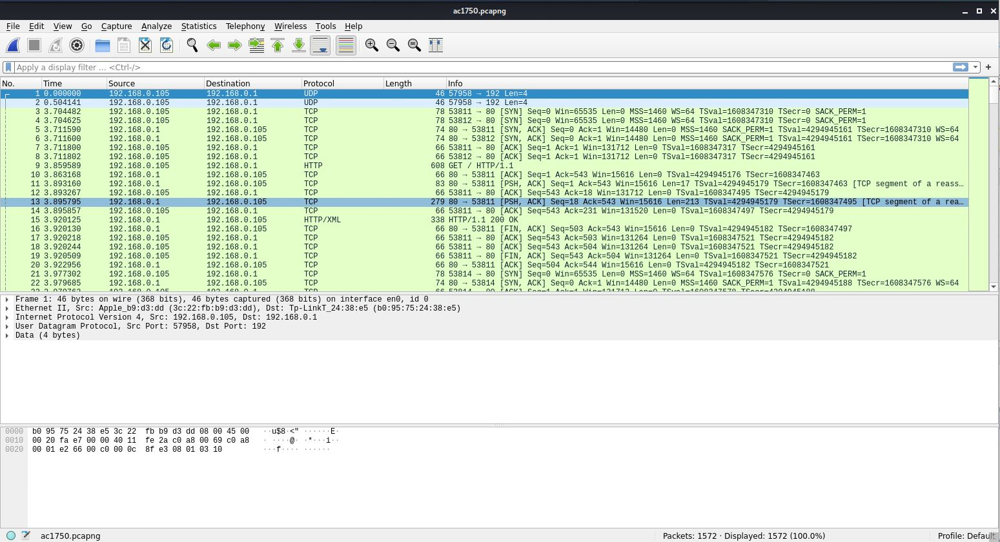
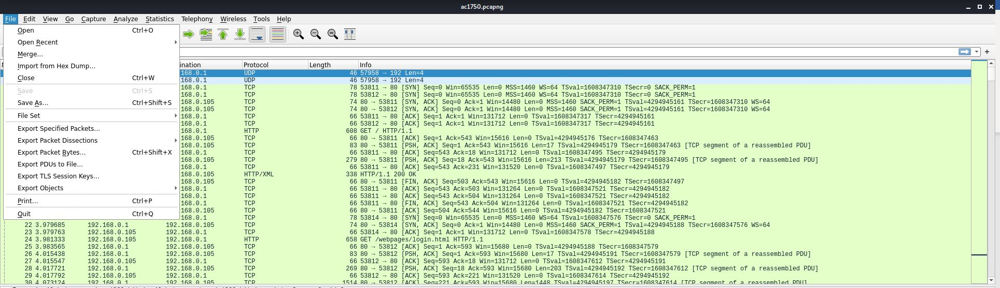
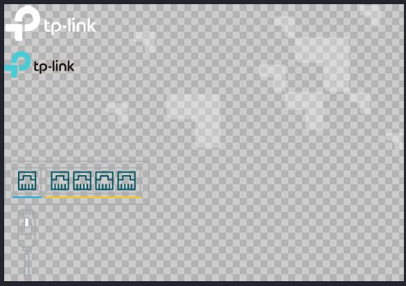
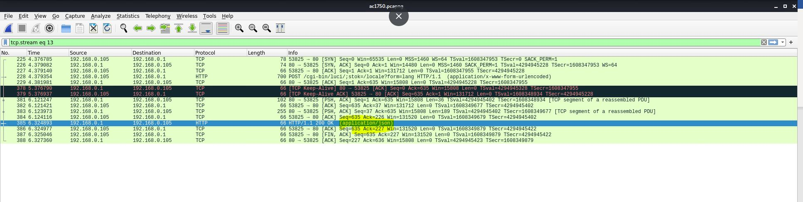
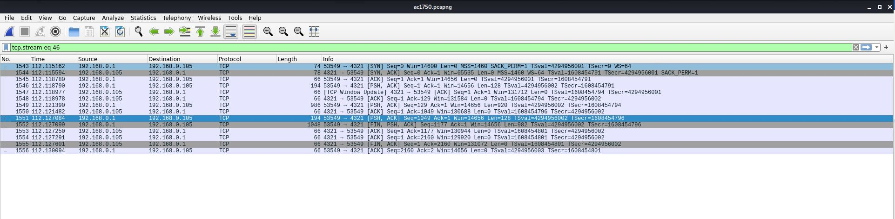
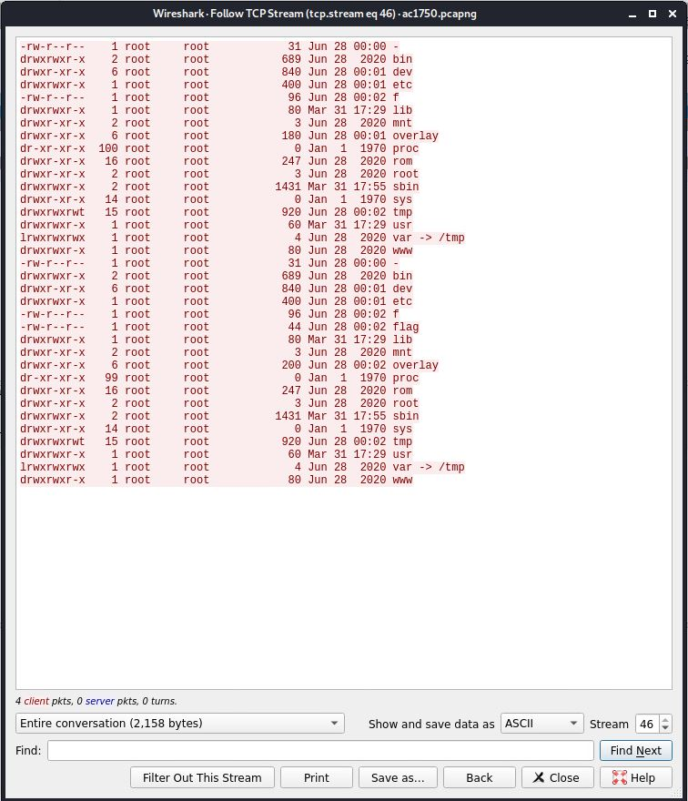
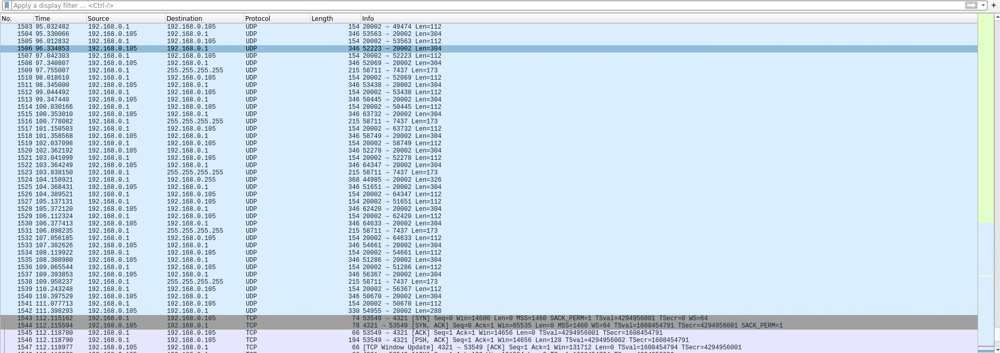
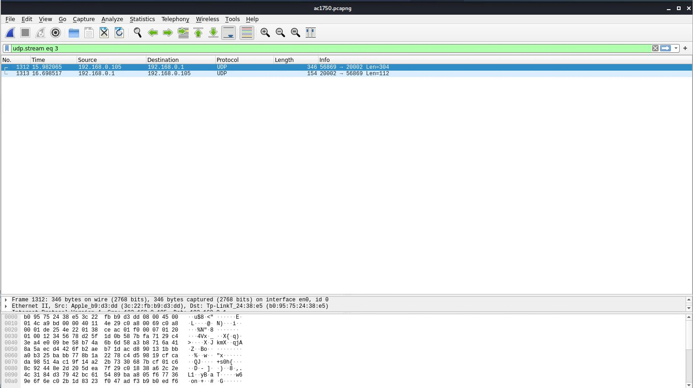
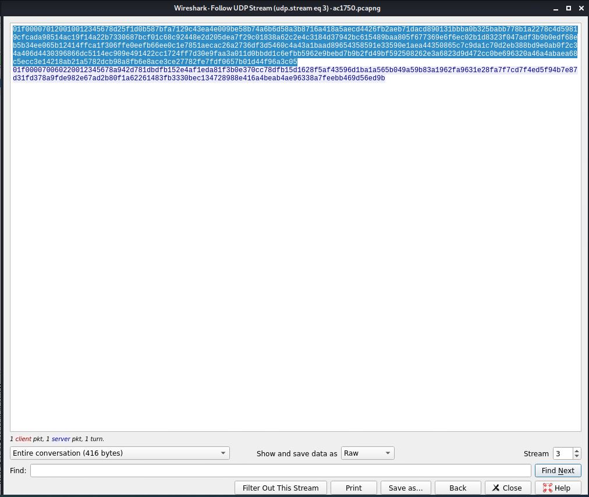
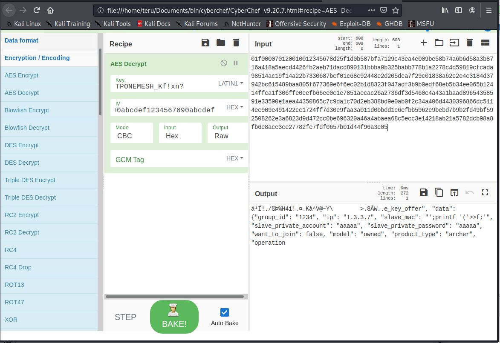

# HITCON CTF 2020 - AC1750
- Write-Up Author: Teru Lei \[[MOCTF](https://www.facebook.com/MOCSCTF)\]

- Flag: hitcon{Why_can_one_place_be_injected_twice}

## **Question:**
AC1750

>Challenge description
>My router is weird, can you help me find the problem?

Attachment: [ac1750.pcapng](./ac1750.pcapng)

## Write up
- We got a packet capture file and opened in Wireshark:



- First we tried to do some information collection first:
	1. In Wireshark, use “Export Objects” to export all HTTP objects:

	

	2. From the icon JPG file, this is communication with a tp-link device:

	

	3. Follow the HTTP stream of the HTTP connection, it’s found that the device model is “Archer C7”:

	

	

	4. Closed to the end of packet capture, follow the TCP stream of 4321 port, it’s found that the device should be compromised already with shell access:

	

	

	5. And it’s also a bit strange that some UDP stream were found just after the stream of shell access above:

	

-Up to this stage, let’s summarize what we gathered – it’s a tp-link device, model is “Archer C7” the device is comprised and there is strange traffic through port TCP 4321 and UDP 20002.

- After some research in Google, it’s pretty sure that the device is compromised by CVE-2020-10882. Although we cannot get the firmware version from the packet capture to verify but from the device model, traffic flow and the port used (UDP 20002), the exploit can be confirmed. Here is a good article for the details:
https://starlabs.sg/blog/2020/10/analysis-exploitation-of-a-recent-tp-link-archer-a7-vulnerability/

- According to the article, the exploit payload is in the UDP data stream, which properly including the flag. And one more useful information is that in the article it’s mentioned that the AES encryption key and IV for the UDP data stream is hard coded as:

```
decryptKey = "TPONEMESH_Kf!xn?gj6pMAt-wBNV_TDP"
ivec = "1234567890abcdef1234567890abcdef"
```

- With the information above, we can decrypt the paylod UDP data stream and get the exploit payload. We can use CyberChef to do it.

- Follow the UDP streams from the beginning of the UDP traffic start. (You can just change the number of “udp.stream eq x” for quick jump) Then copy the payload from 192.168.1.105 to CyberChef:





- In CyberChef, select “Encryption/Encoding”-> “AES Decrypt”, then input the encryption key and IV, since actually the AES encryption is only 128bit, so input the first 16 characters of the encryption key to the “Key” session is ok.



- The output part “printf” function is the payload (in the end you can find that the payload is through printf to save to file named “f”, then execute the file “f” to exploit. Follow the UDP stream one by one, you can get the full exploit code which include the flag:


> hitcon{Why_can_one_place_be_injected_twice}
