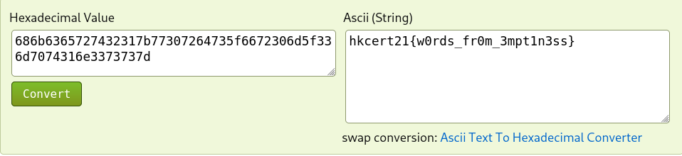

# HKCERT2021 - 無聲浪
- Write-Up Author: Ivan Mak \[[MOCTF](https://hackmd.io/JH0dysBTSx6H1o1PZ7OqWg)\]

- Flag: hkcert21{w0rds_fr0m_3mpt1n3ss}

## **Question:**
無聲浪

>Challenge description


Attachment: [waterwave.wav](./waterwave.wav)

## Write up
1. 先壓縮查看檔案

```
$ unzip the-wave-of-us_ed82d2616c9d118d8dc8637022902330.zip
Archive:  the-wave-of-us_ed82d2616c9d118d8dc8637022902330.zip
  inflating: waterwave.wav

$ file waterwave.wav
waterwave.wav: RIFF (little-endian) data, WAVE audio, Microsoft PCM, 16 bit, stereo 44100 Hz
```

大概就是一段 7 分鐘的海浪聲音頻

2. 到 Github 找工具

就是這個工具: https://github.com/toots/microsoft-audio-watermarking (提示也太好了吧)

3. 轉到 Windows

由於 wav 檔屬於 Windows 系統 (Google說的)，所以 Github 上那個 microsoft-audio-watermarking 工具大概也要在 Windows 上運行

4. 在 Windows 上執行 detect2003.exe

這個工具能找出音頻裡的浮水印

```
C:\Users\ank-windows>C:\Users\ank-windows\Downloads\microsoft-audio-watermarking-master\build\detect2003.exe C:\Users\ank-windows\Downloads\waterwave.wav
(c) Microsoft Corporation. All rights reserved.

Audio watermark detection (c) 1999 Microsoft Corp.
** CONFIDENTIAL AND PROPRIETARY **
Input file: C:\Users\ank-windows\Downloads\waterwave.wav
Number of channels = 2
Sampling frequency = 44100 Hz
Sound clip length = 7:00:000 (M:S:D) = 18522000 samples

Detecting watermarks...
Time=0.000sec [NC= 20.5352 WM=68]
Time=0.139sec [NC= 21.8987 WM=68]
Time=0.279sec [NC= 20.2259 WM=68]
Time=0.418sec [NC= 22.2163 WM=68]
Time=0.557sec [NC= 15.6691 WM=68]
Time=0.697sec [NC= 16.9104 WM=68]
Time=0.836sec [NC= 10.8752 WM=68]
Time=0.975sec [NC= 12.8074 WM=67]
Time=1.115sec [NC= 10.2325 WM=67]
Time=1.254sec [NC= 13.1657 WM=67]
Time=1.393sec [NC= 12.3803 WM=67]
Time=1.533sec [NC=  8.6073 WM=67]
Time=1.672sec [NC= 11.2524 WM=67]
Time=1.811sec [NC=  8.0517 WM=67]
Time=1.950sec [NC=  4.2887 WM=AA]
Window=0 Watermark Detected [NC= 21.4470 WM=68]
...
...略...
...
Time=402.631sec [NC=  7.3933 WM=0F]
Time=402.770sec [NC=  4.5501 WM=0F]
Window=36 Watermark Detected [NC= 21.0468 WM=00]
Window=37 Watermark Not Detected.
End of audio clip reached.

Elapsed time: 11.4 seconds = 2.713% of real time.
[Detection time: 3.6 seconds = 0.857% of real time.]
```
其中找出共 37 個浮水印，WM 就是我們想要的值，不過是 16 進位

比如第一個是 WM=68，第二個是 WM=6B，一直到 WM=00 結束

5. 整理一下

```
Window=0 Watermark Detected [NC= 21.4470 WM=68]
Window=1 Watermark Detected [NC= 20.7645 WM=6B]
Window=2 Watermark Detected [NC= 20.9934 WM=63]
Window=3 Watermark Detected [NC= 21.0645 WM=65]
Window=4 Watermark Detected [NC= 20.8079 WM=72]
Window=5 Watermark Detected [NC= 20.7325 WM=74]
Window=6 Watermark Detected [NC= 20.8660 WM=32]
Window=7 Watermark Detected [NC= 20.6942 WM=31]
Window=8 Watermark Detected [NC= 20.8620 WM=7B]
Window=9 Watermark Detected [NC= 20.7891 WM=77]
Window=10 Watermark Detected [NC= 20.7809 WM=30]
Window=11 Watermark Detected [NC= 21.1518 WM=72]
Window=12 Watermark Detected [NC= 20.8987 WM=64]
Window=13 Watermark Detected [NC= 20.9555 WM=73]
Window=14 Watermark Detected [NC= 20.9826 WM=5F]
Window=15 Watermark Detected [NC= 20.6296 WM=66]
Window=16 Watermark Detected [NC= 20.8089 WM=72]
Window=17 Watermark Detected [NC= 20.8309 WM=30]
Window=18 Watermark Detected [NC= 20.6502 WM=6D]
Window=19 Watermark Detected [NC= 20.6745 WM=5F]
Window=20 Watermark Detected [NC= 20.9663 WM=33]
Window=21 Watermark Detected [NC= 20.6181 WM=6D]
Window=22 Watermark Detected [NC= 20.4951 WM=70]
Window=23 Watermark Detected [NC= 20.9045 WM=74]
Window=24 Watermark Detected [NC= 20.6903 WM=31]
Window=25 Watermark Detected [NC= 20.8252 WM=6E]
Window=26 Watermark Detected [NC= 20.8705 WM=33]
Window=27 Watermark Detected [NC= 20.8613 WM=73]
Window=28 Watermark Detected [NC= 20.8169 WM=73]
Window=29 Watermark Detected [NC= 20.7803 WM=7D]
Window=30 Watermark Detected [NC= 20.8448 WM=00]
Window=30 Watermark Detected [NC= 20.8448 WM=00]
Window=31 Watermark Detected [NC= 20.9327 WM=00]
Window=32 Watermark Detected [NC= 20.9149 WM=00]
Window=33 Watermark Detected [NC= 20.6806 WM=00]
Window=34 Watermark Detected [NC= 20.8183 WM=00]
Window=35 Watermark Detected [NC= 20.8318 WM=00]
Window=36 Watermark Detected [NC= 21.0468 WM=00]

```

- 6. 十六進位轉 ASCII



> hkcert21{w0rds_fr0m_3mpt1n3ss}
