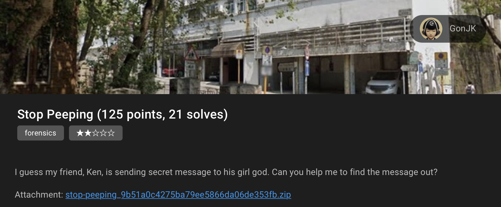
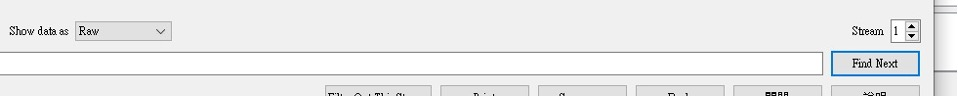
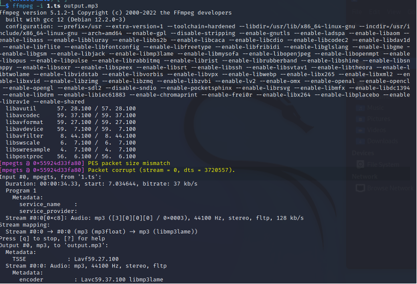
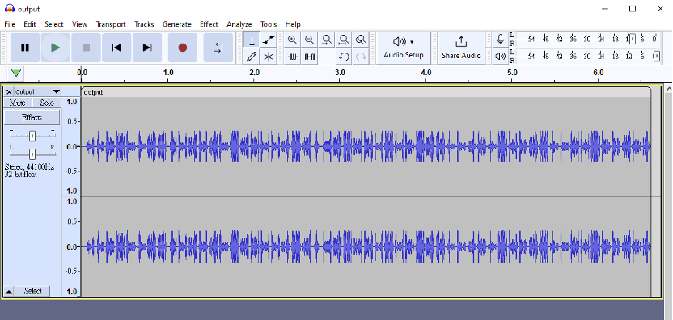
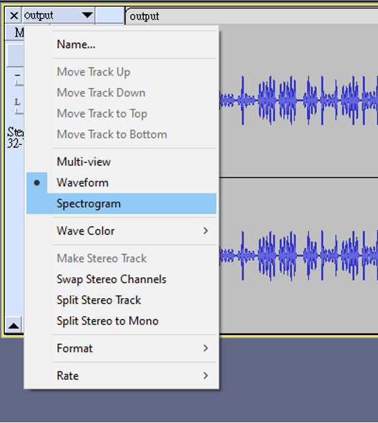
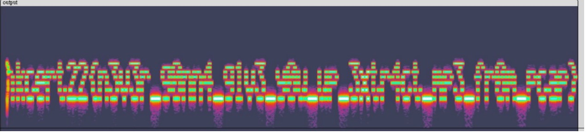

# HKCERT2022 - Places to Check-in
- Write-Up Author: Chloe Ao

- Flag: hkcert22{n3v3r_g0nn4_g1v3_y0u_up_3xtr4ct_mp3_fr0m_pcap}

## **Question:**
Places to Check-in (125 points)

>Challenge description



Attachment: [stream.pcapng](./stream.pcapng)


## Write up
First, we got the pcap file and we can open it in WireShark and see the protocol is MPEG TS, we can select a stream and convert a captured IP stream file to a TS file.
 
Analyze->follow->UDP Stream



Then select show the data as “Raw” and extract as a TS file by Steam 1 & 0. Then we got two audio files.

The audio-related CTF challenges mainly use steganography techniques.
We tried using binwalk command, but there was nothing interesting.

We can use Audacity try to view the waveform pattern of an audio file to find something strange. So we use ffmpeg to extract the mp3 format for analysis

```
ffmpeg -i 1.ts output.mp3   
```



Then we load the file in Audacity and does find any interested in Waveform



Then we select the view to spectrogram



That’s great! We got the flag!



> hkcert22{n3v3r_g0nn4_g1v3_y0u_up_3xtr4ct_mp3_fr0m_pcap}
