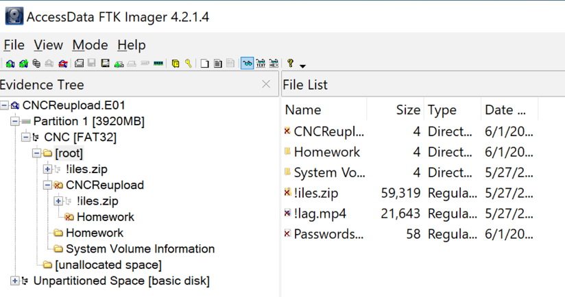
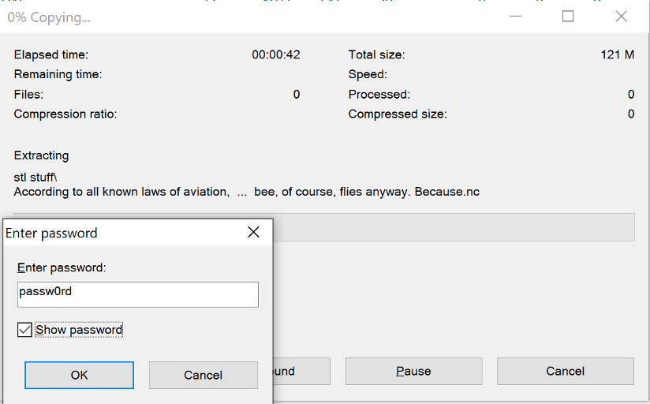
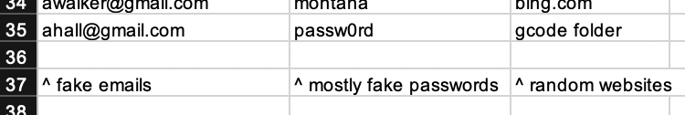
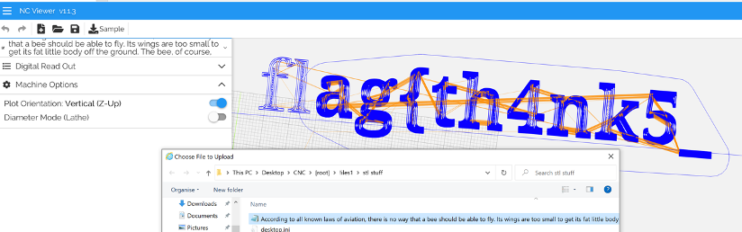
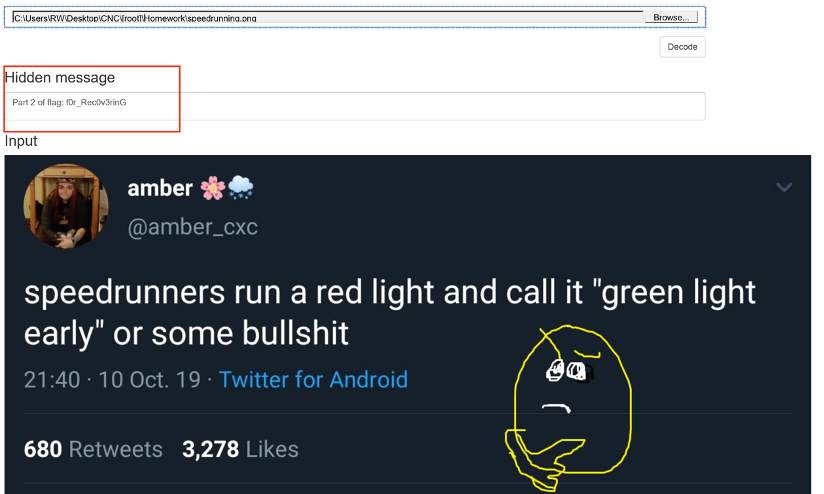
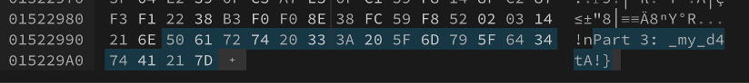

# HSCTF2020 – CNC

- Write-Up Author: molamola \[[MOCTF](https://www.facebook.com/MOCSCTF)\]

- Flag:**flag{th4nk5_ f0r_Rec0v3rinG_my_d4tA!}**

## **Question:**
>CNC

```
My Friend gave me a flash drive so i could help him machine out some points with my CNC machine for a project he's working on. However, he deleted all of the files. I think there's also a few things he's hidden within the files he's previously deleted in the flash drive... can you help me recover his secrets from this image of his drive?

Flag is in 3 parts.

There has been a reupload, but the solution and flag have not been changed.

Author: AC 

Hits:
Have you tried a variety of steganography techniques on the files?

Attachment:
CNCReupload.E01
```
[CNCReupload.E01](https://drive.google.com/drive/folders/1ihcA3TJhFypeM9cPJMqYY28A5fVS6VRQ?usp=sharing)

## Write up
>Open “CNCReupload.E01” by using FTK viewer, shows deleted files and recover them.



>Open “!iles.zip” but locked, found the password in “PasswordsNew.xlsx”




>Found flag part1 by using online NC viewer. Part 1 flag “flag{th4nk5_”



>Found flag part2 in “speedrunning.png” by using steganography technique, Part 2 flag “f0r_Rec0v3rinG”




>Finial, found flag part3 while inspect “!lag.mp4” with hex editor. Part 3 flag “_my_d4tA!}”



>Flag: flag{th4nk5_ f0r_Rec0v3rinG_my_d4tA!}