# HSCTF2020 – Picture Lab

- Write-Up Author: Teru Lei \[[MOCTF](https://www.facebook.com/MOCSCTF)\]

- Flag:**flag{and_y0u_thought_p1ctur3_l4b_was_h4rd}**

## **Question:**
>Picture Lab

```
Dear APCSA students,

you thought you were done with Picture Lab.
Unfortunately, you were wrong.
We're sorry. We should not have pushed this challenge in the middle of a very serious "Catch-The-Flag" competition. We originally wrote this challenge as a joke, hoping that it would poke fun at Collegeboard's APCSA "Picture Lab"; however, we now realize that this decision was insensitive and outright disrespectful to all those who have to solve the challenge. In the futune, we promise that our challenges will not make you suffer as much as this trivial challenge does. We apologize in advance to all those who will suffer at the hands of this beginner-level challenge. I hope you are able to forgive us.

Sincerely,
AC/PMP/JC

Attachment: 
mogodb
PictureLabStudentGuide.pdf

```
[attachment](https://drive.google.com/drive/folders/1Sfx1Ox2FYQsIMQFP-BjNSHXlO5slIdTE?usp=sharing)

## Write up
>Although from the filename “mogodb” it may be a bit confused that it’s a mongodb file. From the question and the attached PDF file. It’s high chance that the file is a PNG file.
For inspection and fixing a PNG file, a tool called “pngcheck” is usefully very helpful. There are both Windows and Linux version. First we use the tool to inspect the file:

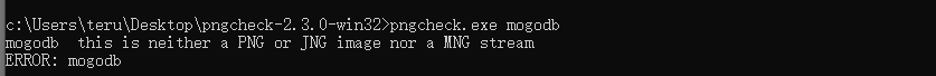

>The file seems corrupted. In order to fix the file, we need to modify the corrupted bytes with a hex editor. For Windows, we may download XVI32 and for Kali Linux, there is embedded tool hexeditor. In the document, we use XVI32 in Windows:

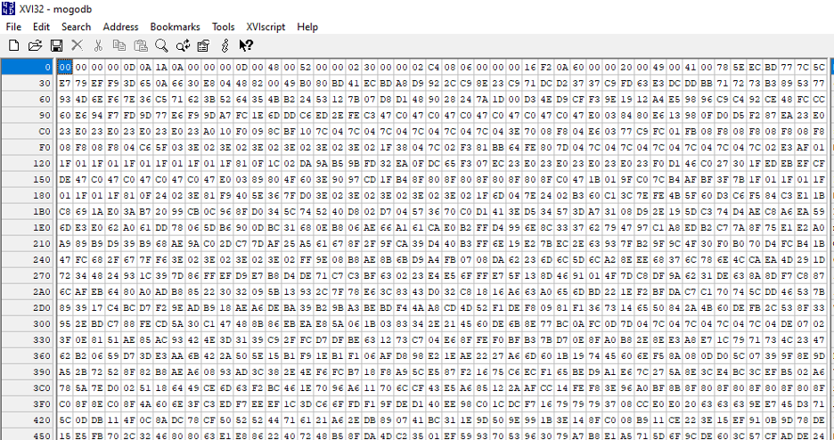

>In order to fix the file, we need to know PNG file format to recover the corrupted bytes. We can refer to the below documents:
https://en.wikipedia.org/wiki/Portable_Network_Graphics

http://www.libpng.org/pub/png/spec/1.2/PNG-Structure.html

>First, we need to fix the PNG file header.

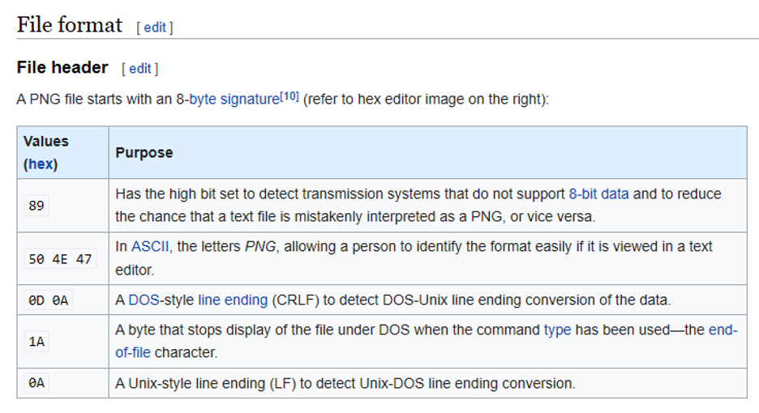

>Fill the 8 bytes above to the file in hex editor:

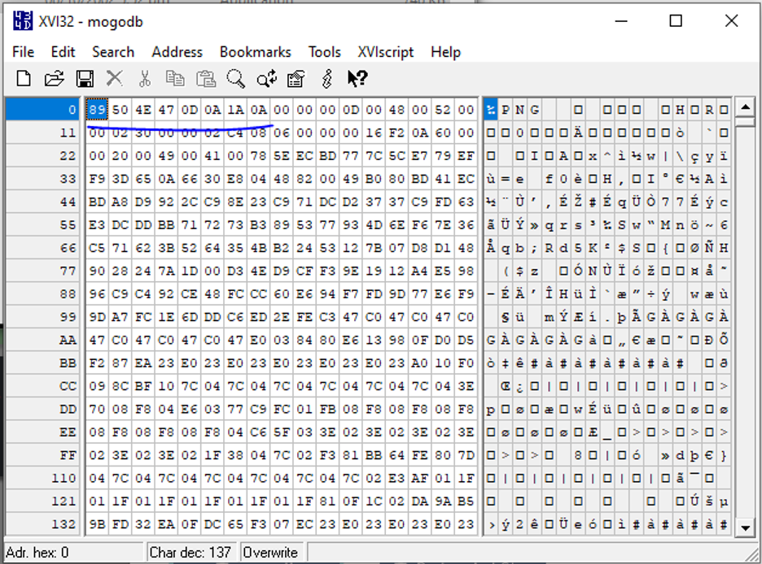

>Next is about the chunks in the file:

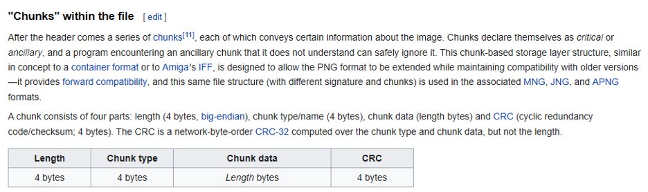

>After the 8 bytes of PNG file header (which we just fixed) plus 4 bytes for the length of first chunk, the next 4 bytes represent “Chunk type”.

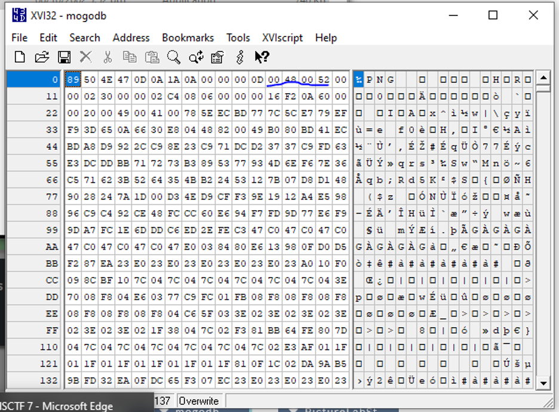

>With converting the chunk types mentioned in the first reference URL mentioned above, the hex values are as below:
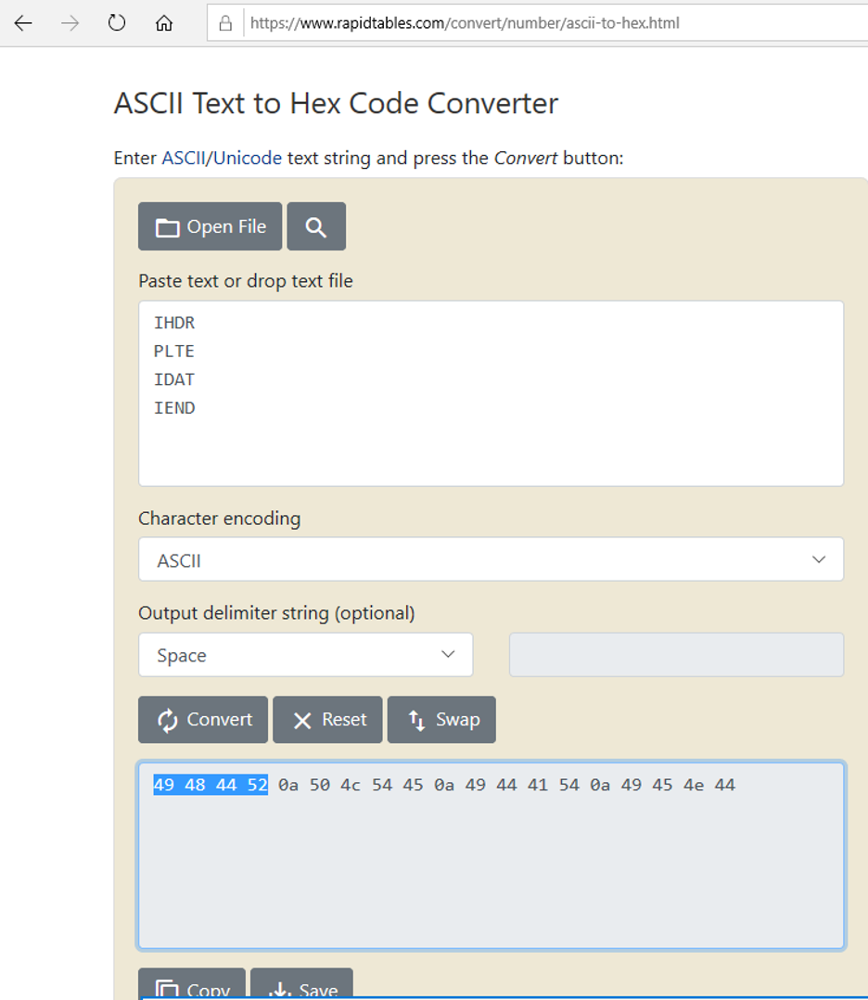

>Since the bytes of chunk type in the corrupted document is “00 48 00 52”, by comparing the hex value we can get to know that the chunk type has higher chance to be IHDR (which has hex “49 48 44 52”). Let’s modify the chunk type bytes and save the file, then use tool pngcheck to check again.

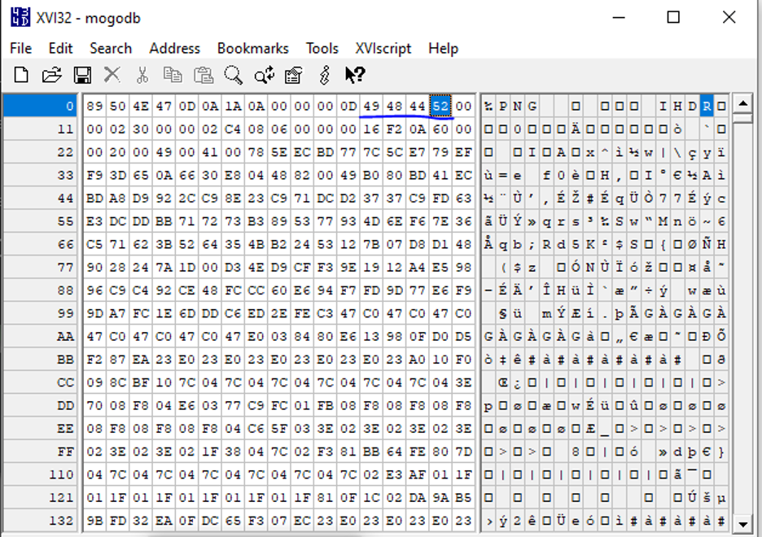
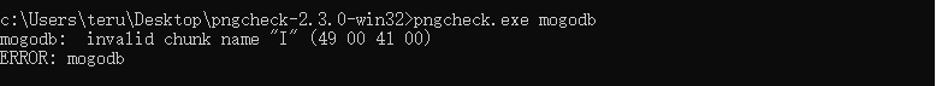

>This time the error is different. There is invalid chunk name “I” (49 00 41 00) in the file. We can search the hex value in XVI32 to locate the position of the chunk name:

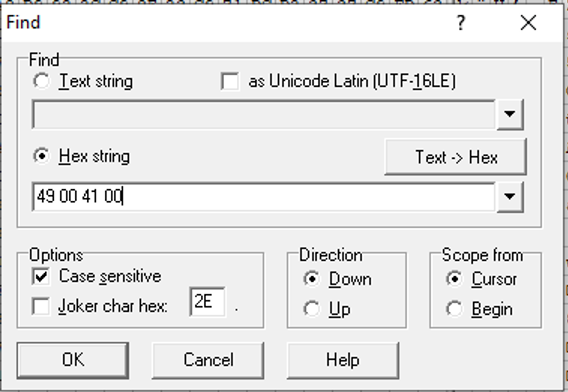
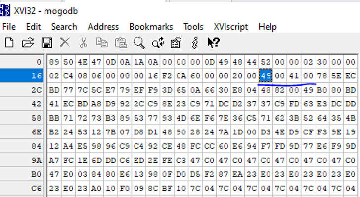

>We got the corrupted chunk type name again. Compare to the chunk type names to corresponding hex again, the chunk type name should be “IDAT” (49 44 41 54). Then we can fix the chunk type name.

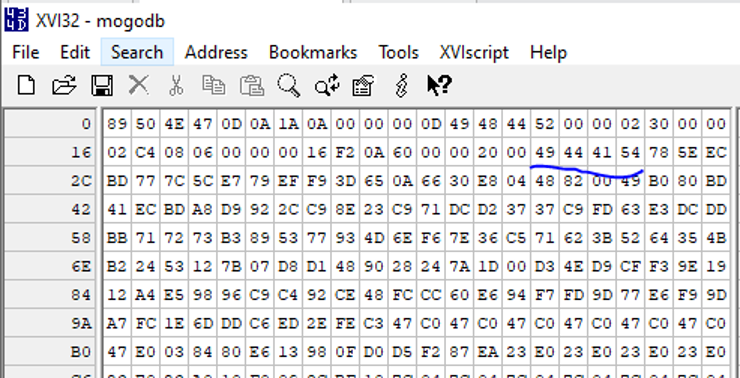

>Use pngcheck to check again:

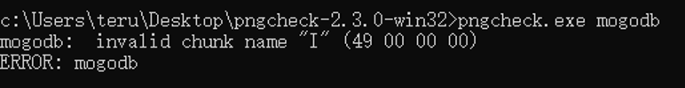

>This time the corrupted chunk name with hex 49 00 00 00. We use XVI32 to check again:

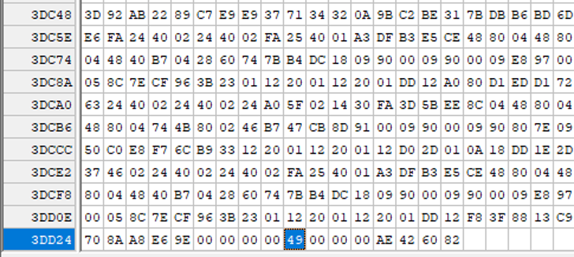
>It’s at the end of the document. The chunk needs to be IEND to indicate end of the file. Now we change the chunk type name hex to 49 45 4e 44:

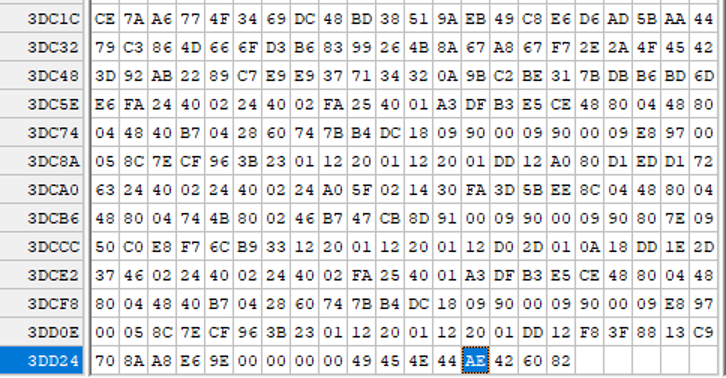
>Again, use pngcheck to check the file again:

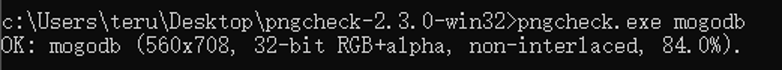

>All looks good now. Let’s rename the file to mogodb.png, then open the file:

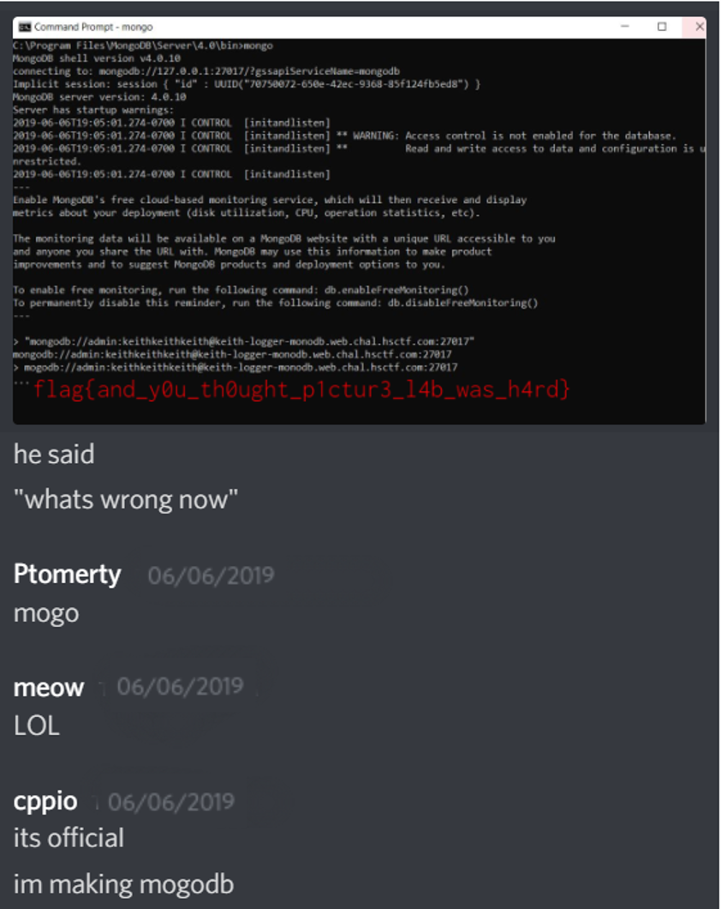

>Bingo! We get the flag!

