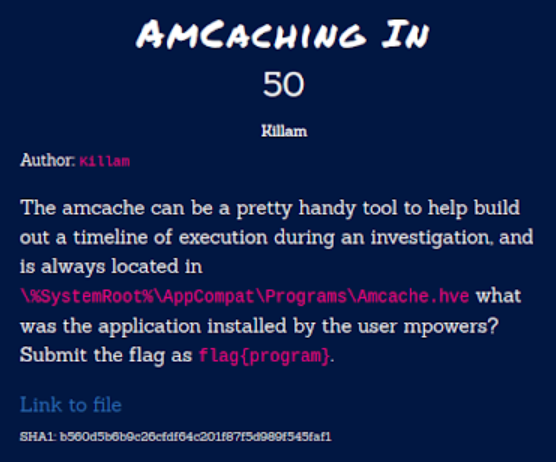
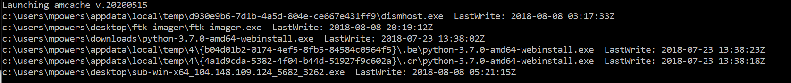

# Hacktober2020 - Amcaching in

- Write-Up Author: Rb916120 \[[MOCTF](https://www.facebook.com/MOCSCTF)\]

- Flag:flag{python}

## **Question:**
Amcaching in



[FOR03.zip](./FOR03.zip)

## Write up
**First, below tool required in this article.**</br>
[regRipper](https://github.com/keydet89/RegRipper3.0) -  Great Tool to Parse Windows Registry files, using either a single module, or a profile.</br>

**reference**:
[The Value of Shimcache for Investigators](https://www.fireeye.com/blog/threat-research/2015/06/caching_out_the_val.html)


The chall provide a [AMCache](https://forensicswiki.xyz/wiki/index.php?title=AMCache) file and ask for the program name that installed by "mpowers". To parase Registry file we can use [regRipper](https://github.com/keydet89/RegRipper3.0).
```
Shimcache/Amcache records basic info about the last several (max 1024) executables that ran. 
If you collect this list frequently, you can use it to build a list of executable filenames 
and locations that run on each system. Shimcache is the older implementation. 
Starting with Windows 8 and Server 2012, it was replaced by Amcache. 
The format is very different, since Amcache has lots more info it can provide, but the intent is the same.es.
```

then we leverage regRipper with amcache plug-in to extract the log and grep the keyword
cmd command:
```batch
rip -r G:\Users\Kit\Downloads\FOR03\Amcache.hve -p amcache | find "mpowers"
```


easy to guess user mpowers are installing python at the moment.
>flag{python}