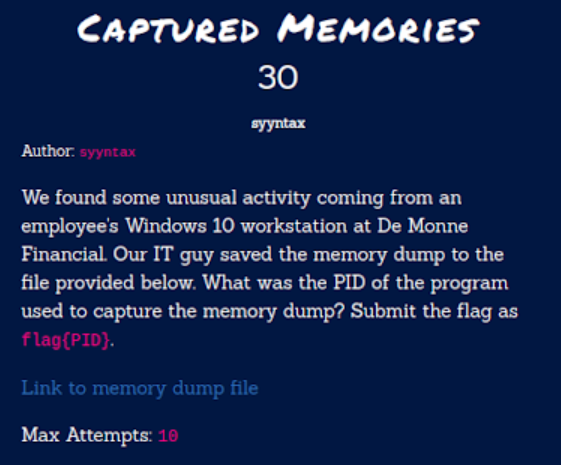
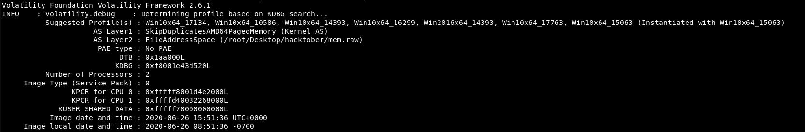
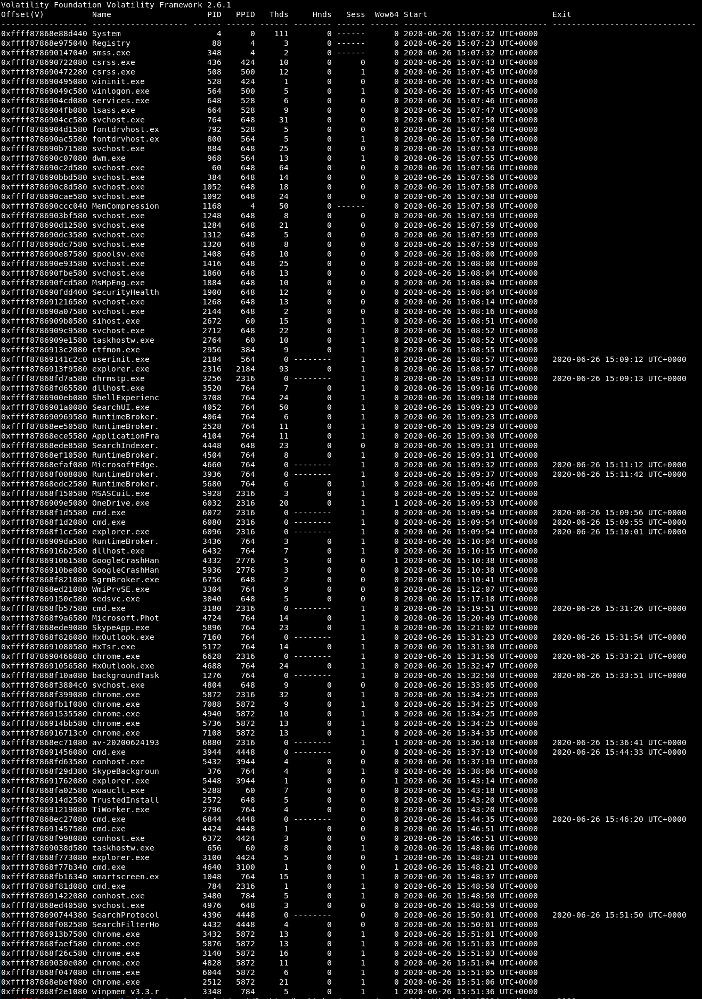

# Hacktober2020 - Captured Memories

- Write-Up Author: Rb916120 \[[MOCTF](https://www.facebook.com/MOCSCTF)\]

- Flag:flag{3348}

## **Question:**
Captured Memories



[Mem dump](https://drive.google.com/file/d/1hiRB_RQqMF0j_QFzfV2D2qqYQbSyrkLM/view?usp=sharing)

## Write up
**First, below tool required in this article.**</br>
[volatility](https://www.volatilityfoundation.org/) -  a great tools to let people performed completely independent of the system being investigated but offer visibility into the runtime state.
of the system

First, the challenge ask for a PID of a memory dump program and given a memory dump file.Then [volatility](https://www.volatilityfoundation.org/) would be the best choice for this chall.</br>

determinate which profile fit this memory dump.

```shell
vol.py -f '/root/Desktop/hacktober/mem.raw' imageinfo
```



Then, we can list the process detail with *pslist* command.

```
vol.py -f '/root/Desktop/hacktober/mem.raw' --profile=Win10x64_17134 pslist
```


search around with the list, winpmem is a tools use to dump memory.

>flag{3348}