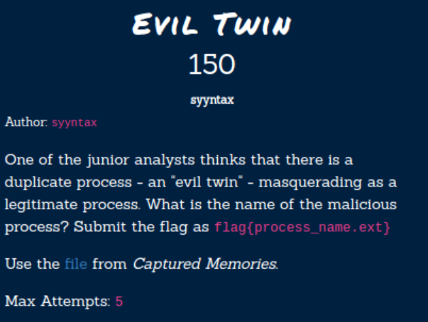

# Hacktober2020 - Evil Twins

- Write-Up Author: Rb916120 \[[MOCTF](https://www.facebook.com/MOCSCTF)\]

- Flag:flag{explorer.exe}

## **Question:**
Evil Twins



[Mem dump](https://drive.google.com/file/d/1hiRB_RQqMF0j_QFzfV2D2qqYQbSyrkLM/view?usp=sharing)

## Write up
**First, below tool required in this article.**</br>
[volatility](https://www.volatilityfoundation.org/) -  a great tools to let people performed completely independent of the system being investigated but offer visibility into the runtime state.
of the system

**reference:**
[SANS Evil Hunt Poster](https://digital-forensics.sans.org/media/DFPS_FOR508_v4.6_4-19.pdf)

First, the challenge ask duplicate process name and given a memory dump file.Then [volatility](https://www.volatilityfoundation.org/) would be the best choice for this chall.</br>

determinate which profile fit this memory dump.

```shell
vol.py -f '/root/Desktop/hacktober/mem.raw' imageinfo
```


Then, we can list the process tree with *pstree* command.

```
vol.py -f '/root/Desktop/hacktober/mem.raw' --profile=Win10x64_17134 pstree
```


look at the result, 2 parts suspected. multiple explorer.exe and cmd.exe. compare to my own windows, the parent process or explorer.exe shoule be userinit.exe</br>
for more info can be found here [SANS Evil Hunt Poster](https://digital-forensics.sans.org/media/DFPS_FOR508_v4.6_4-19.pdf).

>flag{explorer.exe}