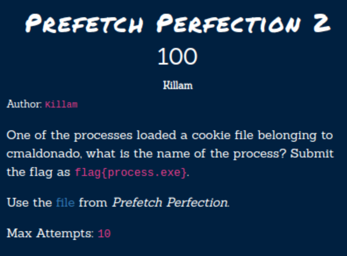
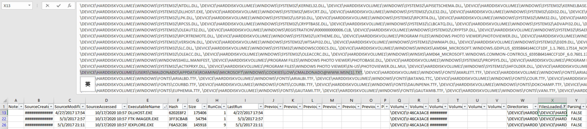

# Hacktober2020 - Prefetch Perfection 2

- Write-Up Author: Rb916120 \[[MOCTF](https://www.facebook.com/MOCSCTF)\]

- Flag:flag{dllhost.exe}

## **Question:**
Prefetch Perfection 2



[prefetch.zip](./prefetch.zip)

## Write up
**First, below tool required in this article.**</br>
[PECmd](https://github.com/EricZimmerman/PECmd) -  Great Prefetch parser which can parse the timeline to csv</br>
[SANS DFIR Poster](https://digital-forensics.sans.org/media/poster-windows-forensics-2015.pdf)</br>
[SANS windows forensic analysis poster](https://www.sans.org/security-resources/posters/windows-forensic-analysis/170/download)</br>
[Eric Zimmerman's Tools](https://ericzimmerman.github.io/#!index.md) - This guy developed a lot of tools to forensic tools to save our life.Thanks Eric!

Same as Prefetch Perfection.[Prefetch files](https://forensicswiki.xyz/wiki/index.php?title=Prefetch) are another handy tool to show evidence of exection.</br>
```
Prefetch files are designed to speed up the application startup process.
contain the name of the executable, 
a Unicode list of DLLs used by that executable, 
a count of how many times the executable has been run, 
and a timestamp indicating the last time the program was run.
```

We can use PECmd to parase the 
```
PECmd.exe -d "C:\location\to\prefetch" --csv .
```
Then we got 2 output file

*timestamp_PECmd_Output.csv* - detailed access log and timestamp of the process

*timestamp_PECmd_Output_timeline.csv* - last launch time of the process

This chall ask for the process name that loaded *cmaldonado's* cookies</br>

```
Cookies

Cookies give insight into what websites have been visited and what
activities may have taken place there.

Internet Explorer
• IE6-8 %USERPROFILE%\AppData\Roaming\Microsoft\Windows\Cookies
• IE10 %USERPROFILE%\AppData\Roaming\Microsoft\Windows\Cookies
• IE11 %USERPROFILE%\AppData\Local\Microsoft\Windows\INetCookies

Firefox
• XP %USERPROFILE%\Application Data\Mozilla\Firefox\Profiles\<random text>.default\cookies.sqlite
• Win7/8/10 %USERPROFILE%\AppData\Roaming\Mozilla\Firefox\Profiles\<randomtext>.default\cookies.sqlite

Chrome
• XP %USERPROFILE%\Local Settings\ApplicationData\Google\Chrome\User Data\Default\Local Storage
• Win7/8/10 %USERPROFILE%\AppData\Local\Google\Chrome\UserData\Default\Local Storage
```
reference:[SANS DFIR Poster](https://digital-forensics.sans.org/media/poster-windows-forensics-2015.pdf)

thus our key word would be "cmaldonado" ,"Cookies" and "AppData" and search in "FilesLoaded" column.


>flag{dllhost.exe}
