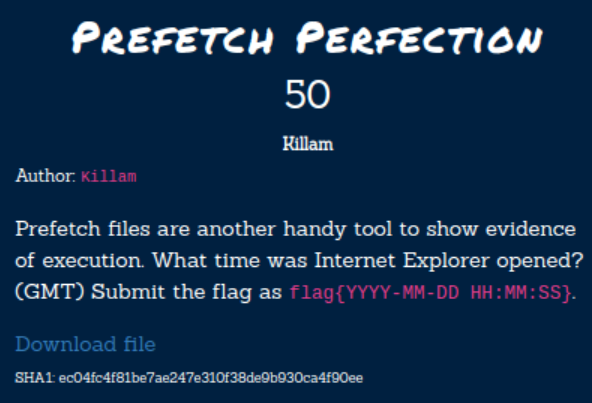
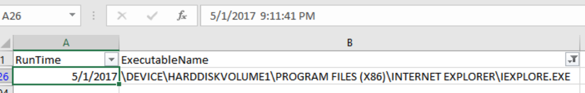

# Hacktober2020 - Prefetch Perfection

- Write-Up Author: Rb916120 \[[MOCTF](https://www.facebook.com/MOCSCTF)\]

- Flag:flag{2017–05–01 21:11:41}

## **Question:**
Prefetch Perfection



[prefetch.zip](./prefetch.zip)

## Write up
**First, below tool required in this article.**</br>
[PECmd](https://github.com/EricZimmerman/PECmd) -  Great Prefetch parser which can parse the timeline to csv

[Eric Zimmerman's Tools](https://ericzimmerman.github.io/#!index.md) - This guy developed a lot of tools to forensic tools to save our life.Thanks Eric!

First, the description given a big hints.[Prefetch files](https://forensicswiki.xyz/wiki/index.php?title=Prefetch) are another handy tool to show evidence of exection.</br>
```
Prefetch files are designed to speed up the application startup process.
contain the name of the executable, 
a Unicode list of DLLs used by that executable, 
a count of how many times the executable has been run, 
and a timestamp indicating the last time the program was run.
```

we can use PECmd to parase the 
```
PECmd.exe -d "C:\location\to\prefetch" --csv .
```
then we got 2 output file

*timestamp_PECmd_Output.csv* - detailed access log and timestamp of the process

*timestamp_PECmd_Output_timeline.csv* - last launch time of the process

search for IEXPLORE.EXE


>flag{2017–05–01 21:11:41}
