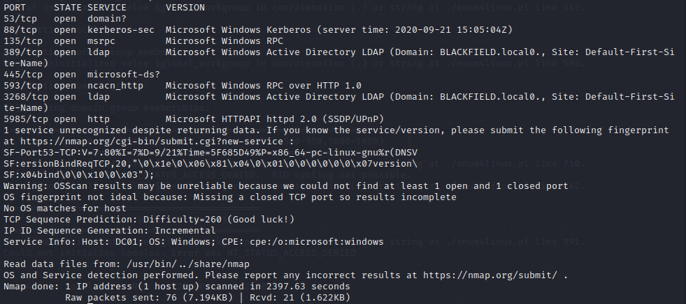
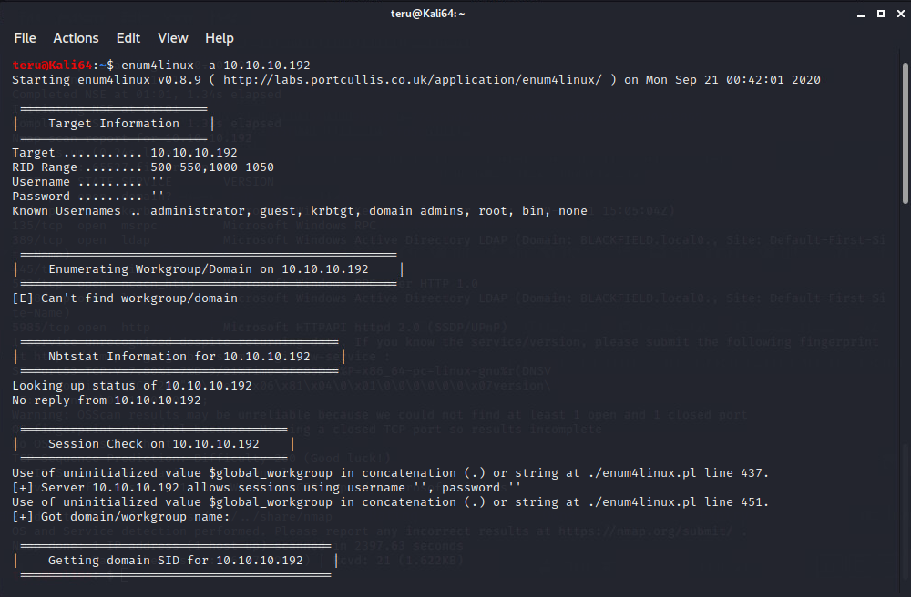
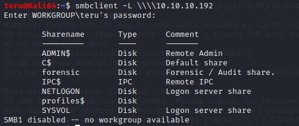
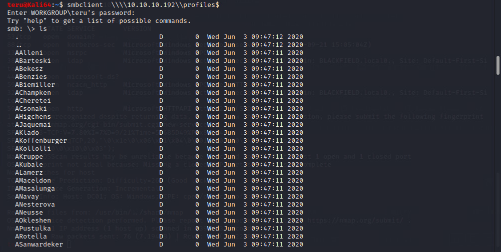
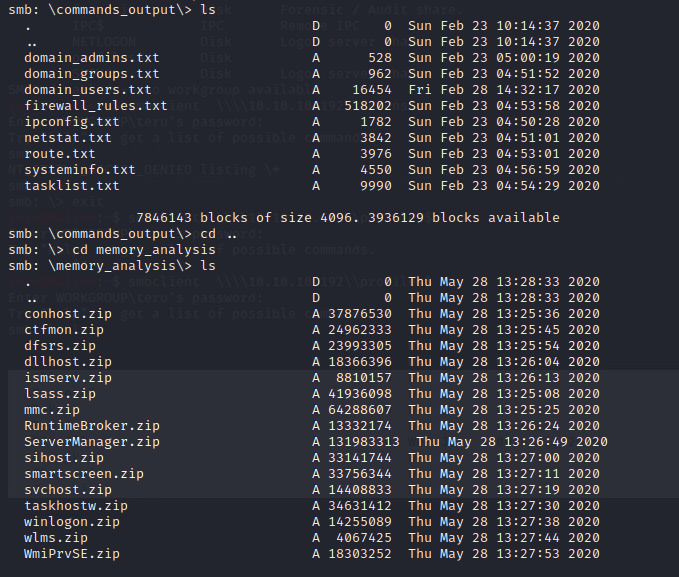
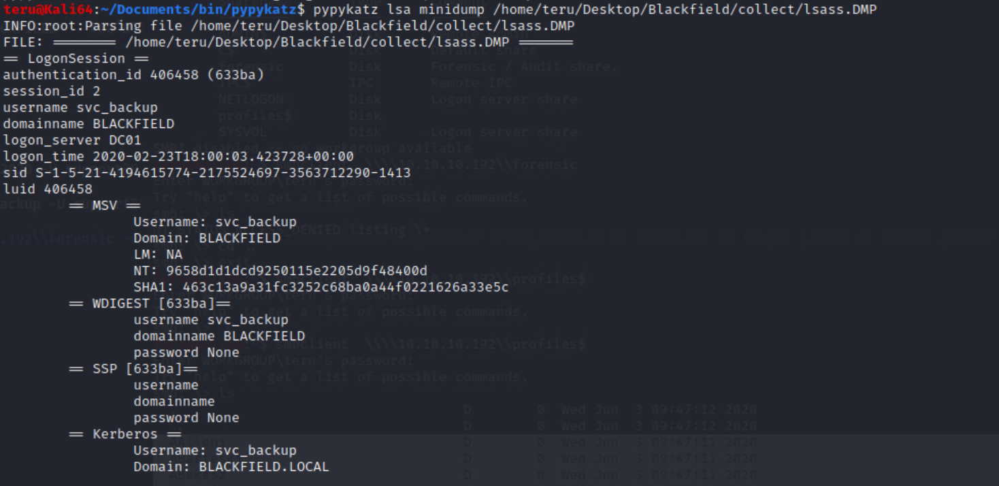
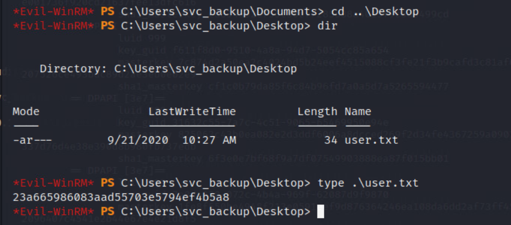
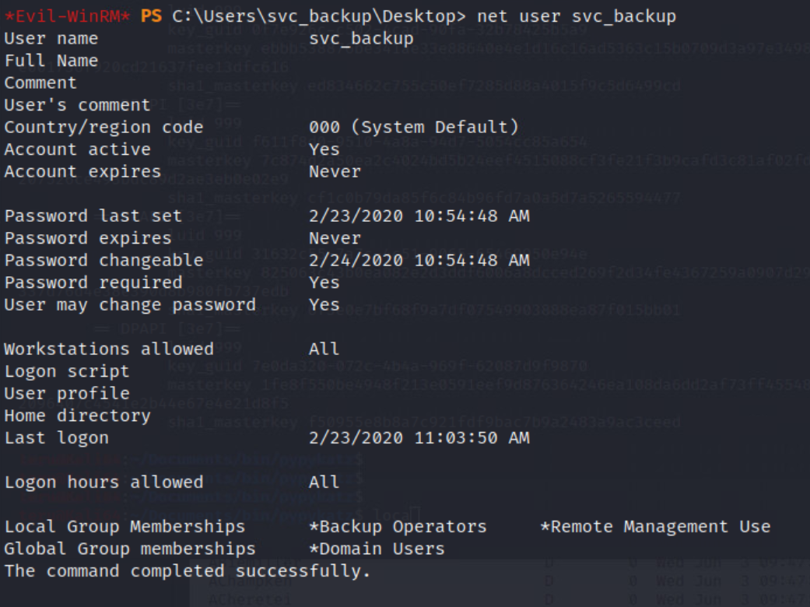
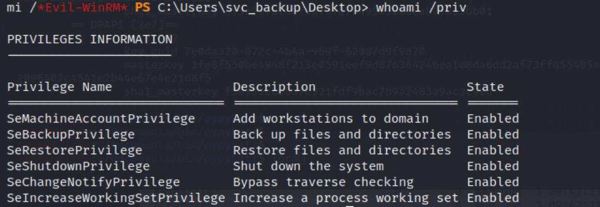
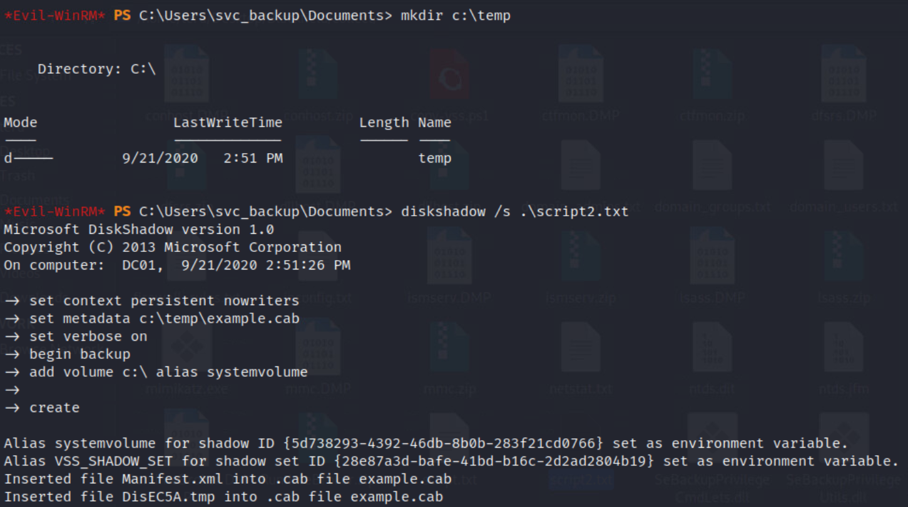

# HackTheBox – BlackField

- Write-Up Author: Teru Lei \[[MOCTF](https://www.facebook.com/MOCSCTF)\]

## **Question:**
> BlackField
```
	OS: Windows
	Difficulty: Hard
	Points:	40
	Release: 06,Jun,2020
```

## Write up
### 1. Enumeration:
>Use &#39;nmap&#39; to list the ports open:

```shell
Nmap -sT -sV -O -Pn -p1-65535 -v 10.10.10.192
```



From the output, we can get to know that it&#39;s likely a Windows Domain Controller (through DNS, Kerberos and LDAP ports), with SMB and WinRM opened.

> Try to use enum4linux to get more information for SMB service:



Nothing special was found except that we got the domain name is called &#39;BlackField&#39;.

> Use &#39;smbclient&#39; to try to list SMB share:



Interesting, there are 2 non-default sharing &#39;forensic&#39; and &#39;profiles$&#39;.

> Tried to access the 2 non-default SMB share. Folder forensic cannot be accessed but profiles$ is able to access. We can guess that this share is a backup of user profiles and normally the profile folder name is equal to user login name. Then we can capture the output of &#39;ls&#39; command of the profiles$, cut other information and get the list of potential users, which will be the attached list:





### 2. Penetration Strategy:
> According to the information gathered, we got to know that the target is to compromise the domain. We have the user list (a list of account login name), and a list of SMB share but we don&#39;t have any password available. We may consider performing brute force but it&#39;s not a good idea. We can try to get a valid password if possible, then see if we can elevate the account privilege. Specially in the user list, we can see accounts called &#39;support&#39;, &#39;audit2020&#39; and in the SMB share there is a share called &#39;forensic&#39; which should be linked to &#39;audit2020&#39; account and contain other sensitive information by its name implied.

### 3. Get Low Privilege User:

> Use &#39;GetNPUser.py&#39; under Impacket to see if there is any user with &#39;required Kerberos pre-authentication&#39; disabled (refer to: [https://social.technet.microsoft.com/wiki/contents/articles/23559.kerberos-pre-authentication-why-it-should-not-be-disabled.aspx](https://social.technet.microsoft.com/wiki/contents/articles/23559.kerberos-pre-authentication-why-it-should-not-be-disabled.aspx) for details), which may be caused by requirement of some legacy application. If so, then we can get the hash of that user:


Great! We get the hash of use &#39;support&#39;. And verify &#39;audit2020&#39; and &#39;svc\_backup&#39; are valid users. Then try to use john the ripper to do offline crack of the hash:


The password of user &#39;support&#39; is cracked, which is &#39;#00^BlackKnight&#39;.

> Use the support credential to play around, seems there is no special found, the support account cannot further access the SMB share. But considering that in general one of the common functions of support account is --- to reset password. So let&#39;s try to reset user &#39;audit2020&#39; account password and if it&#39;s successful, it&#39;s likely that we can access &#39;forensic&#39; share to get more sensitive information. To change user password, we can use &#39;net rpc password&#39; command:


> Seems successfully changed password, let&#39;s try login using smbclient:


As expected, &#39;audit2020&#39; can access the SMB share &#39;forensic&#39;.

> When access commands\_output and memory\_analysis, there are many interesting files found. Let&#39;s dump to local for further investigation. (There are some other tools for remote investigation. In this case we just dump the file to local for easy investigation. Command &#39;mget&#39; can be used to dump the files in a directory in one shoot)




> After unzip the files, it&#39;s DMP files, which is memory dump files, include a file &#39;lsass.DMP&#39;, it&#39;s possible that this is a dump from lsass.exe, which has high chance to include hash of password (for detail: [https://en.wikipedia.org/wiki/Local\_Security\_Authority\_Subsystem\_Service](https://en.wikipedia.org/wiki/Local_Security_Authority_Subsystem_Service)). To inspect lsass.DMP, we can use pypykatz in Kali Linux (mimikatz also include this function, but in my Kali Linux, I cannot run mimikatz with wine. Other tools, like crackexecmap can be considered also)




Great! We got the hash of svc\_backup account (In the dump there is hash for Administrator also, but after checking the hash is not valid, most likely the password of Administrator has been changed after the memory dump)

> Now we have the hash of svc\_backup account, from the name it&#39;s high possible for backup service, which should be a high privilege account. From the enumeration, WinRM service is available, and it&#39;s possible to get a shell with WinRM if we have the required privilege with tool (e.g. Evil-winrm).




Got the user flag from svc\_backup account Desktop folder.

### 4. Get Administrator Access:

> Check the user groups svc\_backup belongs to:





As expected, svc\_backup belongs to &#39;Backup Operators&#39; group.

> Since the user is backup operator, it can be used for backup files. And as mentioned in this link: [https://decoder.cloud/2018/02/12/the-power-of-backup-operatos/](https://decoder.cloud/2018/02/12/the-power-of-backup-operatos/) , actual the privilege is possible to be abused if not managed properly. Moreover, the machine is a Domain Controller, which include the Active Directory database. The ntds.dit file in Windows\ntds folder contain all user password hash. So if we can leverage Backup Operators privilege to dump ntds.dit and get the hash of Administrator account, we can use the hash to login to the machine and get full system control. For Backup Operators account, the key is SeBackupPrivilege and the SeRestorePrivilege, but it&#39;s disabled by default ([https://serverfault.com/questions/990231/windows-backup-operators-and-network-access](https://serverfault.com/questions/990231/windows-backup-operators-and-network-access)). However there is tool to enable the privilege in PowerShell: [https://github.com/giuliano108/SeBackupPrivilege/tree/master/SeBackupPrivilegeCmdLets/bin/Debug](https://github.com/giuliano108/SeBackupPrivilege/tree/master/SeBackupPrivilegeCmdLets/bin/Debug) , download the two dll in the URL, the follow this URL to import the PowerShell modules: [https://github.com/giuliano108/SeBackupPrivilege](https://github.com/giuliano108/SeBackupPrivilege) , then Set-SeBackupPrivilege.


> Next we need a tool to copy ntds.dit. Since the original ntds.dit file is locked in Domain Controller. There need to be an indirect way to copy the file. The most simple way is through shadow copy. &#39;diskshadow&#39; is a tool can do the job (reference link: [https://pentestlab.blog/tag/ntds-dit/](https://pentestlab.blog/tag/ntds-dit/)). Here is the scrip t to be used by diskshadow (In my lab I found that I have to append some white space at the end of each line to make the script run normally under Evil-winrm, if not, the last character of each lines will just be ignored when running the script, which is a bit weird) :




A shadow copy of c drive is successfully created and mounted to z: (In real world, we should unmount the shadow copy after we extract the data, and delete the shadow copy)

> Copy ntds.dit from the z: (We cannot simply use copy command to copy the locked files like ntds.dit, we need to use the copy-filesebackupprivilege command from the import modules to do it), then issue command: &#39;reg.exe save hklm\system .\system.bak&#39; to save the registry needed to dump ntds.dit hash.


> Download the files and use secretsdump.py from Impacket to dump the hash:


Great! We get the password hash of Administrator!

> Use &#39;SecretsDump.py&#39; from Impacket to dump password hash using the downloaded files from last step as below:


Done. We got the administrator privilege.

### 5. Summary:

>1. Weak password protection for support and service accounts is always one of critical risk vectors for unauthorized access. Weak password protection is more than weak password, it also includes authentication setting (e.g. &#39;Disable require Kerberos pre-authentication&#39;, which normally is to support legacy applications not support Kerberos authentication) or password management process (e.g. the password is leaked but not update the password timely)</br></br>2. Store sensitive information in SMB share should be more cautious. Like this case, store memory dump in SMB share without enough protection is the same as recording your password in an Excel file and place it to a SMB share with public access. (It feels like a joke but still happens in many organizations nowadays)</br></br>3. Backup Operators have some special privilege and sometimes it can be abused for privilege escalation. For example, dump the AD database to get the hash of Administrator, then use Pass the Hash technique to get Administrator privilege.</br></br>4. dit cannot be backup by simple copy. Shadow copy need to be leverage to dump the file.

