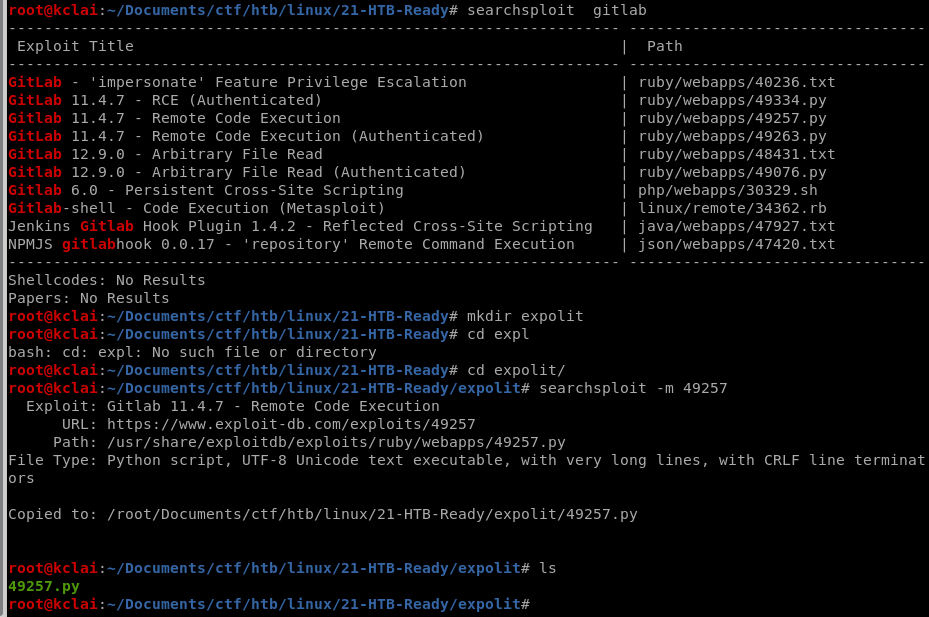
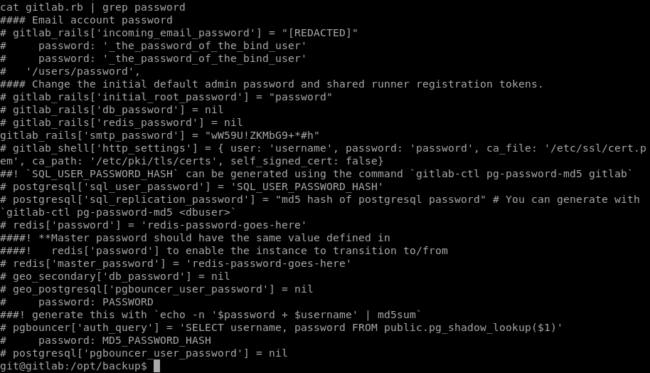

# HackTheBox – Ready

- Write-Up Author: [Calvin Lai](http://security.calvinlai.com)

## **Question:**
> Ready


## Background

Ready is a Linux machine from HackTheBox, that installed the GitLab system under the docker container environment.

After basic enumeration, it was found that the GitLab version was 11.4.7. It suffers from a Remote Code Execution exploit listed with [CVE-2018–19571](https://cve.mitre.org/cgi-bin/cvename.cgi?name=CVE-2018-19571) + [CVE-2018–19585](https://nvd.nist.gov/vuln/detail/CVE-2018-19585). Using the [exploit-db](https://www.exploit-db.com/exploits/49257) provided script. The initial shell was obtained and got the user flag.

Further enumerating the system, a docker configuration file was found at a backup folder that contained an SMTP password. This password can be sudo to the root account.  Unfortunately, the root flag was not found under this account.

According to the backup file found above, the current environment should be inside a docker container. Following this [article](https://betterprogramming.pub/escaping-docker-privileged-containers-a7ae7d17f5a1) on escaping docker privileged containers, the host's root access was obtained and the root flag was got finally.

System patching is the most effective preventive control. Avoiding enabling the privileged flag at the Docker containers, these privileged containers might allow attackers to break the control and gain the host system asscess.   

130n@calvinlai.com

Target Machine: 10.10.10.220

Attacker Machine: 10.10.14.16

## Write up
### 1. Service Scanning:

- Quick Pre-searching:

	Enumerating the available services of the target machine using Nmap aggressive scanning to all available ports. 

	

- Details Analysis:

	

	```
	nmap -p $(grep -Eo '[0-9]{1,5}/open' fkclai.nmap | cut -d '/' -f 1 | tr -s '\n' ',') -sC -sV 10.10.10.220 -o nmap-result.txt
	```

- Enumeration strategies:

	Checking the HTTP port 5080, web enumeration

***
### 2. Enumeration:

A GitLab Community Edition was found on the HTTP port 5080, lets register and log in to the GitLab;


After logging in to the application, the version of this GitLab can be found in the help section which is version 11.4.7. Searching with the [searchsploit](https://www.offensive-security.com/offsec/edb-searchsploit-update-2020/),  it was found that it is a vulnerable version and has a number of exploits CVE's available.





***
### 3. Gaining Foothold:

Just picked a REC exploit code 49257, and using Burp Suite to capture the data of cookie and authenticity token during create a GitLab project. After updated the python code and prepared the return Netcat listener on port 1234.


```
username='fkclai'
authenticity_token='kU0yx1Br8Yk7YQl+TrW9WPVqUTUaBf57KBBrtmpA60cexj39oN6dTKOfWJ5f6yv/WlTPHd6jntiC6xCCPDzP4w=='
cookie = '_gitlab_session=abd8e08f8d2d6d32dd8e6718572414e7; sidebar_collapsed=false; experimentation_subject_id=ImJiYjA1NTc2LTE3YjItNDc3OC04MTBkLTgwNzM4YjU2YmI2NSI%3D--08def3ebde2700b4d281b24b65d2221d8f94dbef'
localport='1234'
localip='10.10.14.15'


url = "http://10.10.10.220:5080"
```


**User flag can be found at the /home/dude/**


***
### 4. Privilege Escalation:

Used the Linux PE Tool - [LinPEAS](https://github.com/carlospolop/privilege-escalation-awesome-scripts-suite/tree/master/linPEAS), a backup /opt/backup folder was found that contained a gitlab.rb file in which found the smtp_password (wW59U!ZKMbG9+\*#h). This password can be used to sudo root access. 



After sudo to root account, but the root flag was not found in the home or root folder. Why? we were inside the docker container. 

```
#determine if a process runs inside lxc/Docker
grep 'docker\|lxc' /proc/1/cgroup
```


With the help of an [article](https://medium.com/better-programming/escaping-docker-privileged-containers-a7ae7d17f5a1) about escaping Docker Privileged Containers, the following command was done and get the host root privilege access finally. 

```
$ mkdir /tmp/test
$ mount /dev/sda2
$ cat /tmp/test/root/root.txt
```


***
### 5. Reference Link

https://www.cnblogs.com/xiaozi/p/13423853.html
