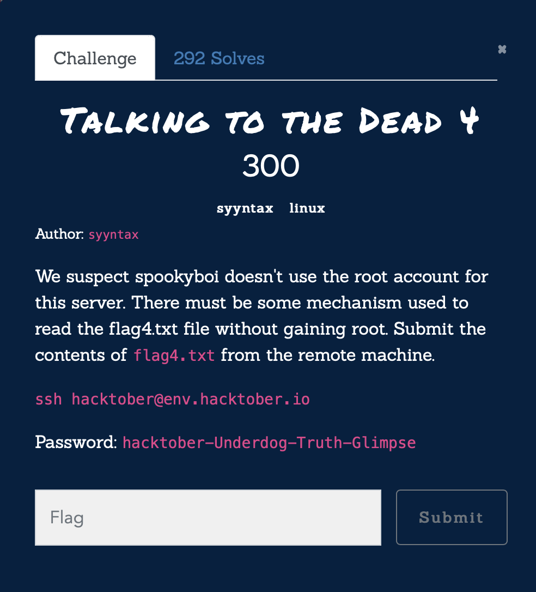
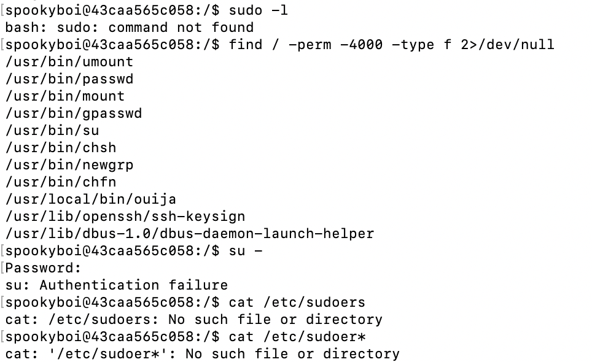
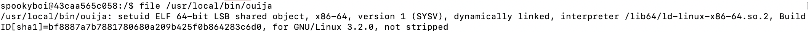
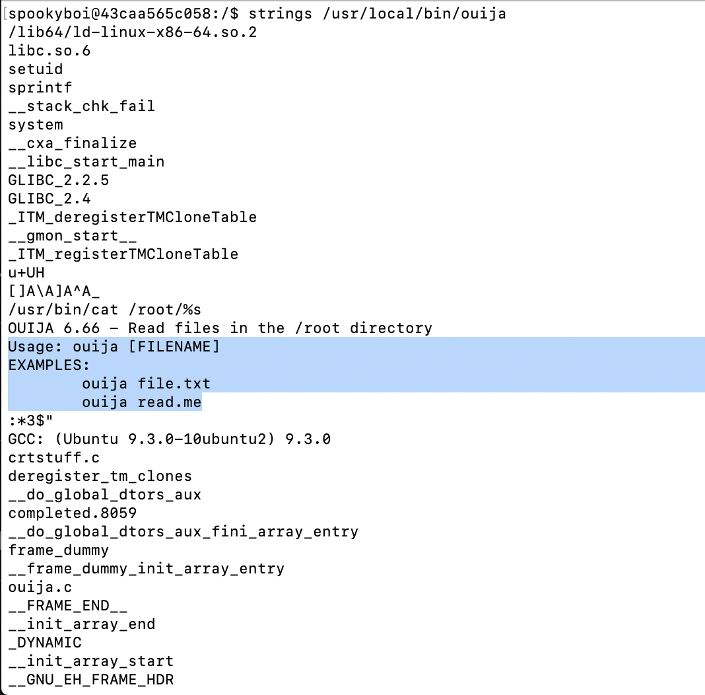
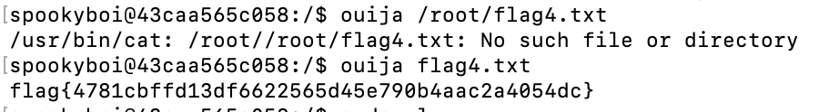

# Hacktober2020 - Talking to the Dead 4

- Write-Up Author: Wendy \[[MOCTF](https://www.facebook.com/MOCSCTF)\]

- Flag:flag{4781cbffd13df6622565d45e790b4aac2a4054dc}

## **Question:**
Talking to the Dead 4



## Write up
First, we switch to user spookyboi with password zxcvbn after ssh, the credential was found on another SQL challenge.</br>
The current user does not have permission to read the flag.

```shell
spookyboi@43caa565c058:/$ ls -l /home/spookyboi
-rw------- root root flag4.txt
```
From the description, we don't have to gain the root, therefore we are looking for another way to read the flag.</br>
As checked, there is no such sudo command and no sodoers file was found. </br>


However, we saw an interesting file during checking SUID files</br>


Then, we move on to look deeply on that file.</br>


Bingo!! Finally, we can use that command to read the flag!!</br>

>flag{4781cbffd13df6622565d45e790b4aac2a4054dc}
