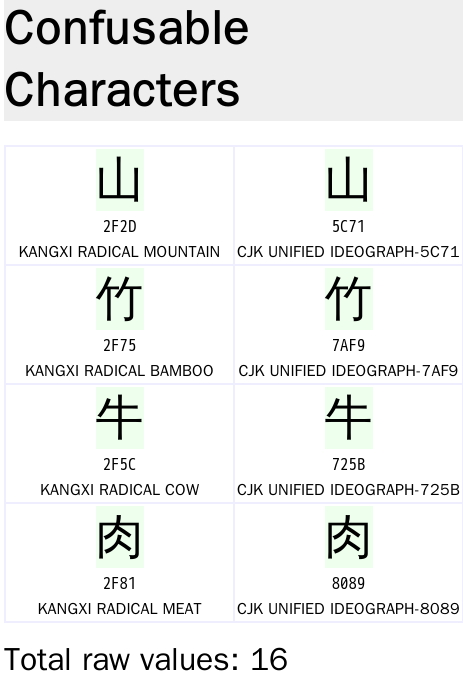

# HKCERT2021 - 點點心
- Write-Up Author: [Ivan Mak](https://ank.pw/tech/)

- Flag: hkcert21{Dim-Sum-As-Variant_Dim-G-As-Boolean_MsgBox-CJK-Homograph}

## **Question:**
點點心 (150 points)

>Challenge description


Attachment: [steamed-meatball_b3d88e1623bd492534d65b4835bfd191.py.png](./steamed-meatball_b3d88e1623bd492534d65b4835bfd191.py.png)

## Write up

說實話，這題如果不看 write up 真的做不出來，解不開大多都以為這是編碼問題，一直研究 unicode, UTF-8, Big5 等編碼研究大半天。

- 其實只是 混 淆 字 而已

從頭到尾，都只是 UTF-8，編碼沒變，就只是我們看的字，跟我們所認識的字是"不同的兩個字"，只是外形"幾乎一樣"，用比喻來說，就是雙胞胎姊妹就看上去一模一樣，但一旦做指紋辨識就能發現不同。

直接看例子吧:

這是我打的 : 山竹牛肉

這是冒牌的 : ⼭⽵⽜⾁

上面 4 個字都長不一樣哦!! 是不是用看的完全分不出來?

不信的話自己複製去驗證看看


1. 到 Confusables - Unicode Utilities 網站

[Confusables - Unicode Utilities](https://util.unicode.org/UnicodeJsps/confusables.jsp)

2. 找找 ‘山竹牛肉’ 有哪些混淆字



每個字都有一個雙胞胎兄弟混淆字，所以一共有 16 個組合

3. 逐個測試


因為不多，試到第 13 個，也就是 ⼭竹牛⾁ (竹和牛是冒牌的)就通過了


也可以寫成 payload

```
from pwn import *

p = remote("chalp.hkcert21.pwnable.hk",28338)

normal = '山竹牛肉'
confusables = '⼭竹牛⾁'

print(normal.encode())
print(confusables.encode())

p.recvuntil("暗號？ ＿＿＿＿")
p.send(confusables)

p.interactive()

```

> hkcert21{Dim-Sum-As-Variant_Dim-G-As-Boolean_MsgBox-CJK-Homograph}
