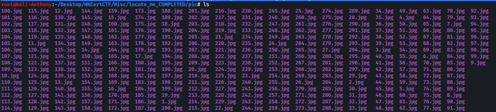
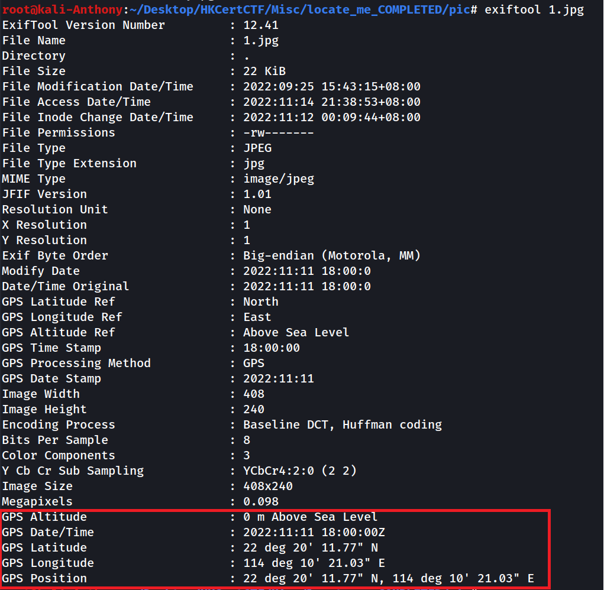
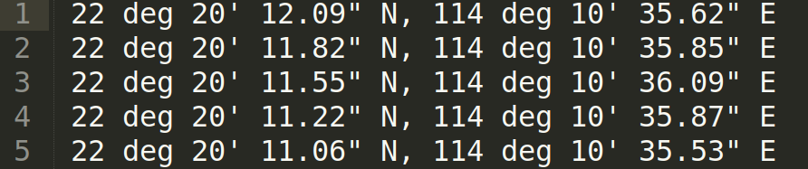
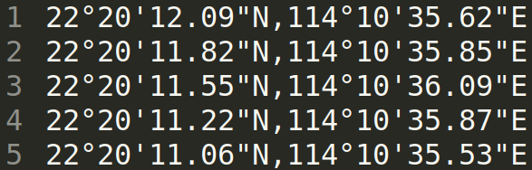
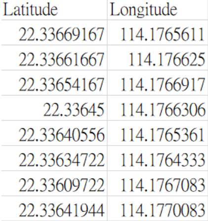
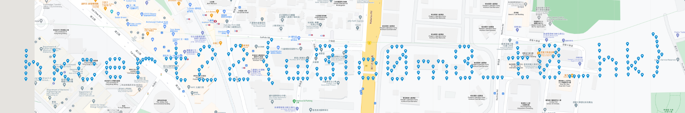

# HKCERT2022 - Locate Me
- Write-Up Author: Anthony Cheng

- Flag: hkcert22{w3lc0m3_t0_hk}

## **Question:**
Locate Me (150 points)

>Challenge description


Attachment: [pic.zip](./pic.zip)

## Write up
After download and unzip the file, can get 297 jpg photo.



First I tried to use exiftool to check the metadata and find there are some GPS locations in these jpg file. So I tried to put all location in a txt folder with the following command.



```
exiftool *.jpg | grep 'GPS Position' | cut -d ':' -f2 >> loaction.txt
```



And then I tried to make some format changes on the txt file and using a script to convert the degree minutes seconds coordinates to decimals coordinates




```
#!/bin/usr/env python3
import re

def dms2dd(dms_val):
    lat_dms = dms_val
    deg, minutes, seconds, direction =  re.split('[°\'"]', lat_dms)
    lat_dd = (float(deg) + float(minutes)/60 + float(seconds)/(60*60)) * (-1 if direction in ['W', 'S'] else 1)
    return lat_dd

with open('coordinate.csv', 'w+') as filp2:
    with open ('location.txt') as filp:

        locates = filp.readlines()
        for locate in locates:
            lat = locate.split(',')[0]
            lon = locate.split(',')[-1]
            result = str(dms2dd(lat)) + ',' + str(dms2dd(lon)) + '\n'
            filp2.write(result)

    filp.close()
filp2.close(
```

After convert to decimals coordinates and output to a csv file and we can import the data to the google for plot the coordinates and will see the flag showing on the map.





> hkcert22{w3lc0m3_t0_hk}
