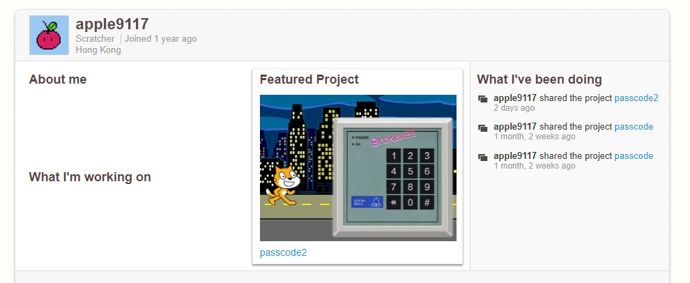
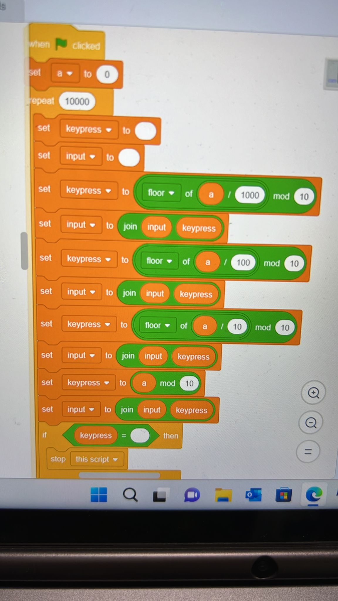
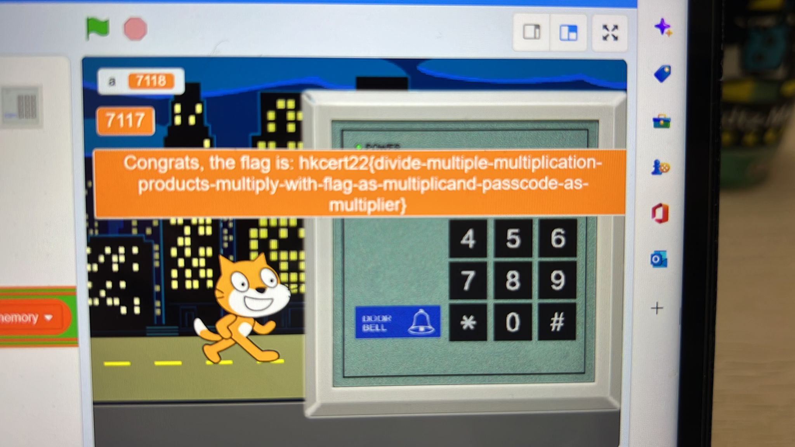

# HKCERT2022 - Scratch Passcode 2
- Write-Up Author: Teru Lei

- Flag: hkcert22{divide-multiple-multiplication-products-multiply-with-flag-as-multiplicand-passcode-as-multiplier}

## **Question:**
Scratch Passcode 2 (125 points)

>Challenge description

Scratch: [link](https://scratch.mit.edu/projects/755732653/)

## Write up

The most direct method can think about is brute force as from the code the PIN is maximum 4 digits. But after play around the code, with some calculations based on variable of ‘memory’ and ‘characters’, seems it’s impossible to have an output of ‘decrypt’ contains ‘pass’ which is the flag from the code. We need to find another approach.

When we access the URL of the challenge, we can see there is another project called passcode:

Compare with passcode 2, the variable ‘memory’ is different and from the challenge we can guess passcode is breakable. So we can modify the code to do brute force. First try to use 4 digit PIN (without use ‘#’). The logic will be as below:

With logic above we can make 4 digit input from 0000~9999. And don’t forget to add “stop this script” block when “success”. Run the code and we can get the flag:

> hkcert22{divide-multiple-multiplication-products-multiply-with-flag-as-multiplicand-passcode-as-multiplier}
