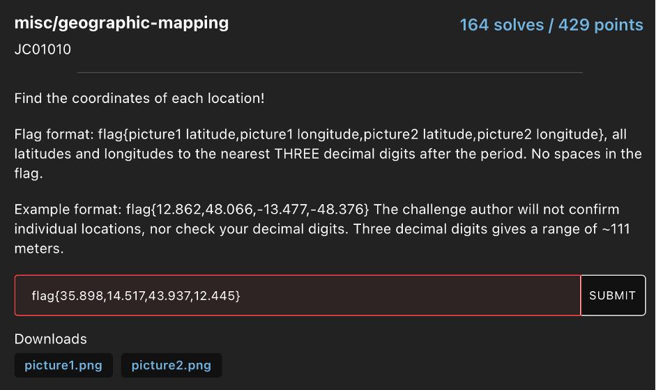
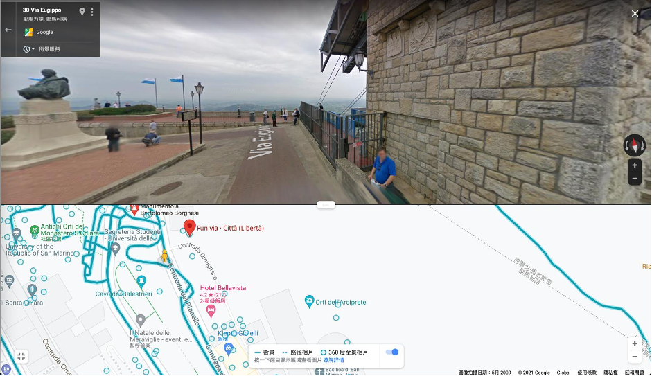
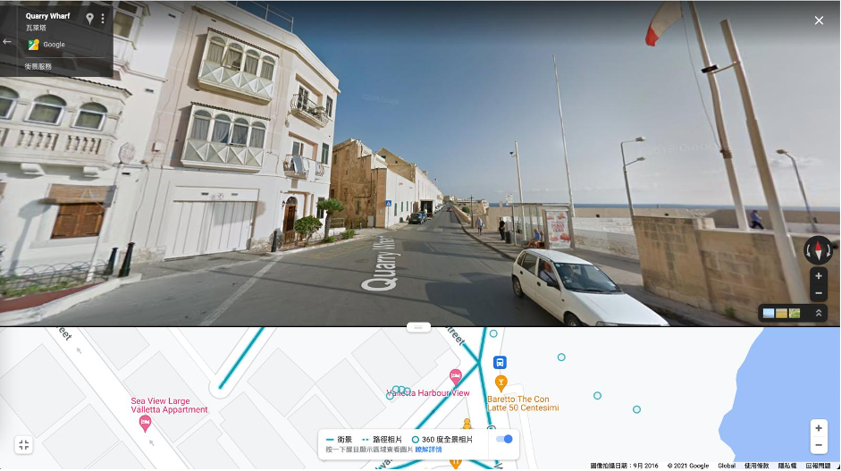

# HSCTF8 - geographic-mapping

- Write-Up Author: Wendy \[[MOCTF](https://www.facebook.com/MOCSCTF)\]

## **Question:**
geographic-mapping

## Write up
According to the question, we have to find out the latitude and longitude of picture 1&2 on google map.

[picture 1](https://www.google.com/maps/@35.8980603,14.517932,3a,75y,340.32h,94.06t/data=!3m6!1e1!3m4!1s_whGCsQQ2BK4r0s9tzcSqA!2e0!7i13312!8i6656)

[picture 2](https://www.google.com/maps/@43.9376694,12.4458827,3a,75y,10.82h,86.43t/data=!3m10!1e1!3m8!1snYl_K8Cr0zd5Etaxh7UKKA!2e0!6shttps:%2F%2Fstreetviewpixels-pa.googleapis.com%2Fv1%2Fthumbnail%3Fpanoid%3DnYl_K8Cr0zd5Etaxh7UKKA%26cb_client%3Dmaps_sv.tactile.gps%26w%3D203%26h%3D100%26yaw%3D151.33801%26pitch%3D0%26thumbfov%3D100!7i13312!8i6656!9m2!1b1!2i45?hl=zh-TW)

We submitted **flag{35.898,14.517,43.937,12.445}**, but it's not correct.

After checked the flag with supprot on discord, I got this reply "you're off by 0.001 on three of the values". Since the game is ended, we don't have enough time to find out the correct flag.
