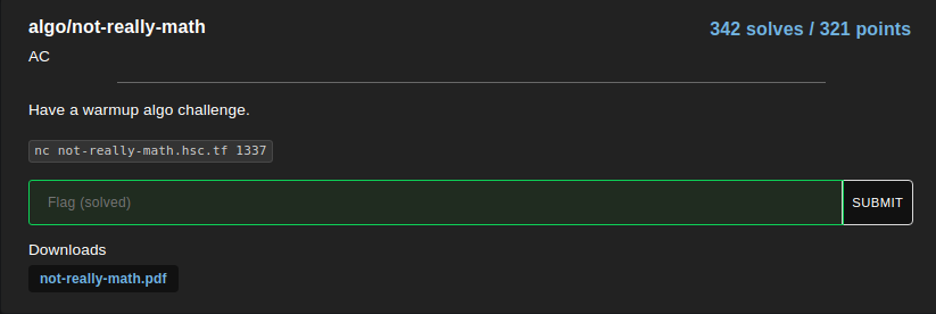

# HSCTF8 - sneks

- Write-Up Author: Teru Lei \[[MOCTF](https://www.facebook.com/MOCSCTF)\]

- Flag:**flag{yknow_wh4t_3ls3_is_n0t_real1y_math?\_c00l_m4th_games.com}**
## **Question:**
sneks



Attachment: 

[not-really-math.pdf](./not-really-math.pdf)

[not-really-math.py](./not-really-math.py)

## Write up:

The details of the algo is described in the pdf file.

According to input format and pdf file description, because we will process ‘plus’ calculation then ‘multiply’, so one of approach is to consider the input as a string, then separate the string by ‘m’ which represents ‘multiply’ calculation, then similar further separate the substrings from previous step to make each substring to a list separate by ‘a’, then convert back the elements to int and we can do math calculation. For example, the sample input in pdf: 2m3a19m2a38m1 we may convert this string to [2,[3,19],[2,38],1] which is two dimension. With this concept, we can develop the below python code to perform the calculation and automate the input capture:

```
from pwn import *
import time
s = ''
r = remote('not-really-math.hsc.tf', 1337)
r.recvuntil('== proof-of-work: disabled ==\n')
# Assuming that we can get the flag within 200 rounds:

for i in range(0,200):
    sep2=1
    #Get the string input:
    x=r.recvline()
    print(x)
    if (': ' in x):
    #Manipulate the input to only keep useful information:
        x=x[2:]
    time.sleep(1) 
#Stop when get the flag or error:    
if ('flag' in x) or ('Unfortunately' in x):
        break
#First split by ‘m’:    
    sep1=x.split('m')
    print(sep1)
#Start processing calculation from string:
    for y in sep1:
# Second split by ‘a’:
        m=y.split('a')
        m = [int(k) for k in m]
        n=sum(m)
#Multiply the result from second split:
        sep2=sep2*n   
#Output with adding mod calculation:
    r.sendline(str(sep2%(2**32-1)))
    print(x)
```

After a few round of calculation we get the flag: 
>flag{yknow_wh4t_3ls3_is_n0t_real1y_math?\_c00l_m4th_games.com}

