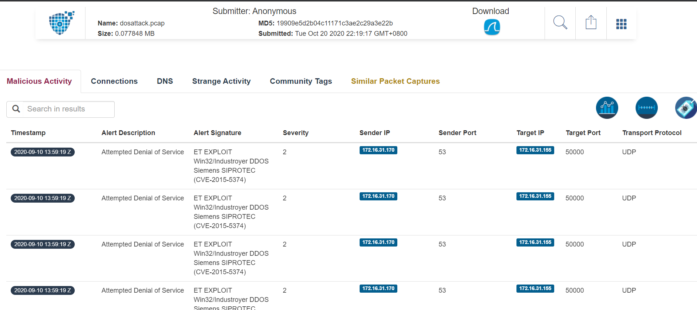

# Syskron Security CTF 2020- DoS attack

- Write-Up Author: Rb916120 \[[MOCTF](https://www.facebook.com/MOCSCTF)\]

- Flag:SyskronCTF{Industroyer}

## **Question:**
DoS attack

>Challenge description  
>One customer of Senork Vertriebs GmbH reports that some older Siemens devices repeatedly crash.  
>We looked into it and it seems that there is some malicious network traffic that triggers a DoS condition.  
>Can you please identify the malware used in the DoS attack? We attached the relevant network traffic.  
>
>Flag format: syskronCTF{name-of-the-malware}  
>
>Hint  
>They bought some older SIPROTEC 4 protection relays.  

[dos-attack.pcap](./dos-attack.pcap)

## Write up
**below tool required in this article.**  
[packettotal](https://packettotal.com/) - an engine for analyzing, categorizing, and sharing .pcap files  

---

upload to [packettotal](https://packettotal.com/) this will tell you the answer.

https://packettotal.com/app/analysis?id=19909e5d2b04c11171c3ae2c29a3e22b
  

>SyskronCTF{Industroyer}