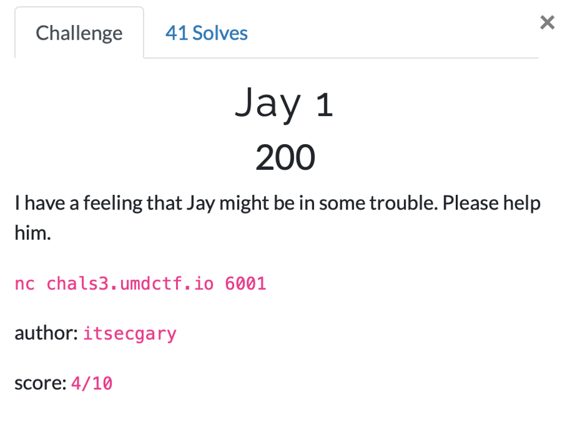
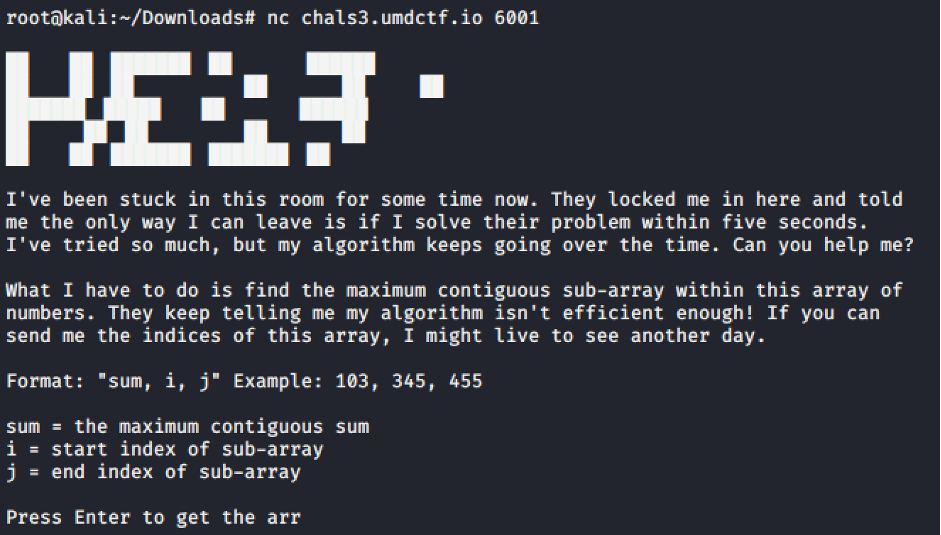
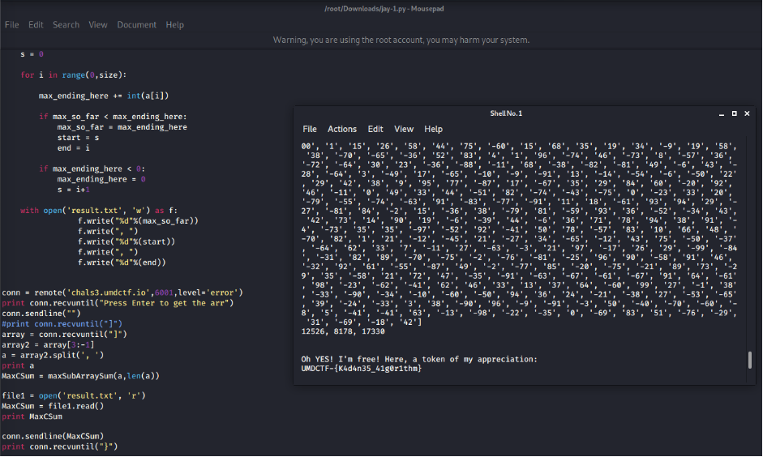

# UMDCTF2021 - Jay 1

- Write-Up Author: Wendy \[[MOCTF](https://www.facebook.com/MOCSCTF)\]

- Flag:UMDCTF-{K4d4n35_41g0r1thm}

## **Question:**
Jay 1



## Write up
First, we run the program and identify the [Kadane’s algorithm](https://www.geeksforgeeks.org/largest-sum-contiguous-subarray/) from the program description. Given an array and calculate the Maximum contiguous sum.



Since we need to finish the calculation within 5 seconds, we have to write script to do it. Here we use pwn library for getting output and sending input from netcat.

```
from pwn import *
from sys import maxsize

def maxSubArraySum(a,size):
 
    max_so_far = -maxsize - 1
    max_ending_here = 0
    start = 0
    end = 0
    s = 0
 
    for i in range(0,size):
 
        max_ending_here += int(a[i])
 
        if max_so_far < max_ending_here:
            max_so_far = max_ending_here
            start = s
            end = i
 
        if max_ending_here < 0:
            max_ending_here = 0
            s = i+1
	
    with open('result.txt', 'w') as f:
		f.write("%d"%(max_so_far))
		f.write(", ")
		f.write("%d"%(start))
		f.write(", ")
		f.write("%d"%(end))
		

conn = remote('chals3.umdctf.io',6001,level='error')
print conn.recvuntil("Press Enter to get the arr")
conn.sendline("")
#print conn.recvuntil("]")
array = conn.recvuntil("]")
array2 = array[3:-1]
a = array2.split(', ')
print a
MaxCSum = maxSubArraySum(a,len(a))

file1 = open('result.txt', 'r')
MaxCSum = file1.read()
print MaxCSum

conn.sendline(MaxCSum)
print conn.recvuntil("}")

```



Finally, we got the flag!
>UMDCTF-{K4d4n35_41g0r1thm}
