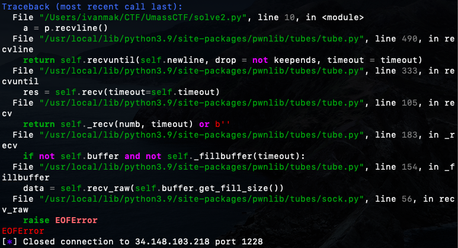
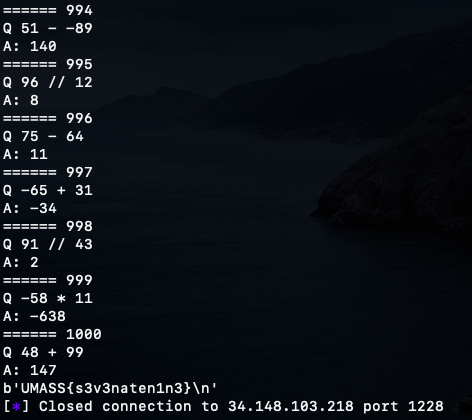

# UMassCTF 2022 writeup - quickmaths
- Write-Up Author: [Ivan Mak](https://ank.pw/tech/)

Flag : UMASS{s3v3naten1n3}

## Question:

Connect to [34.148.103.218:1228](34.148.103.218:1228)，solve 1000 of math problems

## Write up

### 1. use netcat

```shell
nc 34.148.103.218 1228
```

```shell
You must solve 1000 of these math problems that are outputted in the following format {number} {operation} {number} to get the flag. 
Division is integer division using the // operator. 
The input is being checked through python input() function. 
Good luck! 

-21 // 95
-1
Correct!
-52 - 53
-105
Correct!
-28 // 65
```
There are some maths need to solve. Actually, It can be solved manually. but this is not an effective idea.

### 2. use pwntools

[Pwntools](https://docs.pwntools.com/en/stable/) is a great tools to solve the remote program automatically via python.

```python
from pwn import *

p = remote("34.148.103.218",1228)
p.recvuntil("Good luck")
p.recvline()
p.recvline()

for i in range(1000):
    print("======",i)
    a = p.recvline()
    a = a.decode('ascii').strip()
    print("Q",a)
    b = eval(a)
    print("A:",b)
    p.sendline(str(b))
    p.recvuntil("Correct!")
    p.recvline()

c = p.recvline()
print(c)
```

But there is a tricky problem, process always be interrupted due to `EOFError` issue.



It is due to server side has no response, pwntools will be interrupted.

### 3. keep connection alive at server side

Modify the code, use while-loop instead of for-loop. Make pwntools to keep connection alive at the server side when server side has no response.

```python
from pwn import *

p = remote("34.148.103.218",1228)
p.recvuntil("Good luck")
p.recvline()
p.recvline()

i = 1
while i <= 1000:
    try:
        print("======",i)
        a = p.recvline()
        a = a.decode('ascii').strip()
        print("Q",a)
        b = eval(a)
        print("A:",b)
        p.sendline(str(b))
        p.recvuntil("Correct!")
        p.recvline()
        i +=1
    except:
        p = remote("34.148.103.218",1228)

c = p.recvline()
print(c)
```



