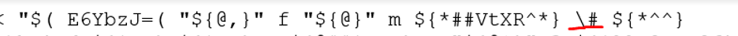
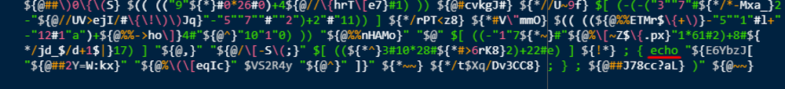

# RedpwnCTF 2020 - Uglybash

- Write-Up Author: Teru Lei \[[MOCTF](https://www.facebook.com/MOCSCTF)\]

- Flag:**flag{us3_zsh,_dummy}**

## **Question:**
>Uglybash

```
This bash script evaluates to ```echo dont just run it, dummy # flag{...}``` where the flag is in the comments.

The comment won't be visible if you just execute the script. How can you mess with bash to get the value right before it executes?

Enjoy the intro misc chal.

Attachemnt:
cmd.sh

```

[cmd.sh](./ccmd.sh)

## Write up
> From the file it’s an obfuscated shell script. We can use eval command (Actually you don’t need if you can observe that the eval command is actually embedded in the script, the “e$'\u0076'al” near the beginning of the script ) to run the script and get the output, but we don’t know the comment which is the flag. The reason to use obfuscated bash bypass static detections on a Linux system (Like signature-based antivirus but not for behavior-based detection system. Here is a good Bashfuscator in GitHub: https://github.com/Bashfuscator/Bashfuscator)
After some observation it’s very difficult to translate the obfuscated shell script to plain script directly. We can try to use “echo” command instead to add to the beginning of obfuscated shell script, hopefully can clear some variables in the script and the script is reversed by rev command embedded it will get reverse back:


>The result:


>With the echo command result and some more observation of the original script, you can see that actually there is “rev” command near the end of original script:


>Copy the output to text editor for better observation:


>With some investigation, it’s not so difficult to observe that there is a “printf” function at the end of the script, related to variables “E6YbzJ” and “VS2R4y”. The “printf” should be used to print the output. 


>And from “E6YbzJ” variable:



>There is “\#” here, which should be the sign for comment! Let’s replace “\#” to “ 1“ , run the script again and see the result:


>Obviously it’s related to the flag but the format is not good. Also try to submit flag{us3_zsh_dummy} was not the correct one. Maybe it’s caused by the format setting in printf function (here to review the printf function if necessary: https://www.geeksforgeeks.org/printf-command-in-linux-with-examples/). To make the thing simple, change the “printf” to “echo” to avoid the format issue:



>And run:


>Yes. We get the flag: flag{us3_zsh,_dummy}. What is zsh mentioned in the flag? Here is the user guide for ZSH: http://zsh.sourceforge.net/Guide/zshguide.pdf . The obfuscated shell script in this question will have error to run in ZSH.
