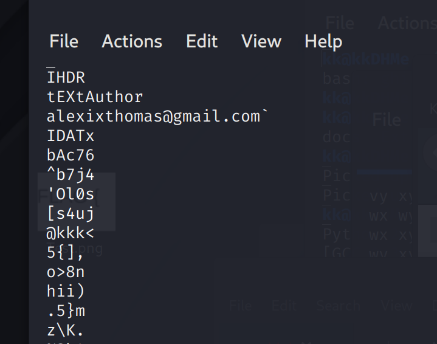

# RTLXHA2021 - All Hail Google

- Write-Up Author: Rb916120 \[[MOCTF](https://www.facebook.com/MOCSCTF)\]

- Flag:RTL{h3he3_bois_y0u_g0t_m3_th15_t1m3}

## **Question:**
All Hail Google

>A 'wonder' place
>
>Note: This is not simply a geoguesser challenge, follow the hint begins with this image, flag's format RTL{...}
>
>Author: psycholog1st#2222 & Moriarty#8077

[unknow.png](./unknow.png)

## Write up
**below tool mentioned in this article.**  
[Ghunt](https://github.com/mxrch/GHunt) - GHunt is a modulable OSINT tool designed to evolve over the years, and incorporates many techniques to investigate Google accounts, or objects. 
[Wikimapia.org](http://wikimapia.org/) - a Wikipedia of map  

**some inspiration**
after the event and review other's writeup.
i aware the place can be found if we using vietnamese for searching. 
How could we search the thing without language limitation?
google lens can help!! i should try this wonderful thing in next OSINT challenge.

btw during the challenge, i got rick rolled twice by the author... lollll....
---

First, let guess the place of this image,

characteristic 1.
this building looking like Thailand/vietnam style, a kind of east asia building style
 

characteristic 2.
people with black hair wearing long clothing, i guess this place is near equatorial(赤道)
  

characteristic 3.
miniature of Arc de Triomphe
 

characteristic 4.
the place near seaside

after inspection on the map candidate would be:
```
india
myanmar
vietnam
cambodia
thailand
china
philippines
malaysia
```

search it with the image and keyword "miniature", "travel","Arc de Triomphe" and country name
this burning a brunch of time to identify the location.


finally find a picture have the same building.
 

and looking at the link and search "Danang golden Bay" in google maps
https://www.tripadvisor.co.il/LocationPhotoDirectLink-g298085-d13211927-i459977468-Danang_Golden_Bay-Da_Nang.html
 

yeah! we find the place, but the game is not end yet. we have to find the flag.

by investigating the review of the place. one of review catch my attention.


look at the pastebin link


2 info from this message.
> 1. Alex will visit this park with my wife next year.
> 2. file from google drive may contain the flag

investigating on the google drive file, it is a PNG file with some exif info


we find the mail address of alex!!

then we can use Ghunt to do further OSINT on alex's address

```
Name : Alexix Thomas

[-] Default profile picture

Last profile edit : 2021/08/02 05:55:09 (UTC)

Email : alexixthomas@gmail.com
Google ID : 117677458572920984210

Hangouts Bot : No

[+] Activated Google services :
- Hangouts
- Maps

[-] YouTube channel not found.

Google Maps : https://www.google.com/maps/contrib/117677458572920984210/reviews
[-] No reviews    

Google Calendar : https://calendar.google.com/calendar/u/0/embed?src=alexixthomas@gmail.com
[-] No public Google Calendar.
```


by visiting the google calendar, we can find the calender event on 2022.


send a email to the mailbox, will got the flag!


