# Syskron Security CTF 2020- Sightseeing again

- Write-Up Author: Rb916120 \[[MOCTF](https://www.facebook.com/MOCSCTF)\]

- Flag:flag{C7Q3+FJ}

## **Question:**
Prefetch Perfection 2

>Challenge description  
>There is something in the bz2 file. We can't open it. We only know that there are four big things with red and white color on the right. Locate the things and tell us the local part of the plus code.  
>
>Flag format: local-part-of-the-plus-code. The flag is just the local part. No syskronCTF{} this time! And, of course, no brute forcing!  
>
>Hint  
>https://en.wikipedia.org/wiki/Open_Location_Code#Example  

[12284592390060427.bz](./12284592390060427.bz)

## Write up
**below tool required in this article.**  
[SunCalc](http://suncalc.net/) - web tools for Sun calculation  
[Wikimapia.org](http://wikimapia.org/) - a Wikipedia of map  

**Reference:**  
[OSINT case](https://haax.fr/en/writeups/osint-geoint/osint-flight-tracking-challenge/)  
[OSINT guide](https://stormctf.ninja/ctf/blog/stormctf/bellebytes-osint-guide)  
[OSINT guide2](https://stormctf.ninja/ctf/blog/stormctf/bellebytes-osint-guide)  
[OSINT Tools List](https://www.aware-online.com/en/osint-tools/geolocation-tools/)  
[Plus code](https://maps.google.com/pluscodes/)  
[Plus Codes (Open Location Code) and Scripting in Google BigQuery](https://towardsdatascience.com/plus-codes-open-location-code-and-scripting-in-google-bigquery-30b7278f3495)  

First, the challenge is asking for the **local part of the plus code** of a location and provide a bz2 file.  
so, what is plus code?  

>It’s the name of the code generated by the Open Location Code geocoding system.  
>This code gives you a four digit area code (only required if you don’t have the nearest town within 25 kilometers),  
>and a six digit local code (quick note, even though they are alphanumeric,  
>in Plus Codes the terminology calls each character a “digit”).  
>There is a “+” symbol right before the last two digits,  
>which doesn’t actually convey any data, but just makes it easier to remember (much like dashes and spaces in a phone number).   
>The ten digit format looks like “8FVC9G8F+6W” (which is the location for Google’s office in Zurich).  
>If you include the town’s name, you can also use the last six digits,  
>so this would be “9G8F+6W Zurich, Switzerland.” If you enter either format in Google Maps, it will take you there.

ok, that is a code to represent geolocation.
next, look at the file and try to decompression.
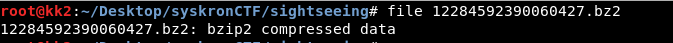  

what!? the file is not a bzip2 file???
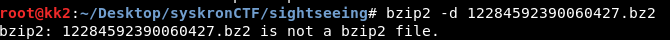

lets look deeper,
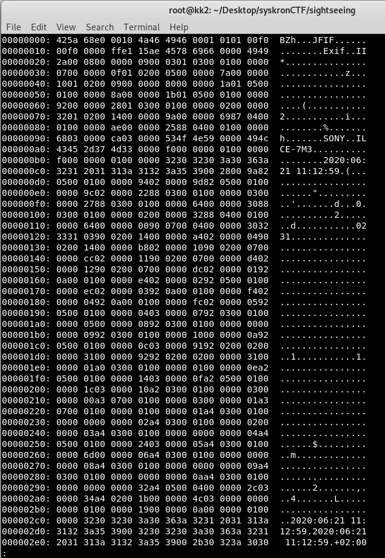  


something weir.. wait, JFIF? maybe this file is a JPG?  
modify the magic number. we finally see the image
```
FF D8 FF E0 00 10 4A 46 49 46 00 01
ÿØÿà..JFIF..
```  
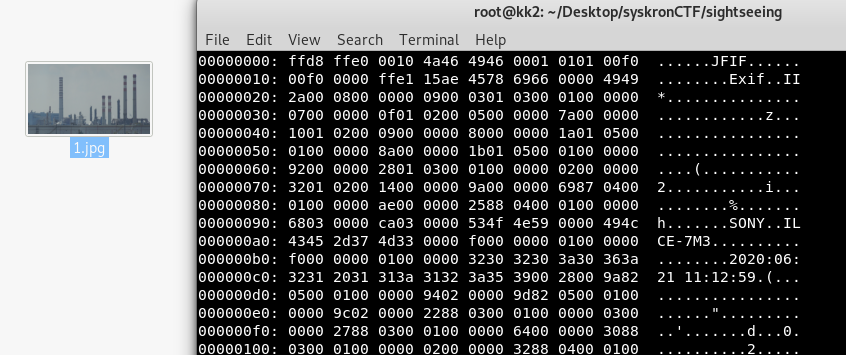  

>there are four big things with red and white color on the right  
so this is a location we are looking for. chimney in the world?
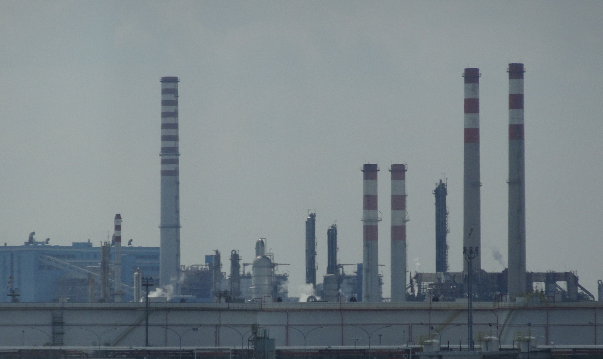

look at the Exif infomation. There is a GPS latitude\(45.461892 N\)
```
# exiftool -c "%.6f" 1.jpg
ExifTool Version Number         : 12.07
File Name                       : 1.jpg
Directory                       : .
File Size                       : 2.4 MB
File Modification Date/Time     : 2020:10:23 23:08:39+08:00
File Access Date/Time           : 2020:10:26 10:21:23+08:00
File Inode Change Date/Time     : 2020:10:26 10:21:17+08:00
....
....
....
Create Date                     : 2020:06:21 11:12:59.1+02:00
Date/Time Original              : 2020:06:21 11:12:59.1+02:00
Modify Date                     : 2020:06:21 11:12:59+02:00
Thumbnail Image                 : (Binary data 4424 bytes, use -b option to extract)
GPS Latitude                    : 45 deg 27' 42.81" N
Circle Of Confusion             : 0.030 mm
Field Of View                   : 18.8 deg
Focal Length                    : 109.0 mm (35 mm equivalent: 109.0 mm)
Hyperfocal Distance             : 39.54 m
Light Value                     : 11.3
```

from here, i am no clue how to go further. look around the in the internet.
some OSINT case inspired me [OSINT case](https://haax.fr/en/writeups/osint-geoint/osint-flight-tracking-challenge/).

the photo was take at 2020:06:21 11:12:59.1+02:00,
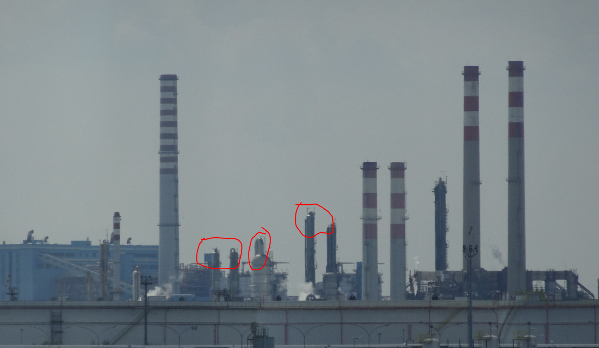  

i guess the 2020:06:21 11:12:59.1+02:00 was 1~4 hrs after sunrise on that place.
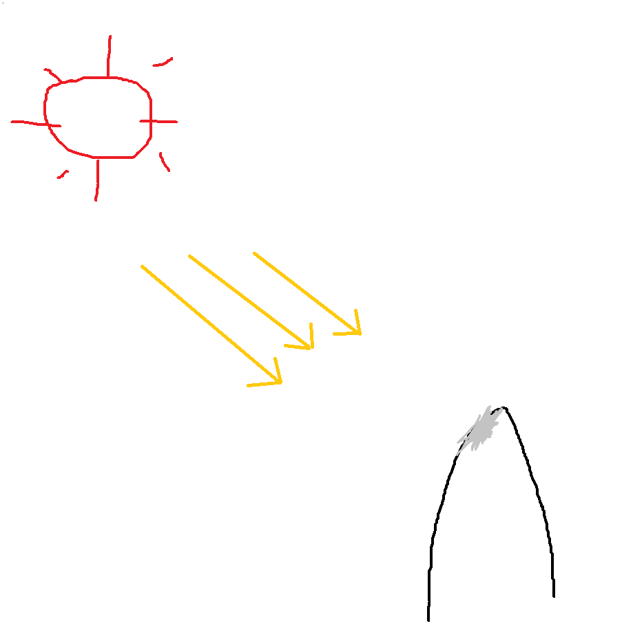  

combine the latitude and my guess.
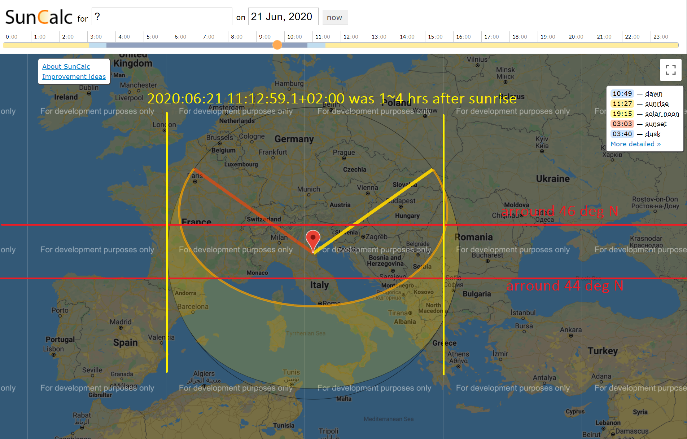  

the place should located in the EU around France to Bulgaria .
Search Chimney on [Wikimapia.org](http://wikimapia.org/#lang=en&lat=45.614037&lon=15.249023&z=5&m=w&tag=148) and combine previous assumption.There is only 8 place meets my assumption.
  

and i found this place.**Fumaiolo centrale (Venice)/Coordinates:  45°25'53"N 12°14'44"E**
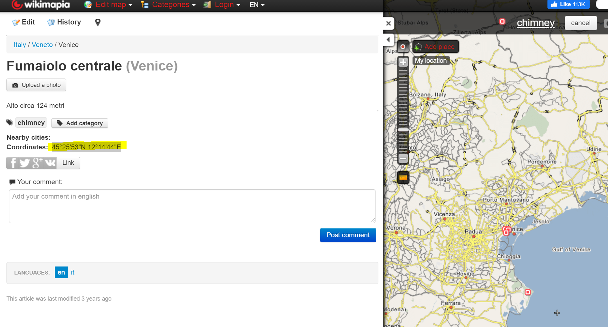  

go to Goole Maps. there is a blue building and primarily match the photo.
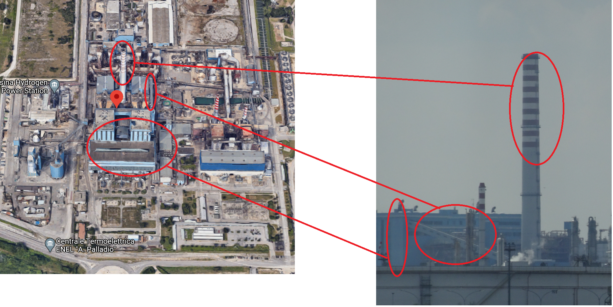  

looking around this place. there are four chimney in the right conner.
  

Bingo!!
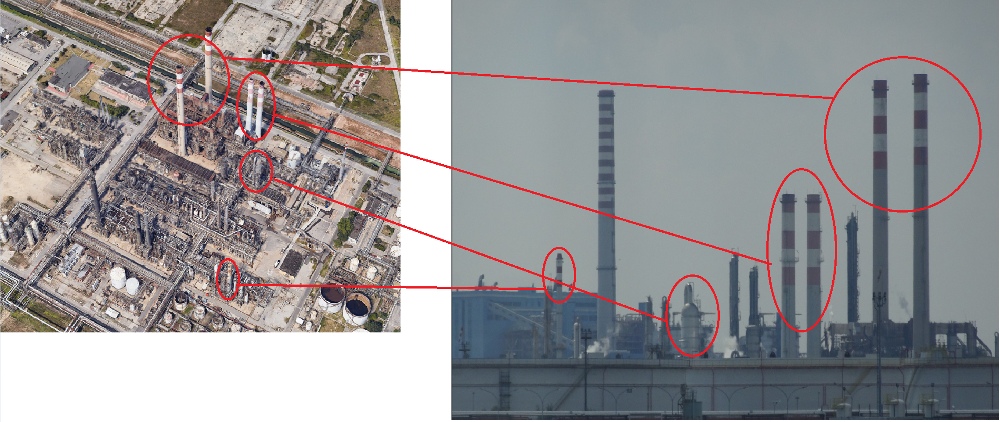
google map will automatic calcuelate the code for the location.


>flag{C7Q3+FJ}

