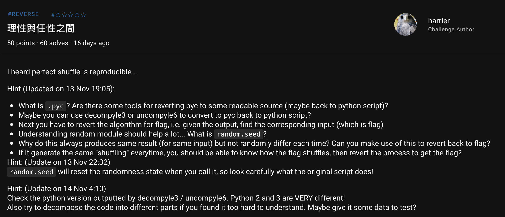

# HKCERT2021 - 理性與任性之間
- Write-Up Author: Ivan Mak \[[MOCTF](https://hackmd.io/JH0dysBTSx6H1o1PZ7OqWg)\]

- Flag: hkcert21{s1mp13_d3shu3ff3l3_1s_s1mp13}

## **Question:**
理性與任性之間 (50 points)

>Challenge description



Attachment: [shuffle_03f016d972f11c15bb25d038a2bd6bb3.zip](./shuffle_03f016d972f11c15bb25d038a2bd6bb3.zip)

## Write up
- 下載附檔後有 2 個檔案，一個 **shuffle.pyc** 和 一個 **output.txt**

```
$ file shuffle.pyc
shuffle.pyc: python 3.8 byte-compiled
```

shuffle.pyc 是一個經過編譯後的檔案，無法直接看懂原始碼，所以這裡要做的第一件事，是把 **.pyc** 反編譯成 **.py**

1. 反編譯 (.pyc to .py)

這裡用到一個工具叫 [uncompyle6](https://asciinema.org/a/171997)

方法:

```
uncompyle6 shuffle.pyc > shuffle.py
```

**shuffle.py**

```
# uncompyle6 version 3.8.0
# Python bytecode 3.8.0 (3413)
# Decompiled from: Python 3.9.7 (default, Oct 10 2021, 15:13:22)
# [GCC 11.1.0]
# Embedded file name: shuffle.py
# Compiled at: 2021-08-17 20:58:36
# Size of source mod 2**32: 281 bytes
import random
flag = open('flag.txt').read().encode()
random.seed(len(flag))
output = b''
for c in flag:
    res = list(map(int, bin(c)[2:].rjust(8, '0')))
    random.shuffle(res)
    shuffled = int(''.join(map(str, res)), 2)
    output += bytes([shuffled])
else:
    print(output)
# okay decompiling shuffle.pyc

```

**output.txt**

```
b'p\xbcl\xf0Y3C#\xf5\xf8\xb0\xe6\x98%\x17\xaf\xa8\x1d\xf1\x19\xb3i\x9aj\x1e\xccx\xb7F\xea\xfa]\r\xf1X\xc1\x8e\xee'

```

編譯過後，剩下的就是單純的解密。

2. 修改原始碼直至看懂

這裡大概說一下它的"加密過程"，比如說一個字元 ‘k’，它的轉換過程如下:

k -> ASCII to hex -> 107
107 -> hex to bin -> 01101011
01101011 -> random.shuffle -> 10111100
10111100 -> dec to hex -> \xbc

這裡的關鍵是 random.shuffle，我們不知道它是如何打亂，但我們知道這個亂數是有初始值 **random.seed(len(flag))**

一開始我以為 flag 的長度是不確定，但後來發現自己假設的 flag 長度和 output 的長度是一樣的

```
>>> output = b'p\xbcl\xf0Y3C#\xf5\xf8\xb0\xe6\x98%\x17\xaf\xa8\x1d\xf1\x19\xb3i\x9aj\x1e\xccx\xb7F\xea\xfa]\r\xf1X\xc1\x8e\xee'
>>> len(output)
38
```

即 random.seed(len(flag))

= random.seed(len(output))

= random.seed(38)

我們不僅能知道 flag 的總長度是 38 位，還能確定 random 的初始值 seed，換句話來說，它的隨機性是**固定的(可重現的)**

3. 構造一個已知的 list 去進行同樣的 shuffle

舉個例子，我構造一個 list = [0, 1, 2, 3, 4, 5, 6, 7]

當我用同樣的 random.seed 去做同樣的 random.shuffle，那我便可以知道它如何打亂。

重現打亂後的值:

```
my_list = [0, 1, 2, 3, 4, 5, 6, 7] #打亂前
my_list_= [2, 0, 1, 6, 4, 7, 5, 3] #打亂後
```

等價於

```
res = [0, 1, 1, 0, 1, 0, 1, 1] #打亂前
res = [1, 0, 1, 1, 1, 1, 0, 0] #打亂後
```

4. 寫出 payload
```
import random

output = b'p\xbcl\xf0Y3C#\xf5\xf8\xb0\xe6\x98%\x17\xaf\xa8\x1d\xf1\x19\xb3i\x9aj\x1e\xccx\xb7F\xea\xfa]\r\xf1X\xc1\x8e\xee'
flag = b''
random.seed(len(output))

for c in output:
    res = list(map(int, bin(c)[2:].rjust(8, '0')))
    my_list = list(range(8)) # generate a list = [0, 1, 2, 3, 4, 5, 6, 7]
    random.shuffle(my_list)

    ans_res = [0]*8
    j = 0
    for i in my_list:
        ans_res[i] = res[j]
        j += 1
    shuffled = int(''.join(map(str, ans_res)), 2)

    flag += bytes([shuffled])
else:
    print("flag =",flag)    

```

```
$ py solve.py
flag = b'hkcert21{s1mp13_d3shu3ff3l3_1s_s1mp13}'

```

> hkcert21{s1mp13_d3shu3ff3l3_1s_s1mp13}
