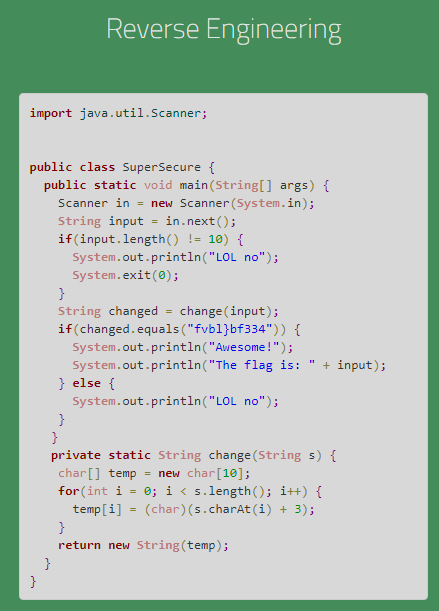
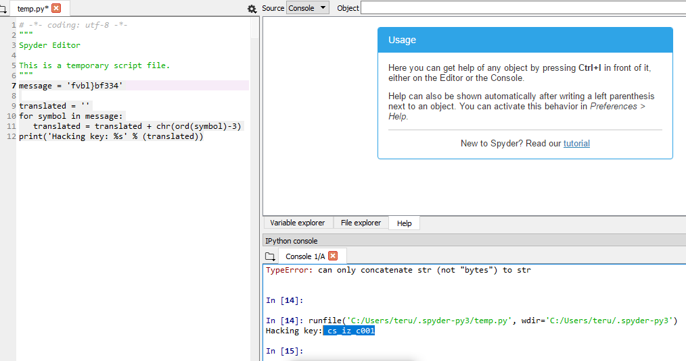
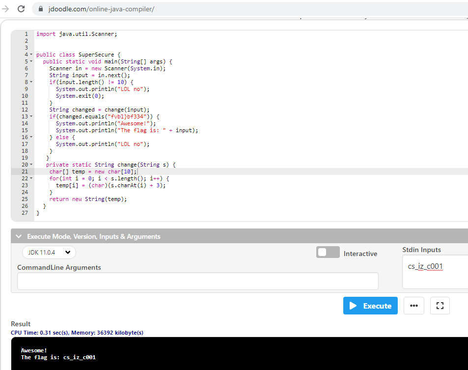

# Crypto - HSCTF2020 - Reverse Engineering

- Write-Up Author: Teru Lei \[[MOCTF](https://www.facebook.com/MOCSCTF)\]

- Flag:**cs_iz_c001**
## **Question:**
>Reverse Engineering



## Write up:

>From the program above, the flag can be displayed when we get “changed.equals(“fvbl)bf334”)” , then we can get the flag. Then we examine the “change” function, the function is to rotate 3 characters of the input. So with correct input, after rotating the input becomes “fvbl)bf334”. If we rotate back “fvbl)bf334” 3 characters, we can get the correct input which is the flag according to the code above.</br>In Python, we can use “ord” function to convert char type to int, minus 3 to rotate back the char, then use “chr” function to convert int back to char, which get the input. The code is as below:

```python
	message = 'fvbl}bf334'
	translated = ''
	#translated variable is used to contain the correct input.
	
	for symbol in message:
	   translated = translated + chr(ord(symbol)-3)
	   
	print('Hacking key: %s' % (translated))

```
>Run the code, the output is ‘cs_iz_c001’.



>Use ‘cs_iz_c001’ as input to the Java program, get the expected output (Online Java compiler like https://www.jdoodle.com/online-java-compiler/ can be used to run the Java program).


