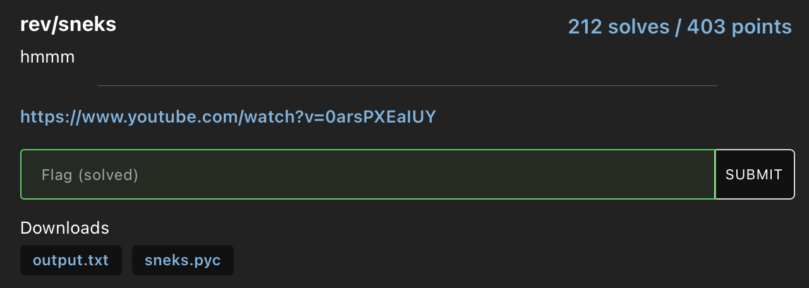
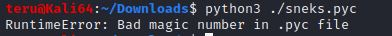
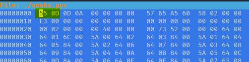
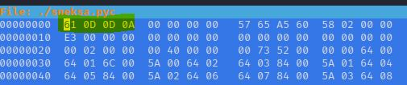
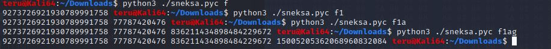

# HSCTF8 - sneks

- Write-Up Author: Teru Lei \[[MOCTF](https://www.facebook.com/MOCSCTF)\]

- Flag:**flag{s3qu3nc35_4nd_5um5}**
## **Question:**
sneks



Attachment: 
[sneks.pyc](./sneks.pyc)
[output.txt](./output.txt)

## Write up:

Examine the output, there are a bunch of number strings, which should be transformed from flag.

Try to open the pyc file, got error that there is ‘Bad magic number’.




pyc file is complied Python code. At this moment we need to first fix this error so that we can at least run the program and get some understanding of how the program works. There are some good articles in Internet like this: [python - What's the bad magic number error? - Stack Overflow](https://stackoverflow.com/questions/514371/whats-the-bad-magic-number-error/514395#514395). Below is the magic number of the original pyc file by opening the file from hexeditor:



You may also try to check the magic number of Python version available in your machine to see if match your version:
Python 3.4 or up:
```
>>> import importlib
>>> importlib.util.MAGIC_NUMBER.hex()
Python version lower than 3.4 or 2:
>>> import imp
>>> imp.get_magic().hex()
```

After some trial, you can find the pyc is from Python 3 and magic number **0x610d0d0a** will work:



Try to run the program for example with input of ‘f’, ‘fl’,’flag’:



Ok. It works and aligns with the output.txt we have.

At this moment, we can try some decompiler to get the original code like using ‘uncompyle6’ but there was some issue in my Python environment so I could not decompile the program directly. However, with observation from the output above, we could find that:
1. The number of bunches of number string is the same as number of letter input (e.g. when I input ‘f’ there was just a number string but when I input ‘flag’ there were four.

2. The output of string of certain position only affected by the letter of that position and the letters before it. (e,g, for the 4th number string ‘15005205362068960832084’ it’s only affected by the 1-4th letter input. It is not related from the 5th letter even there is)

By 1) and 2) observed above, even we do not decompile the program, we can still use brute force to get the flag quickly. Here is the Python code (save the code with the fixed pyc file in the same folder):

```
import subprocess
#Make output.txt as array
result=["9273726921930789991758","166410277506205636620946","836211434898484229672","15005205362068960832084","226983740520068639569752018","4831629526120101632815236","203649875442","1845518257930330962016244","12649370320429973923353618","203569403526","435667762588547882430552","2189229958341597036774","175967536338","339384890916","319404344993454853352","-9165610218896","435667762522082586241848","3542248016531591176336","319401089522705178152","-22797257207834556","12649370160845441339659218","269256367990614644192076","-7819641564003064368","594251092837631751966918564"]
flag=""
#You need to remove some special character since some characters will give strange output. you may find those out by adding print 'cmd' variable during debug
candidate="abcdefghijklmnopqrstuvwxyzABCDEFGHIJKLMNOPQRSTUVWXYZ1234567890-,.?:{}!@$%^_+"
for i in range(0,len(result)):
  for j in candidate:
    cmd="python3 sneks.pyc "+flag+j
    r = str(subprocess.run(cmd,shell=True, check=True, stdout=subprocess.PIPE, universal_newlines=True).stdout).split()[i]
    print(r)
    if(r==result[i]):
      print('correct')
      flag=flag+j
      print(flag)
      break
print(flag)
```

>Around 1 mins you can get the flag: flag{s3qu3nc35_4nd_5um5}