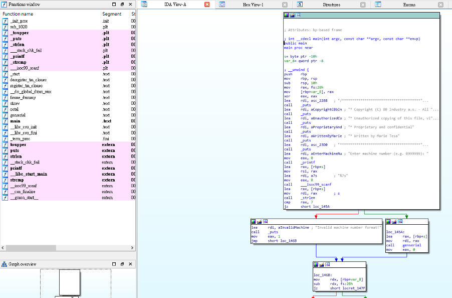
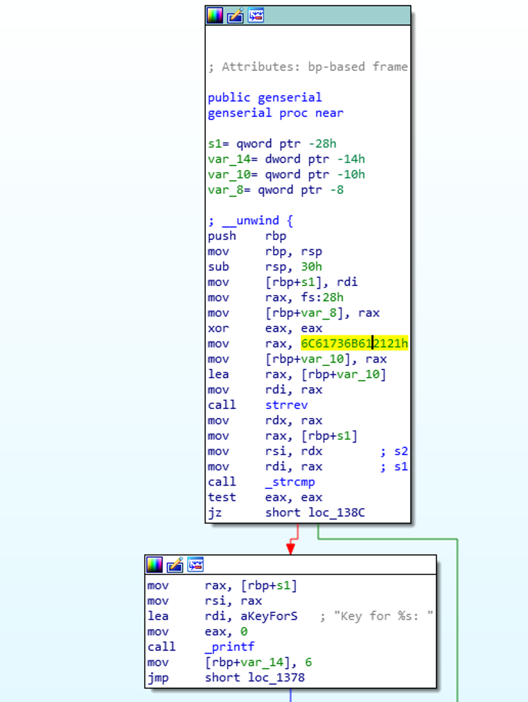

# Syskron Security CTF 2020 - Key Generator
- Write-Up Author: Bon \[[MOCTF](https://www.facebook.com/MOCSCTF)\]

- Flag: syskronCTF{7HIS-isn7-s3cUr3-c0DIN9}

## **Question:**
Key Generator

>Challenge description
>This is our official key generator that we use to derive keys from machine numbers. Our developer put a secret in its code. Can you find it?

Hint
0-7

Attachment: [keygen](./keygen)

## Write up
Checked and found the given file is an executable file.

Execute it which prompt a request to input 7 characters to gives you a set of number.

Put it into ida and check its function.

 

Nothing interesting, move on to another function.



?! An interesting hex and having exactly 7 characters. Change it to ascii and we got **‘laska!!’**, try to put it to the executable file. 

```
Starting program: ./keygen
/********************************************************************************
* Copyright (C) BB Industry a.s. - All Rights Reserved
* Unauthorized copying of this file, via any medium is strictly prohibited
* Proprietary and confidential
* Written by Marie Tesařová <m.tesarova@bb-industry.cz>, April 2011
********************************************************************************/

Enter machine number (e.g. B999999): laska!!
1639171916391539162915791569103912491069173967911091119123955915191639156967955916396391439125916296395591439609104911191169719175
You are not done yet! ಠ‿ಠ
```

Then we got a large integer, try to convert it to hex gives boring result.

Checking the hint ‘0-7’, but the integer has 9?? After discuss with my teammate then I realize that the hint point to octal number, the nine should be ignored.

```
163 171 163 153 162 157 156 103 124 106 173 67 110 111 123 55 151 163 156 67 55 163 63 143 125 162 63 55 143 60 104 111 116 71 175
```

Change it to ascii and get the flag.

>syskronCTF{7HIS-isn7-s3cUr3-c0DIN9}
