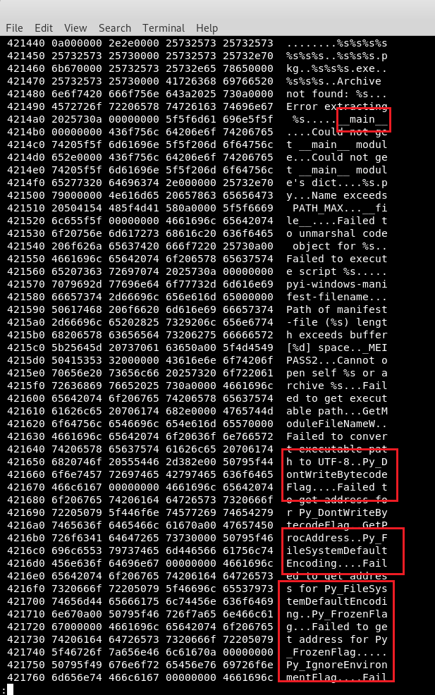
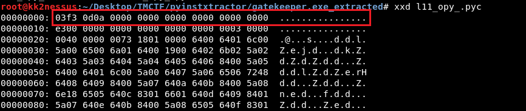
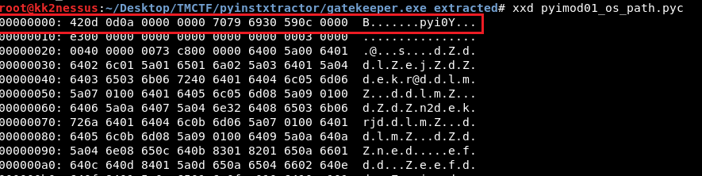
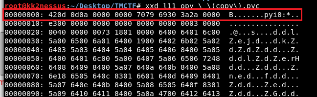

# TrednMicro2020 – GateKeeper

- Write-Up Author: Rb916120 \[[MOCTF](https://www.facebook.com/MOCSCTF)\]

- Flag:**TMCTF{m0th34_H4msT3r!}**

## **Question:**
> GateKeeper

```
:P forgot to backup the challenge description. will update the challenge description later
the challenge provide a file:

```
**Warning: This file might be detected as malicious by some AV. We don't need to run the program directly in this Write-up.**</br>
[gatekeeper.zip](./gatekeeper.zip)</br>
unzip password:**TMCTF2020**

## Write up
>It is a windows executable file and with 4.8 MB size, seems a lot of reverse stuff to check...</br>


>check the file in binary, we can find some of interesting string in .rdata section.</br>
Py_FileSystemDefaultEncoding,Py_....,__main__?</br>
looks like a Python script packed to a EXE file?</br>


>checked in Python Document, we can confirm that this EXE is a wrapper for a Python script.
which mean we might be possible to extract the python file from the EXE and decompile it.</br></br>
[PyInstallerExtractor](https://github.com/extremecoders-re/pyinstxtractor) – Python script to extract the contents of a PyInstaller generated Windows executable file.</br></br>
[Python Decompiler](https://python-decompiler.com/) - A free online tool to decompile Python bytecode back into equivalent Python source code.

>first we try to unpack the EXE.
```shell
python pyinstxtractor.py gatekeeper.exe
```


>ok, the file l11_opy_.pyc extracted. the last thing we need is just reverse it.</br>
put it on https://python-decompiler.com/.</br>


>but fail to recognized. do research on python decompiler, i aware that cause by l11_opy_.pyc doesn't have the correct magic byte.</br>
incorrect magic byte</br>
</br>
correct magic byte</br>


>use hexeditor modify the magic byte of l11_opy_.pyc then we got the reversed python file
```
420d 0d0a 0000 0000 7079 6930
```
</br>
[gatekeeper.py](./gatekeeper.py)


> look at the code, there is some kind of code obfuscated and the major part of the code is 
a infinite while loop asking for input , compare the input and print if true.
```python
while True:
    l1l1l1 = input(l1l1('??\u086f\u0876\u0868\u0876?\u087a\u0868\u0866?\u0873\u0865\u0878\u0879\u0877\u0870\u0874\u0867????'))
    if l1l1l1 == l1lll1():
        print(l1l)
        print(l1l1('??\u0871\u0878?\u0866\u0878\u0865?\u0865\u0872\u0876\u0877\u086b\u0863\u0875???'))
        print(l1l1('??\u0868\u0876\u086a?\u0869\u0874?\u087c\u0873\u087a\u0878?\u0867\u086e\u0864\u086b\u083f??'), l1ll1())
        input(l1l1('??\u0876\u086a\u0879\u0873?\u0867\u0871\u0878\u086a\u0878?\u0875\u0871?\u0867\u0874\u0874\u0874\u086a\u0870\u0878\u0869??\u082e??'))
        break
    else:
        print(l1l1('?????????\u0871\u086b\u0861\u0874\u0867?\u0878\u0877\u087f?\u0862\u0869\u0864\u086d\u0873??'))
```


>i bet this if statement could print the flag, modify the code to:
```python
while True:
    l1l1l1 = input(l1l1('??\u086f\u0876\u0868\u0876?\u087a\u0868\u0866?\u0873\u0865\u0878\u0879\u0877\u0870\u0874\u0867????'))
    if True:
        print(l1l)
        print(l1l1('??\u0871\u0878?\u0866\u0878\u0865?\u0865\u0872\u0876\u0877\u086b\u0863\u0875???'))
        print(l1l1('??\u0868\u0876\u086a?\u0869\u0874?\u087c\u0873\u087a\u0878?\u0867\u086e\u0864\u086b\u083f??'), l1ll1())
        input(l1l1('??\u0876\u086a\u0879\u0873?\u0867\u0871\u0878\u086a\u0878?\u0875\u0871?\u0867\u0874\u0874\u0874\u086a\u0870\u0878\u0869??\u082e??'))
        break
    else:
        print(l1l1('?????????\u0871\u086b\u0861\u0874\u0867?\u0878\u0877\u087f?\u0862\u0869\u0864\u086d\u0873??'))
```

>and run the code again.This time, whatever we put the program will show us the result.

>boom! Flag:**TMCTF{m0th34_H4msT3r!}**