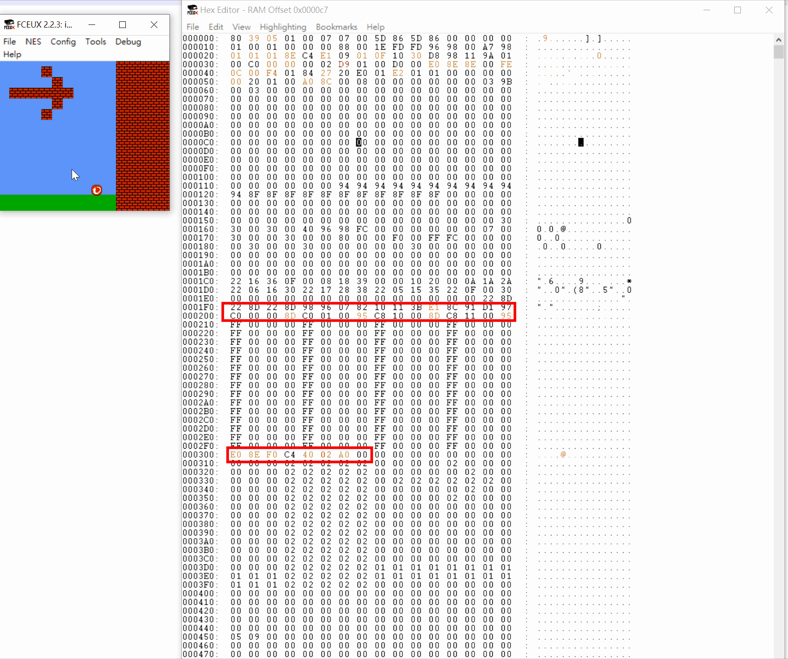
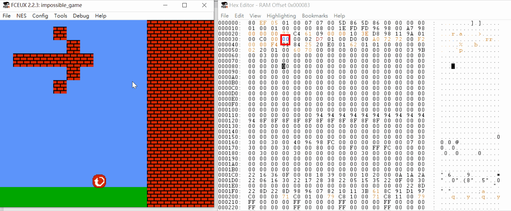

# TrendMicroCTF2020 – Reverse II

- Write-Up Author: Rb916120 \[[MOCTF](https://www.facebook.com/MOCSCTF)\]

- Flag:set the seventh bit of 9016 to 0

## **Question:**
> Reverse II


**I solve this question after the event, no way to verify the flag. this write-up just for recording i how to solve the challenge. actually learn a lot in assembly and so impressive on the old school NES game are make by a little 6502 chip.**</br>
[impossible_game.nes](./impossible_game.nes)</br>

## Write up
> **First, below tool required in this article.**</br>
>[FCEUX](https://github.com/TASVideos/fceux) - An open source NES Emulator for Windows and Unix that features solid emulation accuracy and state of the art tools for power users. For some reason casual gamers use it too.
>
> **Useful Reference:**</br>
>[Easy6502](https://skilldrick.github.io/easy6502/) - useful to learn or test your 6502 assembly code</br>
>[Nerdy Nights Mirror](https://nerdy-nights.nes.science/#main_tutorial-5) - a great tutorial to learn how to build your own NES game and theory</br>
>[FCEUX documents](http://fceux.com/web/help/fceux.html?NESRAMMappingFindingValues.html) - great explain the mechanism of NES and the emulator</br>
>[NES reverse with Ghidra](https://allthingsreversed.io/solving-space-fights-ctf/) - great article to learn how to dissemble NES in Ghidra</br>

***

>we can run the NES rom in FCEUX, that is a simple game we can move the character left,right and jump. and the challenge is go through the wall with **[eight charter game genie cheat code](http://fceux.com/web/help/fceux.html?GameGenieEncoderDecoder.html)**


```
Game Genie Decoder/Encoder

This will take an NES address space PRG address ($8000-$FFFF), a comparison value (for 8-letter GG codes; refer to a Game Genie code FAQ for an explanation of what this does), and a Value that replaces the addressed byte.

Filling in the Address and Value fields will produce a 6-letter code; if you also fill out the Compare field, it will produce an 8-letter code.  The code so produced will appear in the Game Genie Code box immediately; you can then click "Add to Cheat List" to activate it.

To decrypt a Game Genie code, enter it into the Game Genie Code box, and the Address and Value fields will be automatically filled in, as will the Compare field if it was an 8-letter code.
```

>Now we know the goal and the range we have to looking for($8000-$FFFF).
>Launch the debugger and hex editor.many address are bilking.


>when we moving the character, some outstanding address are also changed immediately.
>assume those address are tracking the location or something of the character?


>after checking on [FCEUX documents](http://fceux.com/web/help/fceux.html?NESRAMMappingFindingValues.html)
>$01xx , $03xx, $04xx and $05xx are storing the character properties
```
Pages
This ram is broken down into 8 pages.  A "page" is a block of 256 ram values.
I will refer to these values as such:

Block 0                $00xx                ($0000-$00FF) 
Block 1                $01xx                ($0100-$01FF) <-- Music & Sound FX & Player & Enemy Stats &Player & Enemy Stats
Block 2                $02xx                ($0200-$02FF) <-- Sprite Data   
Block 3                $03xx                ($0300-$03FF) <-- Player & Enemy Stats
Block 4                $04xx                ($0400-$04FF) <-- Player & Enemy Stats
Block 5                $05xx                ($0500-$05FF) <-- Player & Enemy Stats
Block 6                $06xx                ($0600-$06FF)
Block 7                $07xx                ($0700-$07FF) <-- Music & Sound FX

....
....
....

Player & Enemy Stats        Blocks 1,3,4,5 generally (any or all of these)
This is your "sweet spot" for movie making, as often you will be wanting to track the players speed or coordinates, enemy energy, or enemy coordinates.
These values rarely (if at all) reside outside blocks 1, 3, 4, or 5.  This knowledge already reduces your search possibilities in half!
```

>during the analysis, i aware some pattern in 0x0300. looks like the pattern in the background

>with a guess, i thinks 00 is mapping to the sky, 01 is mapping to the grass and 02 is mapping to the brick.
>try to modify the bottom of the brick from 02 to 00.


>ok cool, we go through the wall and show __you win__. but there is not finished yet. we have to got the cheat code for this.


>03D3 - 03D7 are controlling the brick we can go through.
>the program certainly check this value if the character collide with the brick.
>so we just set up a read breakpoint to see what is exact happens line by line.


>Then we move the character and trigger to read ** 03D3 **

> the instruction stop at 9733
**assembly code is in running order for easy reading**
```assembly
>00:9733:B9 08 03  LDA $0308,Y 					<-- load the value of $03D3(02) to register A ($A = 02)
 00:9736:4C 3E 97  JMP $973E					<-- Jump to $97E3
	......
	......
 00:973E:85 31     STA $0031					<-- store the value of register A to $0031 ($0031 = 02)
 00:9740:A4 31     LDY $0031					<-- load the value of $0031 to register Y ($Y = 02)
 00:9742:B9 14 99  LDA $9914,Y					<-- load the value of $9914 + Y to register A ($9916=C0)
 00:9745:85 31     STA $0031					<--	store the value of register A to $0031 ($0031 = C0)
 00:9747:60        RTS						<-- return the subroutine ($94A9)
	......
	......
 00:94A9:A5 31     LDA $0031					<-- load the value of $0031 to register A ($A = C0)
 00:94AB:29 40     AND #$40					<-- bitwise and operation with A(C0) and 0x40(11000000 ^ 100000) that leave only seventh bit of register A 
 00:94AD:F0 04     BEQ $94B3					<-- jump to $94B3 if zero flag is 1
 00:94AF:E6 33     INC $0033					<-- increase  $0033 by 1
 00:94B1:E6 34     INC $0034					<-- increase  $0034 by 1
	......
	......
```
** register A is accumulate register generally use for calcuelate purpose**
** register X,Y is indexing register generally use for position indexing**

>compare with normal and cheating running status.
>$0033 and $0034 are controlling the the character weather or not go through the brick
```
 00:94AF:E6 33     INC $0033					<-- increase  $0033 by 1
 00:94B1:E6 34     INC $0034					<-- increase  $0034 by 1
```
>while froze $0033 or $0034 to zero we can go through the brick in weird way


>so, if we jump over 94AF(INC $0033) and 94B1(INC $0034).
>then we just consider how to let the result to be false on $94AD.
>the order of the code is :
> 1. Load the value of $9916 to register A
> 2. put register A's value to $0031
> 3. Load the value of $0031 to register A
> 4. run AND bitwise operation with 100000 <-- must be false
> 5. ignore the increase of $0033 and $0034

>thence, we just put a value that seventh bit is 0 on $9916 ,then we can go trough the wall


>we can use AAOPVPEG as cheat code</br>
>**possible** Flag{AAOPVPEG}
