# CSAW2020 - Widthness

- Write-Up Author: Teru Lei \[[MOCTF](https://www.facebook.com/MOCSCTF)\]

- Flag:**flag{gu3ss_u_f0und_m3}**
## **Question:**
>Widthness

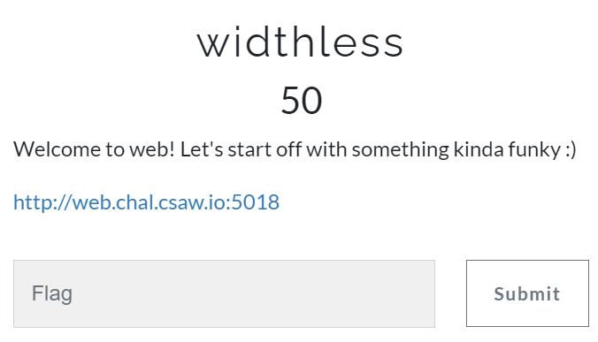

## Write up:

>First browse the web page. We can observe that the web page is mixed with English and other language and the description of content is a bit weired… it seems that there is something hidden in the web content.
 
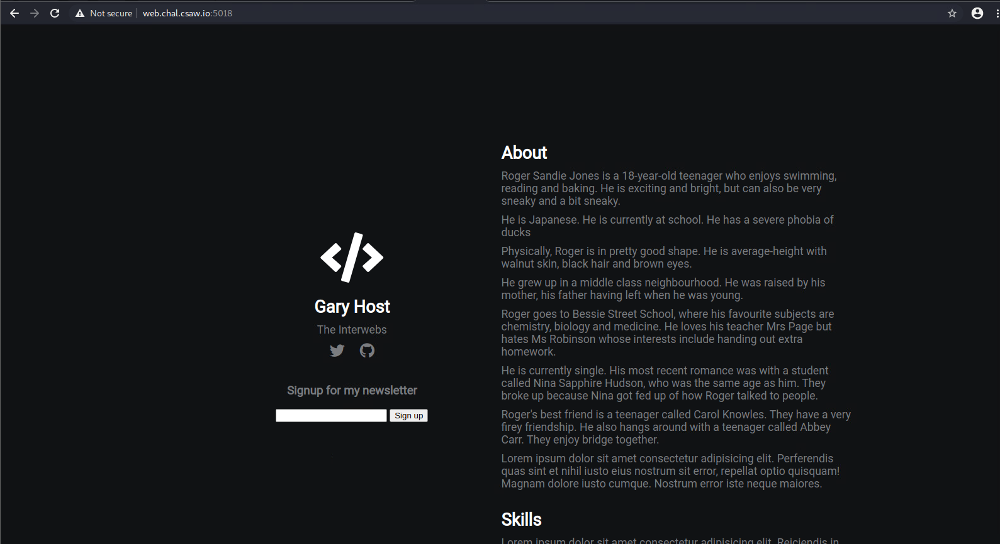

>View source. We can see comment ‘zwsp is fun!’
 
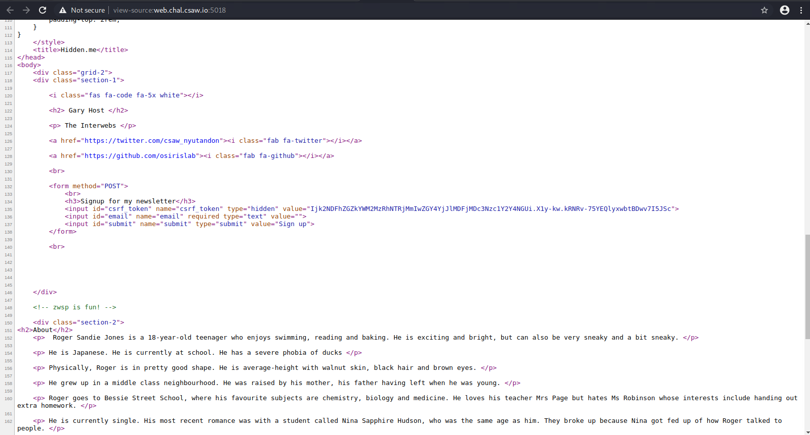

>By google what is zwsp, ZWSP means ‘zero-width space’.
And after google more. There is a good website for zwsp demo: https://offdev.net/demos/zwsp-steg-js

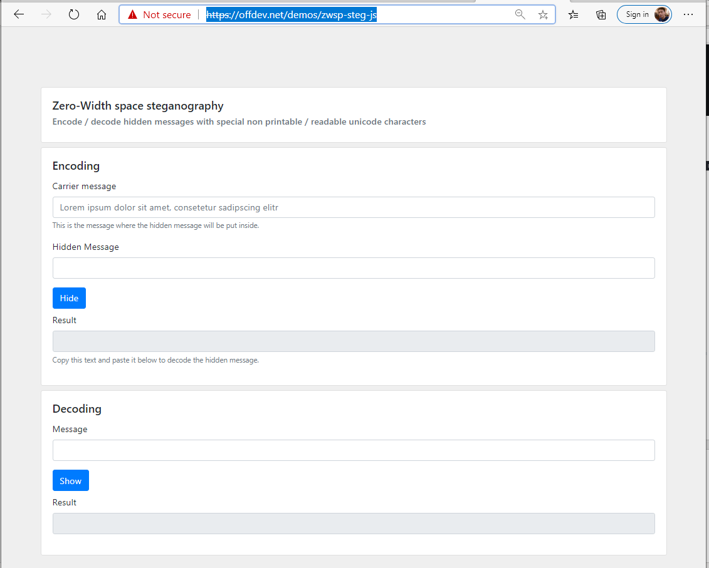

>Let’s try to copy all of the web content by Ctrl-A->Ctrl-C to decode:

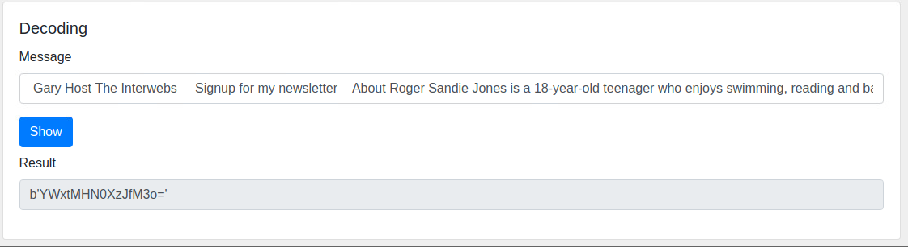

>From the patten of result, it’s a base64 string, copy to online conversion website (e.g. base64decode.org) to decode:

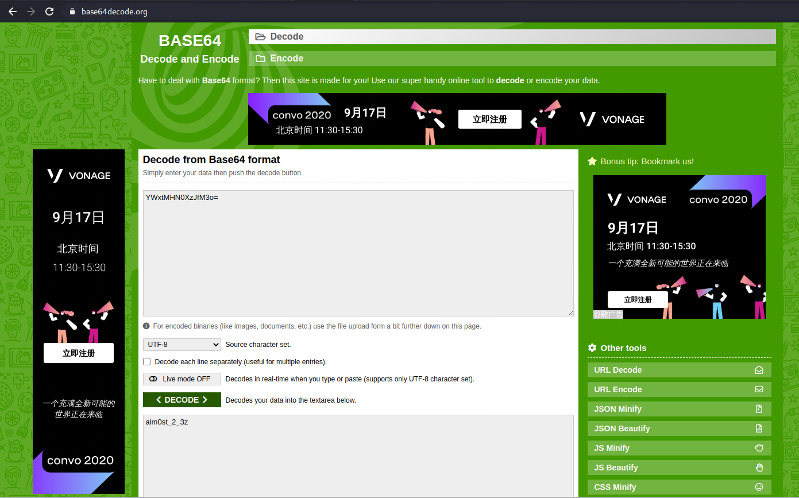

>It’s not a flag but obviously it’s a hint. And there is input field in web page. Try to copy the decoded output to webpage sign up text box, click ‘sign up’:

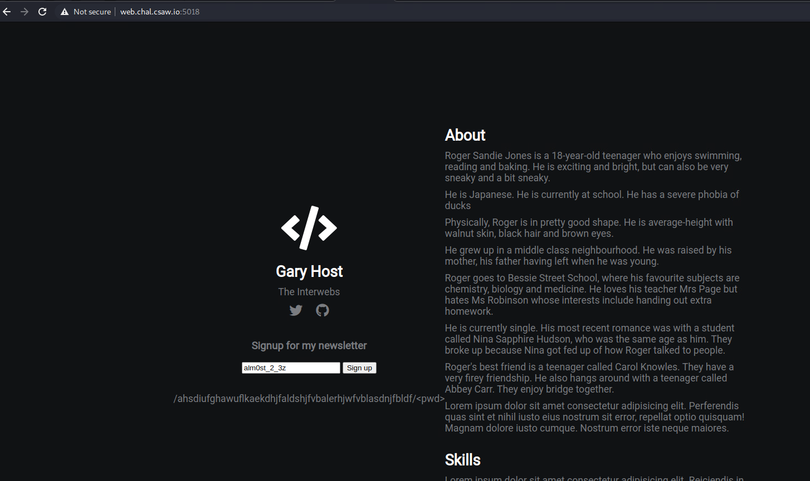

>A path is shown. Add the path shown to the web path, use the base64 decoded output in previous steps as <pwd>:

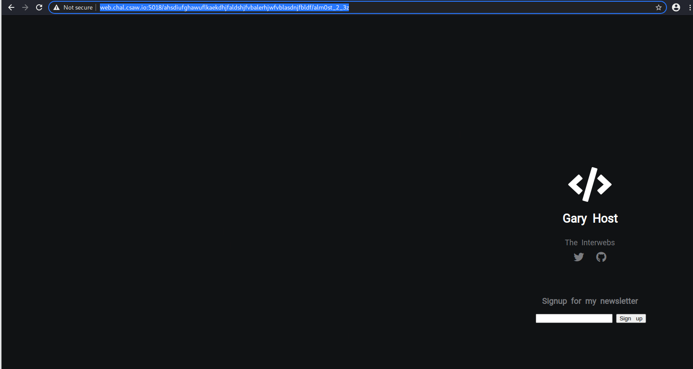
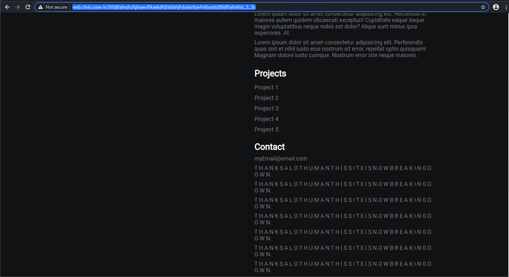

 >Seems it’s still another layer of zwsp. But after tried it did not work to just copy the webpage to zwsp demo webpage to decode. Next step let’s try to copy the source code by select ‘View Source’, and copy all content to zwsp decode:

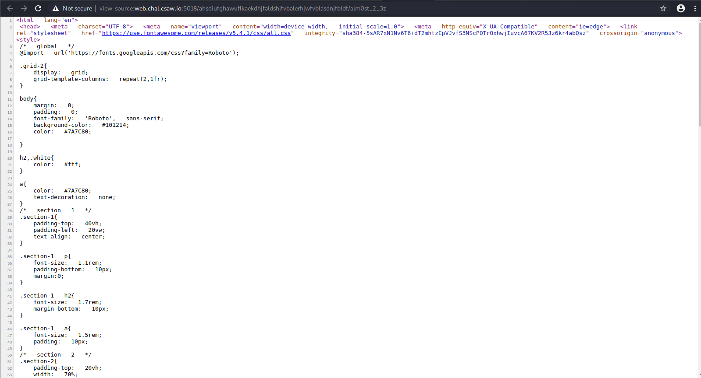
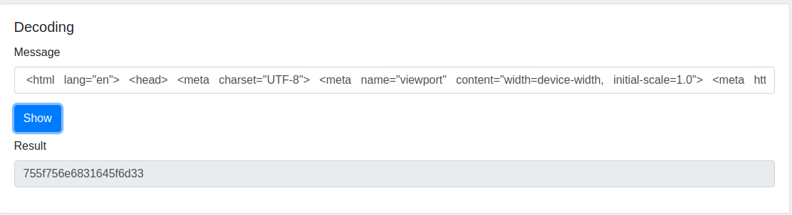

>The result output is a hex string. Copy thee hex string to online hex to ASCII conversion website (e.g. rapidtables.com) to convert:

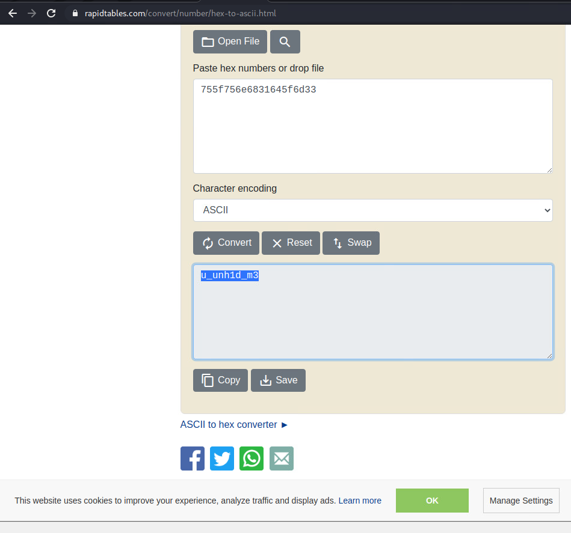

>With experience gained in previous steps, now we can try to copy the output to the text input field besides Sign Up again, then click Sign Up:

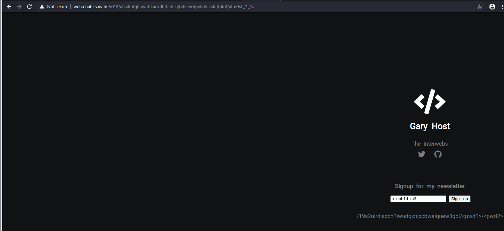

>Another URL path show again, use the previous base64 decode output as pwd1 and hex to ASCII decode output as pwd2, we can get the flag finally:

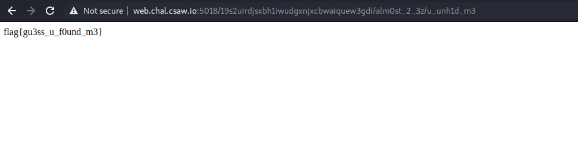

