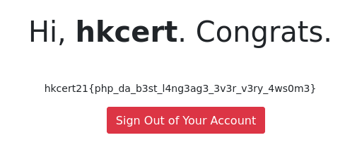

# HKCERT2021 - 因講了出來
- Write-Up Author: [Ivan Mak](https://ank.pw/tech/)

- Flag: hkcert21{php_da_b3st_l4ng3ag3_3v3r_v3ry_4ws0m3}

## **Question:**
因講了出來 (150 points)

>Challenge description


http://chalf.hkcert21.pwnable.hk:28156/

## Write up

題目很簡潔，只有填寫帳號和密碼的窗口


查看提示，有 php 的原始碼提供:

```
 <?php
session_start();

if(isset($_SESSION["loggedin"]) && $_SESSION["loggedin"] === true){
    header("location: welcome.php");
    exit;
}

$username = $password = "";
$username_err = $password_err = $login_err = "";

if($_SERVER["REQUEST_METHOD"] == "POST"){

    if ((strlen($_POST["username"]) > 24) or strlen($_POST["password"]) > 24) {
        header("location: https://www.youtube.com/watch?v=2ocykBzWDiM");
        exit();
    }

    if(empty(trim($_POST["username"]))){
        $username_err = "Please enter username.";
    } else{
        $username = trim($_POST["username"]);
        if(empty(trim($_POST["password"]))){
            $password_err = "Please enter your password.";
        } else{
            $password = trim($_POST["password"]);
            if (!ctype_alnum(trim($_POST["password"])) or !ctype_alnum(trim($_POST["username"]))) {
                switch ( rand(0,2) ) {
                    case 0:
                    header("location: https://www.youtube.com/watch?v=l7pP3ydt3tU");
                    break;
                    case 1:
                    header("location: https://www.youtube.com/watch?v=G094II5gIsI");
                    break;
                    case 2:
                    header("location: https://www.youtube.com/watch?v=0YQtsez-_D4");
                    break;
                    default:
                    header("location: https://www.youtube.com/watch?v=2ocykBzWDiM");
                    exit();
                }   
            }
        }
    }    

    if ($username === 'hkcert') {
        if( hash('md5', $password) == 0 &&
            substr($password,0,strlen('hkcert')) === 'hkcert') {
            if (!exec('grep '.escapeshellarg($password).' ./used_pw.txt')) {

                $_SESSION["loggedin"] = true;
                $_SESSION["username"] = $username;

                $myfile = fopen("./used_pw.txt", "a") or die("Unable to open file!");
                fwrite($myfile, $password."\n");
                fclose($myfile);
                header("location: welcome.php");

            } else {
                $login_err = "Password has been used.";
            }

        } else {
            $login_err = "Invalid username or password.";
        }
    } else {
        $login_err = "Invalid username or password.";
    }
}
?>

<!DOCTYPE html>
<html lang="en">
<head>
    <meta charset="UTF-8">
    <title>Login</title>
    <link rel="stylesheet" href="https://stackpath.bootstrapcdn.com/bootstrap/4.5.2/css/bootstrap.min.css">
    <style>
    body{ font: 14px sans-serif; }
    .wrapper{ width: 360px; padding: 20px; }
</style>
</head>
<body>
    <div class="wrapper">
        <h2>Login</h2>
        <p>Please fill in your credentials to login.</p>

        <?php 
        if(!empty($login_err)){
            echo '<div class="alert alert-danger">' . $login_err . '</div>';
        }        
        ?>

        <form action="<?php echo htmlspecialchars($_SERVER["PHP_SELF"]); ?>" method="post">
            <div class="form-group">
                <label>Username</label>
                <input type="text" name="username" class="form-control <?php echo (!empty($username_err)) ? 'is-invalid' : ''; ?>" value="<?php echo $username; ?>">
                <span class="invalid-feedback"><?php echo $username_err; ?></span>
            </div>    
            <div class="form-group">
                <label>Password</label>
                <input type="password" name="password" class="form-control <?php echo (!empty($password_err)) ? 'is-invalid' : ''; ?>">
                <span class="invalid-feedback"><?php echo $password_err; ?></span>
            </div>
            <div class="form-group">
                <input type="submit" class="btn btn-primary" value="Login">
            </div>
            <p>Want hints? <a href="source.php">Check Here</a>.</p>
        </form>
    </div>
</body>
</html>

```

**重要只要這幾句:**

```
if ($username === 'hkcert') {
    if( hash('md5', $password) == 0 &&
        substr($password,0,strlen('hkcert')) === 'hkcert') {

```

也就是說帳號名稱是 **hkcert**，而密碼 是 **hkcert** 這 6 個字開頭，但做了 md5 的 hash 後，是 **0e** 開頭所組成的字串。

Q. 為什麼是 **0e** 開頭呢?

A. 因為這是 PHP 的一個字串處理漏洞特性，也就是說 PHP 會處理時當成科學記數法，由於 0 的任何次方數最終都為 0，所以在判斷式裡用 0e 開頭的字串都等於 0

payload

github 上找到別人的 [code](https://github.com/bl4de/ctf/blob/master/2017/HackDatKiwi_CTF_2017/md5games1/md5games1.md)，發現挺不錯，然後我改成 python3

```
#!/usr/bin/env python
import hashlib
import re

prefix = 'hkcert_ank'

def breakit():
    iters = 0
    while 1:
        s = prefix + str(iters)
        s = s.encode('utf-8')
        hashed_s = hashlib.md5(s).hexdigest()
        iters = iters + 1
        r = re.match('^0e[0-9]{30}', hashed_s)
        if r:
            print("[+] found! md5( {} ) ---> {}".format(s, hashed_s))
            print("[+] in {} iterations".format(iters))
            exit(0)

        if iters % 1000000 == 0:
            print("[+] current value: {}       {} iterations, continue...".format(s, iters))

breakit()

```





> hkcert21{php_da_b3st_l4ng3ag3_3v3r_v3ry_4ws0m3}
